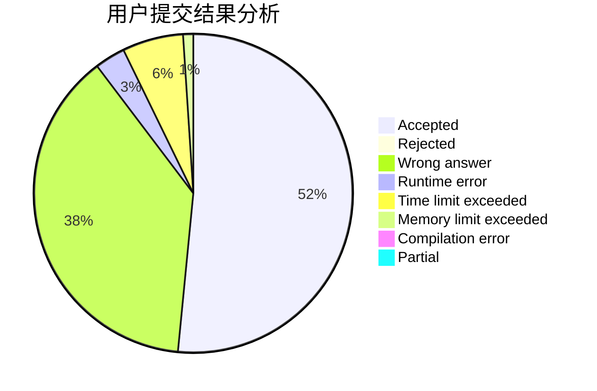
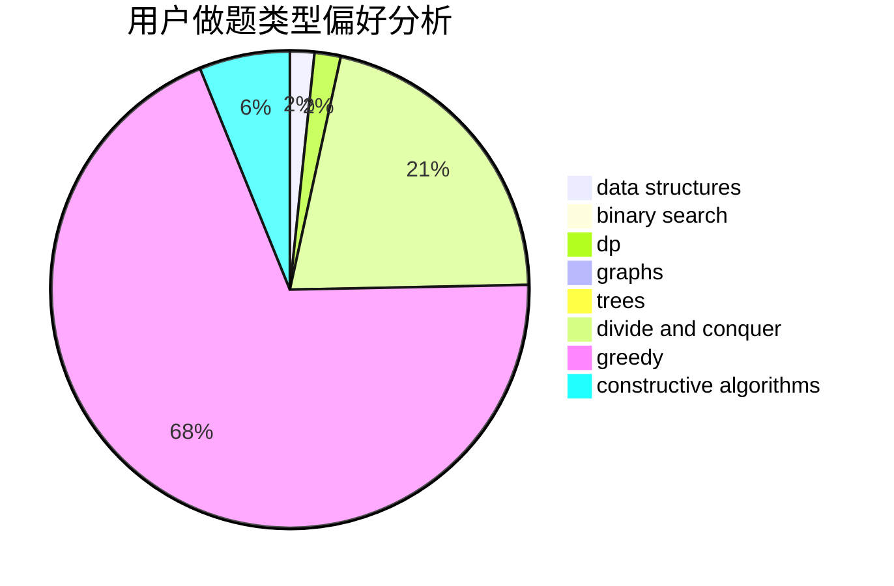
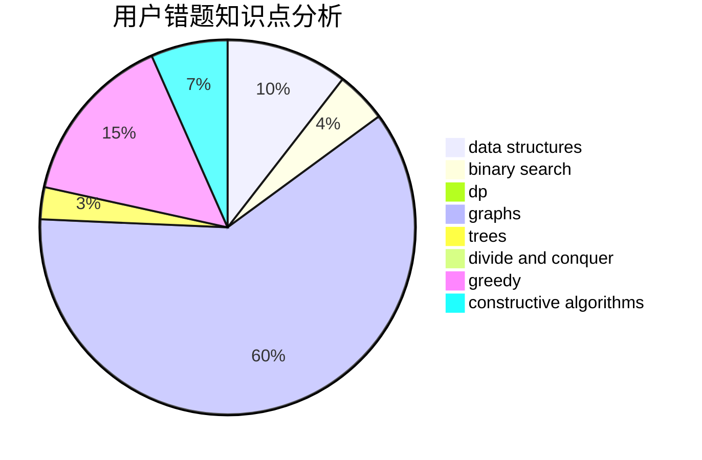

# QAQAutoMaton

<!-- tabs:start -->

#### **用户提交结果分析**

#### **用户做题类型偏好分析**

#### **用户错题知识点分析**

<!-- tabs:end -->
# 推荐题目
[1336C](https://codeforces.com/contest/1336/problem/C)		dp,
                        strings		  
[1201A](https://codeforces.com/contest/1201/problem/A)		implementation,
                        strings		  
[216B](https://codeforces.com/contest/216/problem/B)		dfs and similar,
                        implementation		  
[1023D](https://codeforces.com/contest/1023/problem/D)		constructive algorithms,
                        data structures		  
[923E](https://codeforces.com/contest/923/problem/E)		fft,
                        math,
                        matrices		  
[727F](https://codeforces.com/contest/727/problem/F)		binary search,
                        dp,
                        greedy		  
[1340C](https://codeforces.com/contest/1340/problem/C)		dfs and similar,
                        dp,
                        graphs,
                        shortest paths		  
[1401C](https://codeforces.com/contest/1401/problem/C)		constructive algorithms,
                        math,
                        number theory,
                        sortings		  
[757G](https://codeforces.com/contest/757/problem/G)		data structures,
                        divide and conquer,
                        graphs,
                        trees		  
[1068F](https://codeforces.com/contest/1068/problem/F)		dsu,graphs,sortings,trees		  
