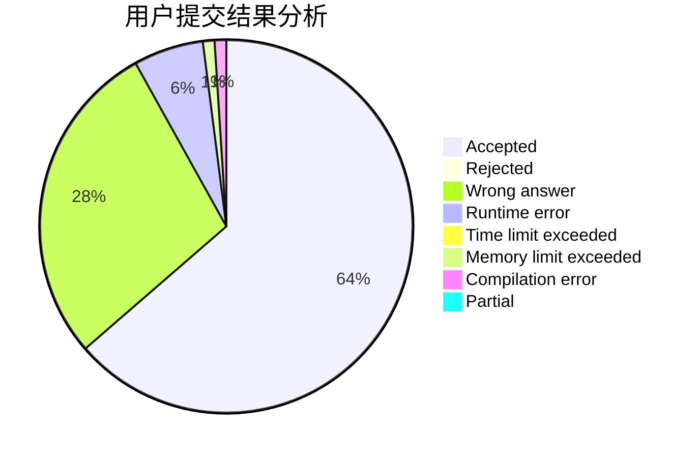
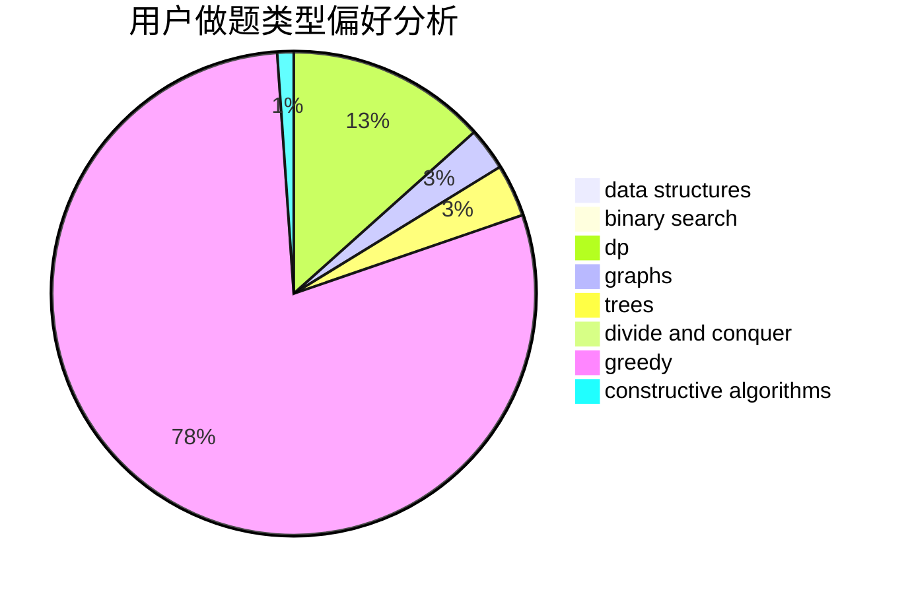

# QDK_Storm

<!-- tabs:start -->

#### **用户提交结果分析**

#### **用户做题类型偏好分析**

#### **用户错题知识点分析**

<!-- tabs:end -->
# 推荐题目
[957B](https://codeforces.com/contest/957/problem/B)		dsu,graphs,sortings,trees		  
[180D](https://codeforces.com/contest/180/problem/D)		greedy,
                        strings		  
[612B](https://codeforces.com/contest/612/problem/B)		implementation,
                        math		  
[1208B](https://codeforces.com/contest/1208/problem/B)		binary search,
                        brute force,
                        implementation,
                        two pointers		  
[931A](https://codeforces.com/contest/931/problem/A)		brute force,
                        greedy,
                        implementation,
                        math		  
[691C](https://codeforces.com/contest/691/problem/C)		implementation,
                        strings		  
[769A](https://codeforces.com/contest/769/problem/A)		*special problem,
                        implementation,
                        sortings		  
[482C](https://codeforces.com/contest/482/problem/C)		bitmasks,
                        dp,
                        probabilities		  
[3B](https://codeforces.com/contest/3/problem/B)		greedy,
                        sortings		  
[1458A](https://codeforces.com/contest/1458/problem/A)		math,
                        number theory		  
