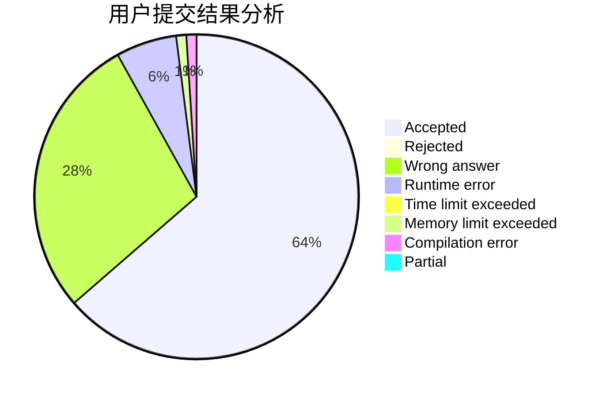
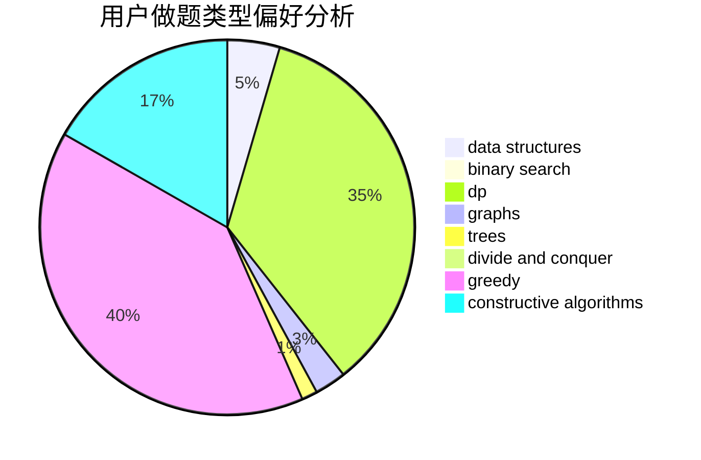

# QDK_Storm

<!-- tabs:start -->

#### **用户提交结果分析**

#### **用户做题类型偏好分析**

#### **用户错题知识点分析**

<!-- tabs:end -->
# 推荐题目
[978E](https://codeforces.com/contest/978/problem/E)		combinatorics,
                        math		  
[208A](https://codeforces.com/contest/208/problem/A)		strings		  
[631D](https://codeforces.com/contest/631/problem/D)		data structures,
                        hashing,
                        implementation,
                        string suffix structures,
                        strings		  
[1213F](https://codeforces.com/contest/1213/problem/F)		data structures,
                        dfs and similar,
                        dsu,
                        graphs,
                        greedy,
                        implementation,
                        strings		  
[952A](https://codeforces.com/contest/952/problem/A)		math		  
[711A](https://codeforces.com/contest/711/problem/A)		brute force,
                        implementation		  
[789A](https://codeforces.com/contest/789/problem/A)		implementation,
                        math		  
[501A](https://codeforces.com/contest/501/problem/A)		implementation		  
[429C](https://codeforces.com/contest/429/problem/C)		bitmasks,
                        constructive algorithms,
                        dp,
                        greedy,
                        trees		  
[1466I](https://codeforces.com/contest/1466/problem/I)		binary search,
                        data structures,
                        data structures,
                        interactive		  
