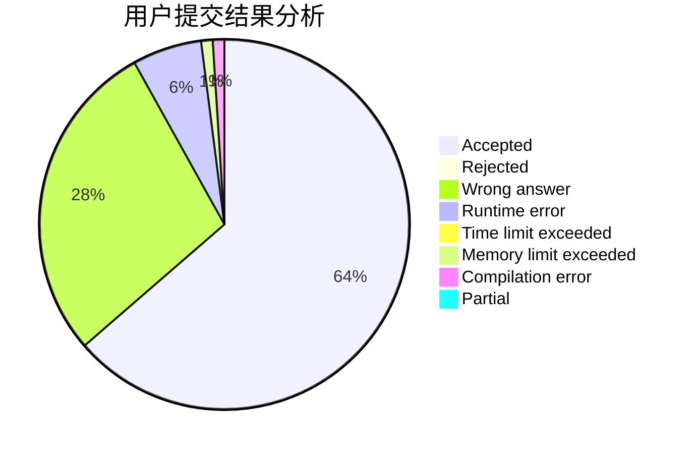
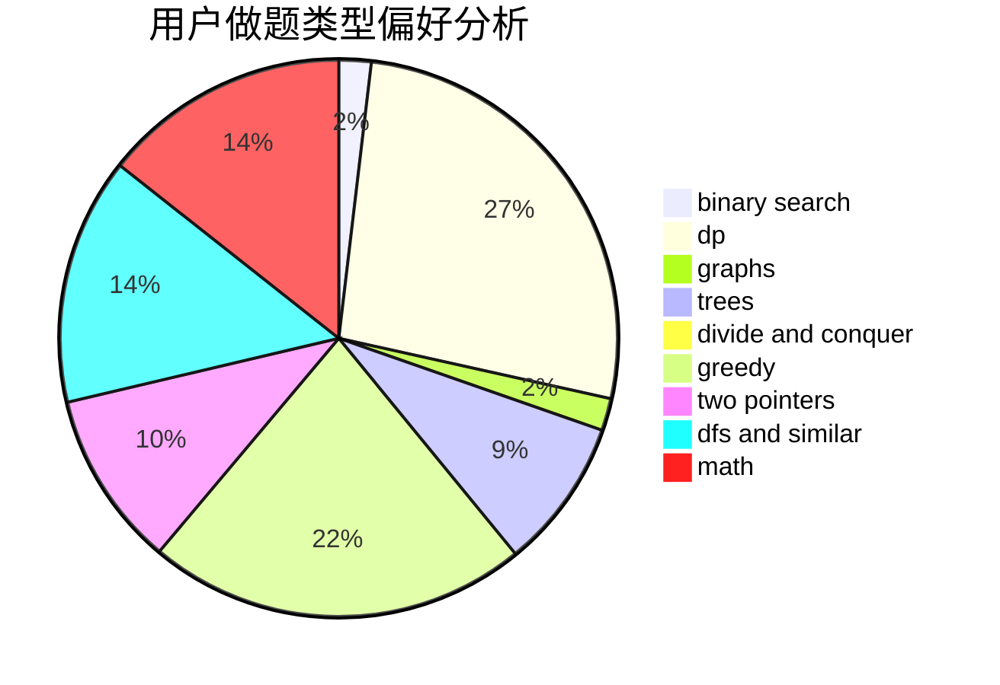

# QDK_Storm

<!-- tabs:start -->

#### **用户提交结果分析**

#### **用户做题类型偏好分析**

<!-- tabs:end -->
# 推荐题目
[978E](https://codeforces.com/contest/978/problem/E)
[208A](https://codeforces.com/contest/208/problem/A)
[631D](https://codeforces.com/contest/631/problem/D)
[1213F](https://codeforces.com/contest/1213/problem/F)
[952A](https://codeforces.com/contest/952/problem/A)
[711A](https://codeforces.com/contest/711/problem/A)
[789A](https://codeforces.com/contest/789/problem/A)
[501A](https://codeforces.com/contest/501/problem/A)
[429C](https://codeforces.com/contest/429/problem/C)
[1466I](https://codeforces.com/contest/1466/problem/I)
