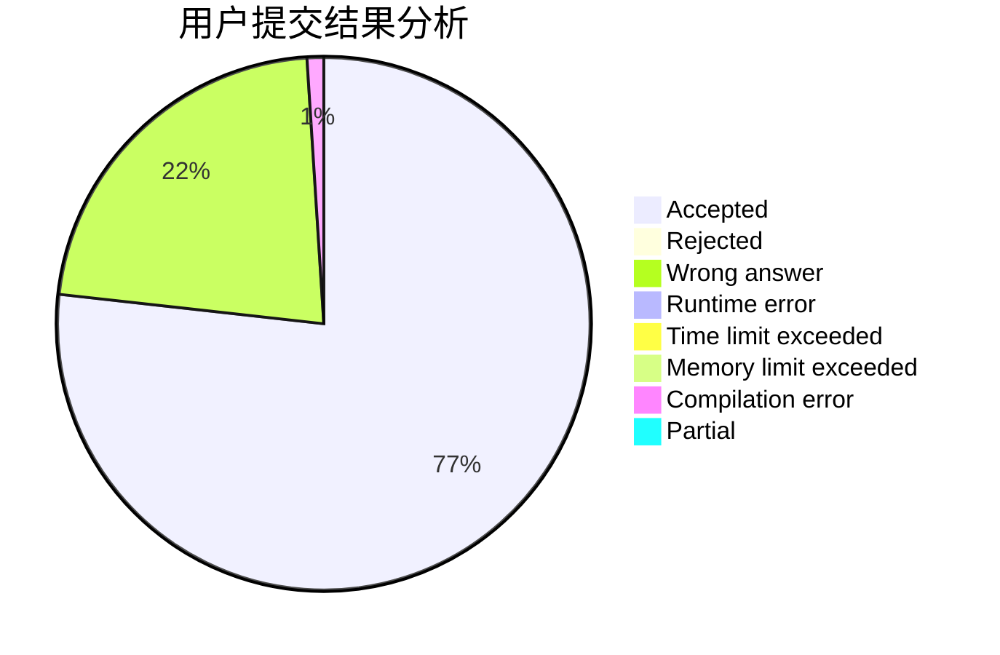
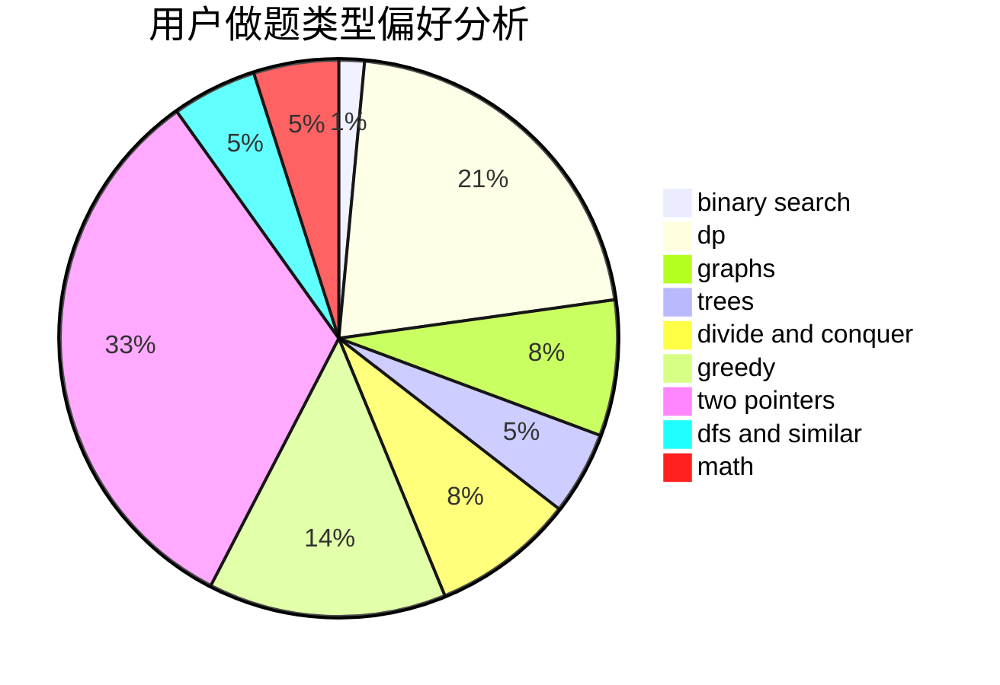

# QYitong

<!-- tabs:start -->

#### **用户提交结果分析**

#### **用户做题类型偏好分析**

<!-- tabs:end -->
# 推荐题目
[579A](https://codeforces.com/contest/579/problem/A)
[13352](https://codeforces.com/contest/1335/problem/2)
[1030B](https://codeforces.com/contest/1030/problem/B)
[707B](https://codeforces.com/contest/707/problem/B)
[11951](https://codeforces.com/contest/1195/problem/1)
[1408H](https://codeforces.com/contest/1408/problem/H)
[1252F](https://codeforces.com/contest/1252/problem/F)
[821B](https://codeforces.com/contest/821/problem/B)
[1062F](https://codeforces.com/contest/1062/problem/F)
[669C](https://codeforces.com/contest/669/problem/C)
