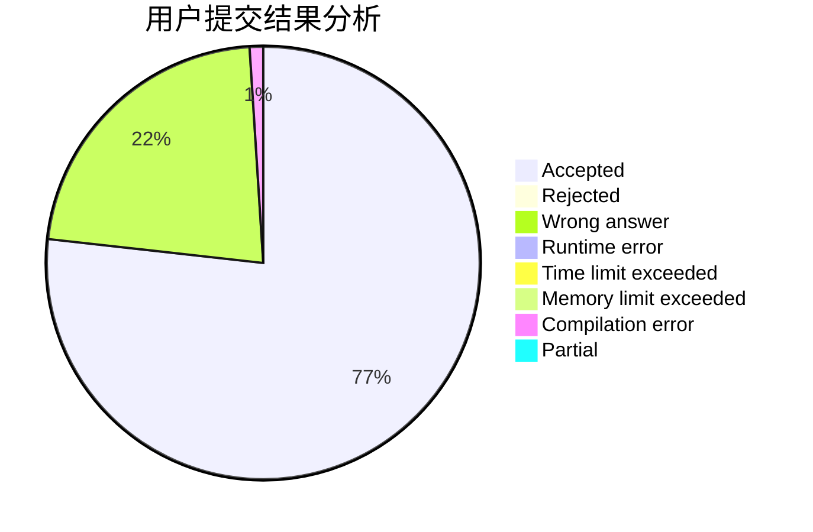
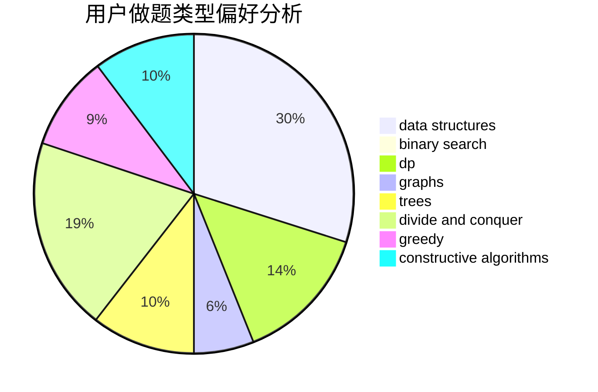
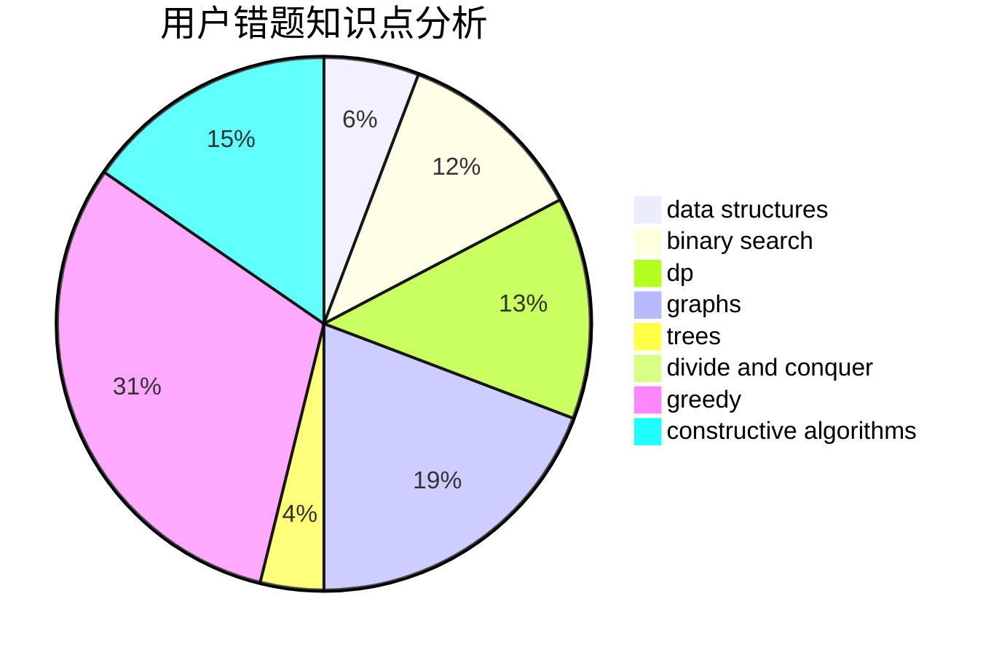

# QYitong

<!-- tabs:start -->

#### **用户提交结果分析**

#### **用户做题类型偏好分析**

#### **用户错题知识点分析**

<!-- tabs:end -->
# 推荐题目
[579A](https://codeforces.com/contest/579/problem/A)		bitmasks		  
[13352](https://codeforces.com/contest/1335/problem/2)		dsu,graphs,sortings,trees		  
[1030B](https://codeforces.com/contest/1030/problem/B)		geometry		  
[707B](https://codeforces.com/contest/707/problem/B)		graphs		  
[11951](https://codeforces.com/contest/1195/problem/1)		dsu,graphs,sortings,trees		  
[1408H](https://codeforces.com/contest/1408/problem/H)		binary search,
                        data structures,
                        flows,
                        greedy		  
[1252F](https://codeforces.com/contest/1252/problem/F)		hashing,
                        trees		  
[821B](https://codeforces.com/contest/821/problem/B)		brute force,
                        math		  
[1062F](https://codeforces.com/contest/1062/problem/F)		dfs and similar,
                        graphs		  
[669C](https://codeforces.com/contest/669/problem/C)		dsu,graphs,sortings,trees		  
