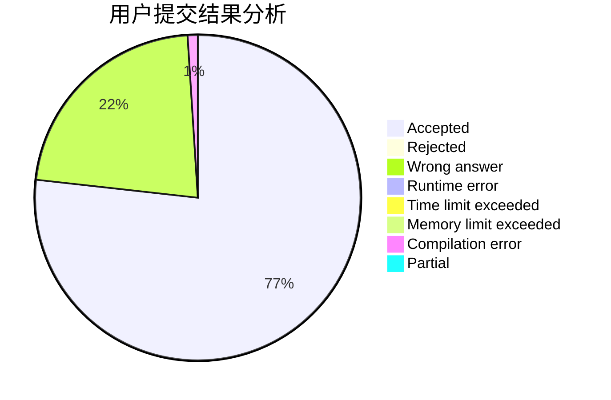
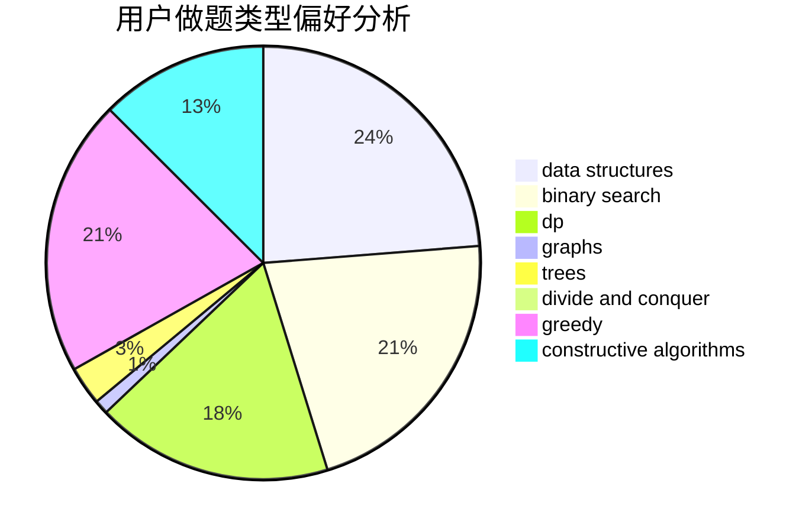
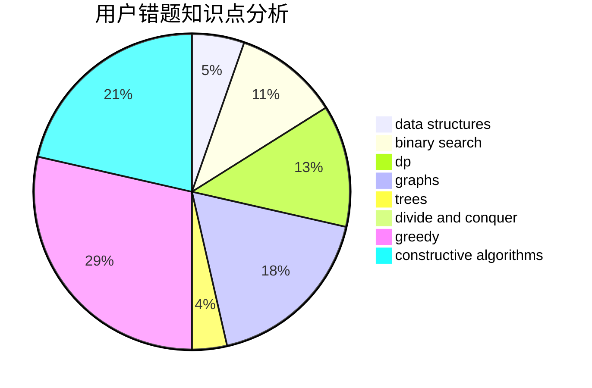

# QYitong

<!-- tabs:start -->

#### **用户提交结果分析**

#### **用户做题类型偏好分析**

#### **用户错题知识点分析**

<!-- tabs:end -->
# 推荐题目
[553E](https://codeforces.com/contest/553/problem/E)		dp,
                        fft,
                        graphs,
                        math,
                        probabilities		  
[1328F](https://codeforces.com/contest/1328/problem/F)		greedy		  
[102A](https://codeforces.com/contest/102/problem/A)		brute force		  
[683A](https://codeforces.com/contest/683/problem/A)		*special problem,
                        geometry		  
[1189D2](https://codeforces.com/contest/1189D/problem/2)		dsu,graphs,sortings,trees		  
[1399F](https://codeforces.com/contest/1399/problem/F)		data structures,
                        dp,
                        graphs,
                        sortings		  
[1248D2](https://codeforces.com/contest/1248D/problem/2)		dsu,graphs,sortings,trees		  
[805A](https://codeforces.com/contest/805/problem/A)		greedy,
                        math		  
[1062C](https://codeforces.com/contest/1062/problem/C)		greedy,
                        implementation,
                        math		  
[639E](https://codeforces.com/contest/639/problem/E)		binary search,
                        greedy,
                        math,
                        sortings		  
