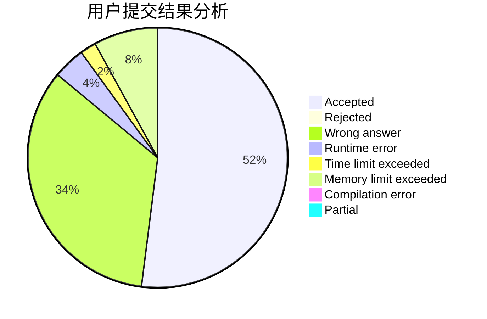
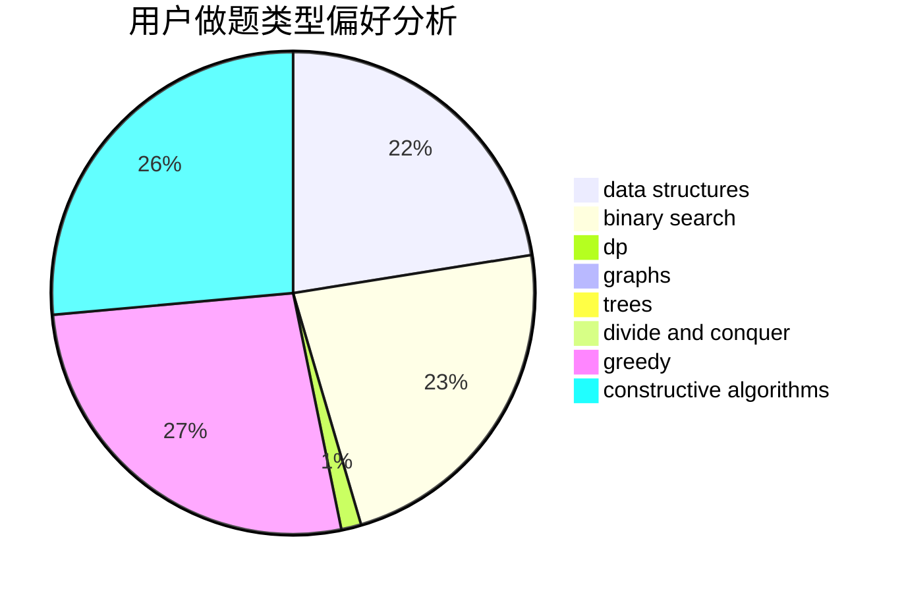
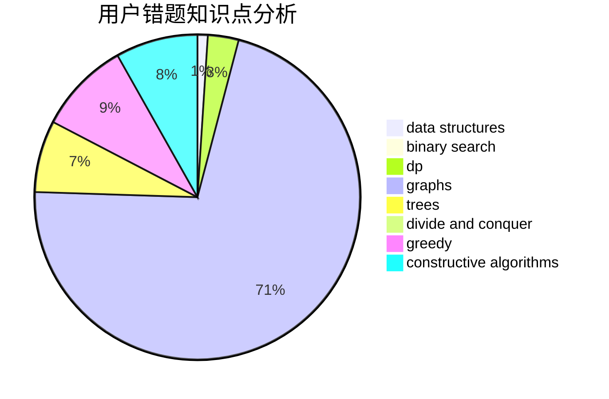

# QYitong2

<!-- tabs:start -->

#### **用户提交结果分析**

#### **用户做题类型偏好分析**

#### **用户错题知识点分析**

<!-- tabs:end -->
# 推荐题目
[1332E](https://codeforces.com/contest/1332/problem/E)		combinatorics,
                        constructive algorithms,
                        math,
                        matrices		  
[1139D](https://codeforces.com/contest/1139/problem/D)		dp,
                        math,
                        number theory,
                        probabilities		  
[1450H1](https://codeforces.com/contest/1450H/problem/1)		combinatorics,
                        fft,
                        math		  
[965E](https://codeforces.com/contest/965/problem/E)		data structures,
                        dp,
                        greedy,
                        strings,
                        trees		  
[735A](https://codeforces.com/contest/735/problem/A)		implementation,
                        strings		  
[1388B](https://codeforces.com/contest/1388/problem/B)		greedy,
                        math		  
[319D](https://codeforces.com/contest/319/problem/D)		greedy,
                        hashing,
                        string suffix structures,
                        strings		  
[226E](https://codeforces.com/contest/226/problem/E)		data structures,
                        trees		  
[948A](https://codeforces.com/contest/948/problem/A)		brute force,
                        dfs and similar,
                        graphs,
                        implementation		  
[1305E](https://codeforces.com/contest/1305/problem/E)		constructive algorithms,
                        greedy,
                        implementation,
                        math		  
