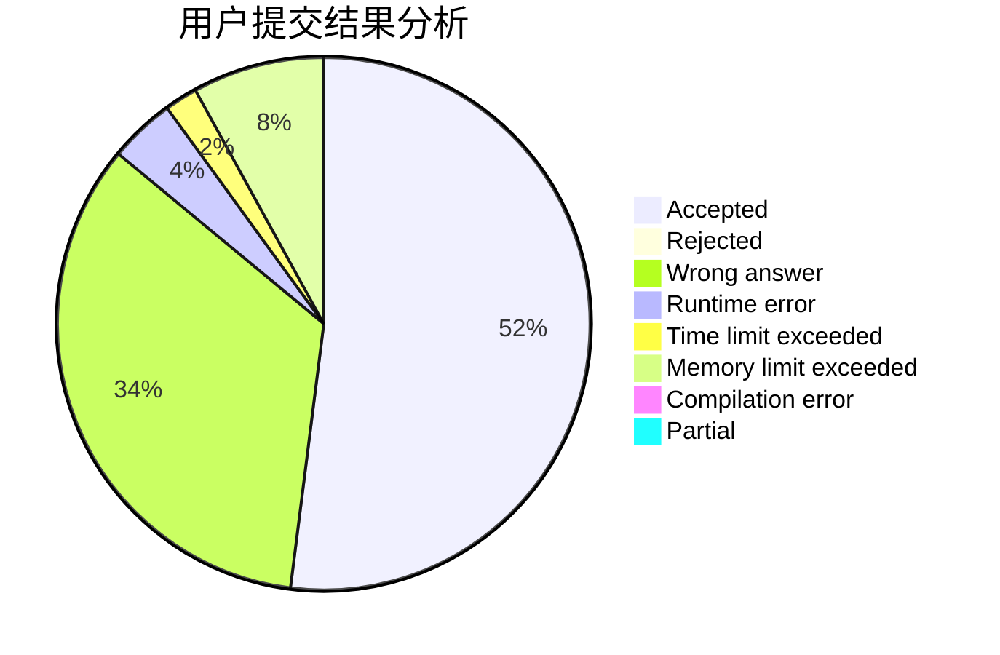
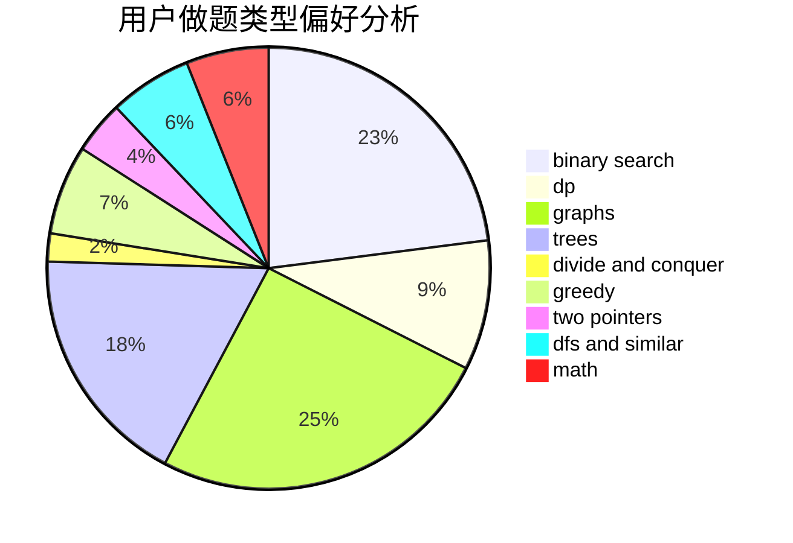

# QYitong2

<!-- tabs:start -->

#### **用户提交结果分析**

#### **用户做题类型偏好分析**

<!-- tabs:end -->
# 推荐题目
[1339B](https://codeforces.com/contest/1339/problem/B)
[11411](https://codeforces.com/contest/1141/problem/1)
[1459E](https://codeforces.com/contest/1459/problem/E)
[987E](https://codeforces.com/contest/987/problem/E)
[755G](https://codeforces.com/contest/755/problem/G)
[1397E](https://codeforces.com/contest/1397/problem/E)
[34D](https://codeforces.com/contest/34/problem/D)
[246A](https://codeforces.com/contest/246/problem/A)
[965B](https://codeforces.com/contest/965/problem/B)
[1314D](https://codeforces.com/contest/1314/problem/D)
