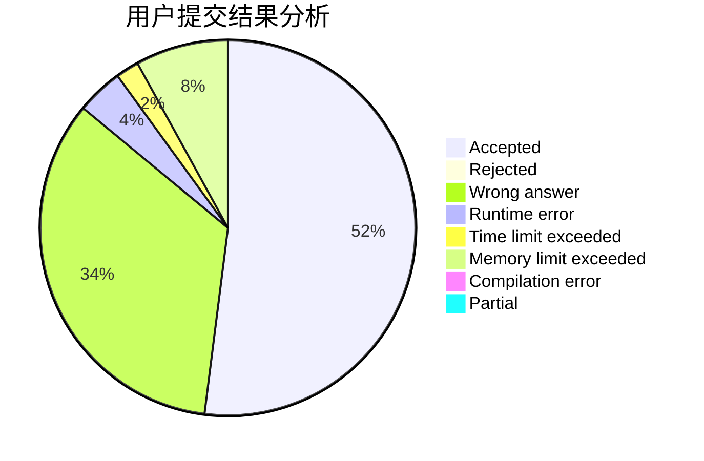
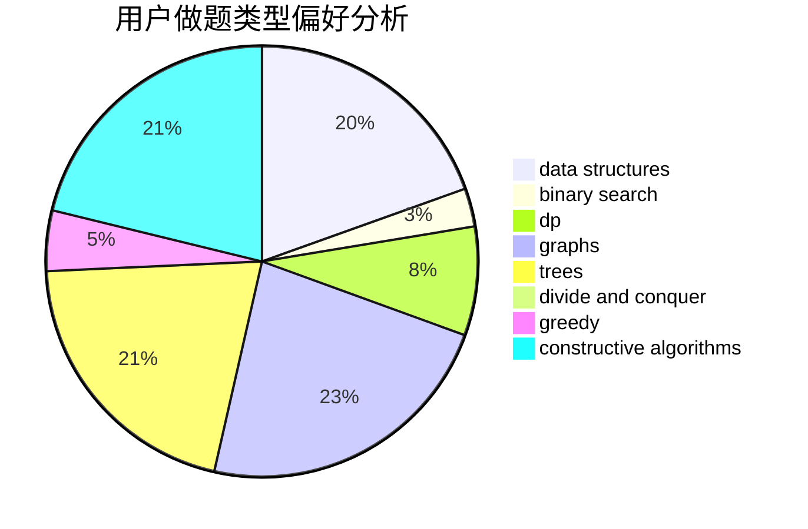
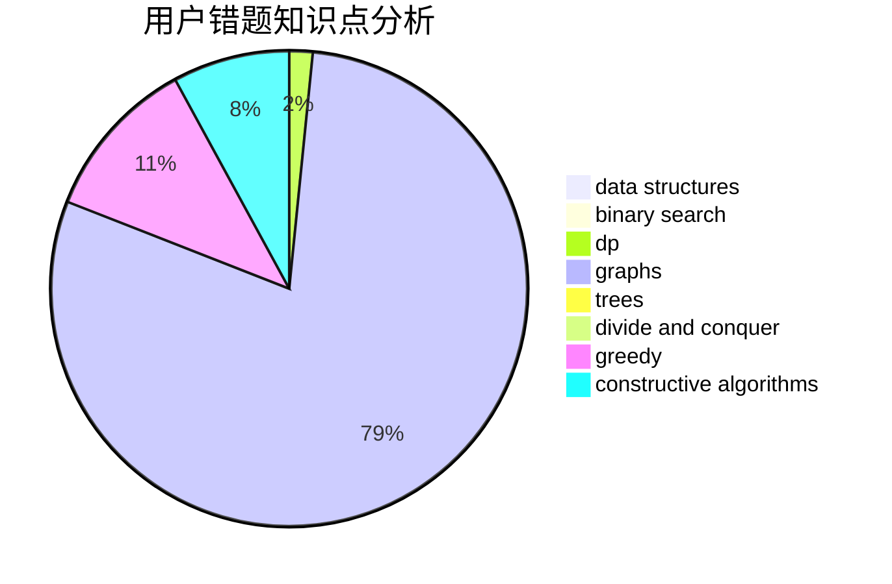

# QYitong2

<!-- tabs:start -->

#### **用户提交结果分析**

#### **用户做题类型偏好分析**

#### **用户错题知识点分析**

<!-- tabs:end -->
# 推荐题目
[1339B](https://codeforces.com/contest/1339/problem/B)		constructive algorithms,
                        sortings		  
[11411](https://codeforces.com/contest/1141/problem/1)		dsu,graphs,sortings,trees		  
[1459E](https://codeforces.com/contest/1459/problem/E)		dsu,graphs,sortings,trees		  
[987E](https://codeforces.com/contest/987/problem/E)		dsu,graphs,sortings,trees		  
[755G](https://codeforces.com/contest/755/problem/G)		combinatorics,
                        divide and conquer,
                        dp,
                        fft,
                        math,
                        number theory		  
[1397E](https://codeforces.com/contest/1397/problem/E)		dsu,graphs,sortings,trees		  
[34D](https://codeforces.com/contest/34/problem/D)		dfs and similar,
                        graphs		  
[246A](https://codeforces.com/contest/246/problem/A)		constructive algorithms,
                        greedy,
                        sortings		  
[965B](https://codeforces.com/contest/965/problem/B)		implementation		  
[1314D](https://codeforces.com/contest/1314/problem/D)		dsu,graphs,sortings,trees		  
