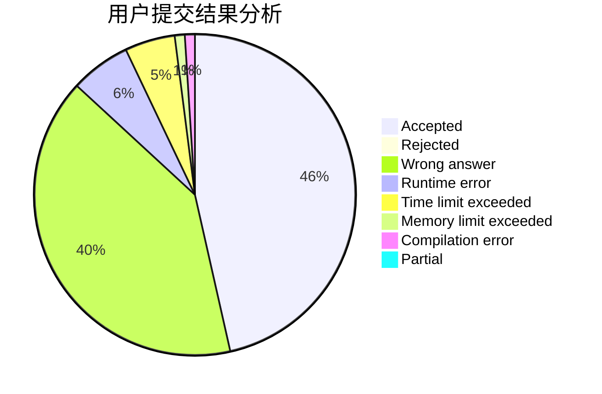
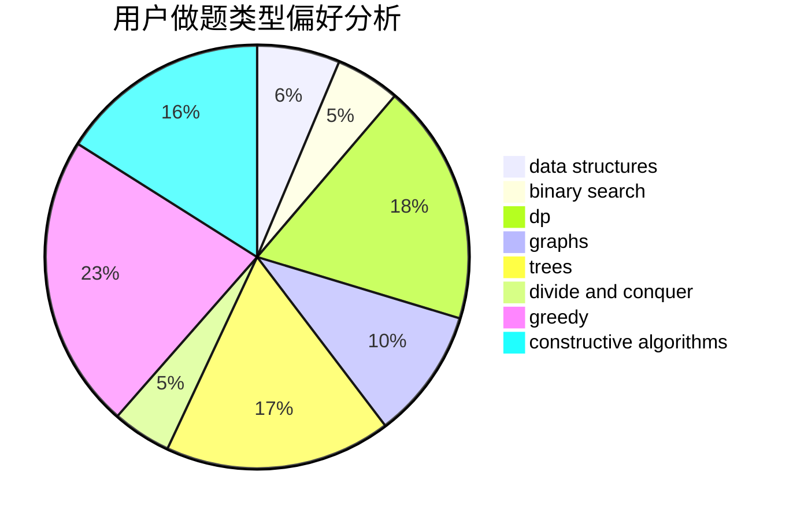
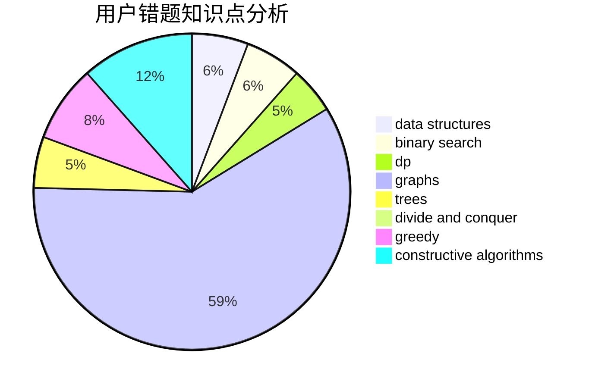

# QZSRY

<!-- tabs:start -->

#### **用户提交结果分析**

#### **用户做题类型偏好分析**

#### **用户错题知识点分析**

<!-- tabs:end -->
# 推荐题目
[1433C](https://codeforces.com/contest/1433/problem/C)		constructive algorithms,
                        greedy		  
[485D](https://codeforces.com/contest/485/problem/D)		dsu,graphs,sortings,trees		  
[1446C](https://codeforces.com/contest/1446/problem/C)		binary search,
                        bitmasks,
                        data structures,
                        divide and conquer,
                        dp,
                        trees		  
[1016D](https://codeforces.com/contest/1016/problem/D)		constructive algorithms,
                        flows,
                        math		  
[773E](https://codeforces.com/contest/773/problem/E)		data structures,
                        sortings		  
[525B](https://codeforces.com/contest/525/problem/B)		constructive algorithms,
                        greedy,
                        math,
                        strings		  
[1092F](https://codeforces.com/contest/1092/problem/F)		dfs and similar,
                        dp,
                        trees		  
[622B](https://codeforces.com/contest/622/problem/B)		implementation		  
[682D](https://codeforces.com/contest/682/problem/D)		dp,
                        strings		  
[909F](https://codeforces.com/contest/909/problem/F)		constructive algorithms		  
