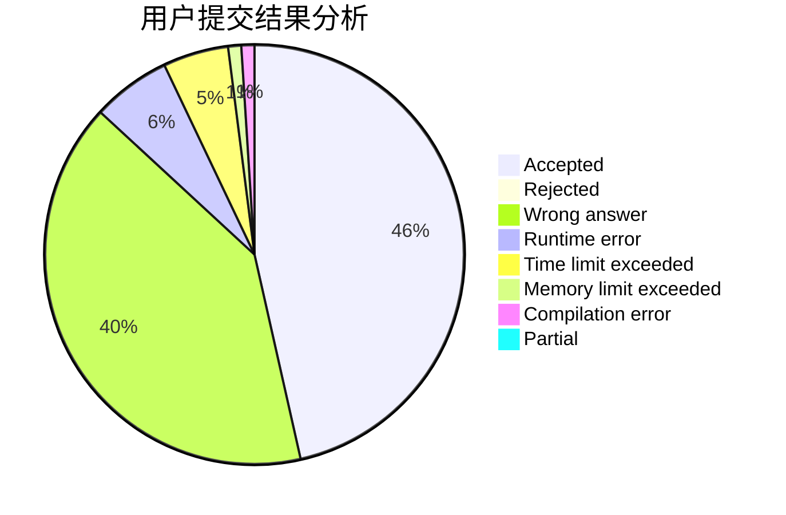
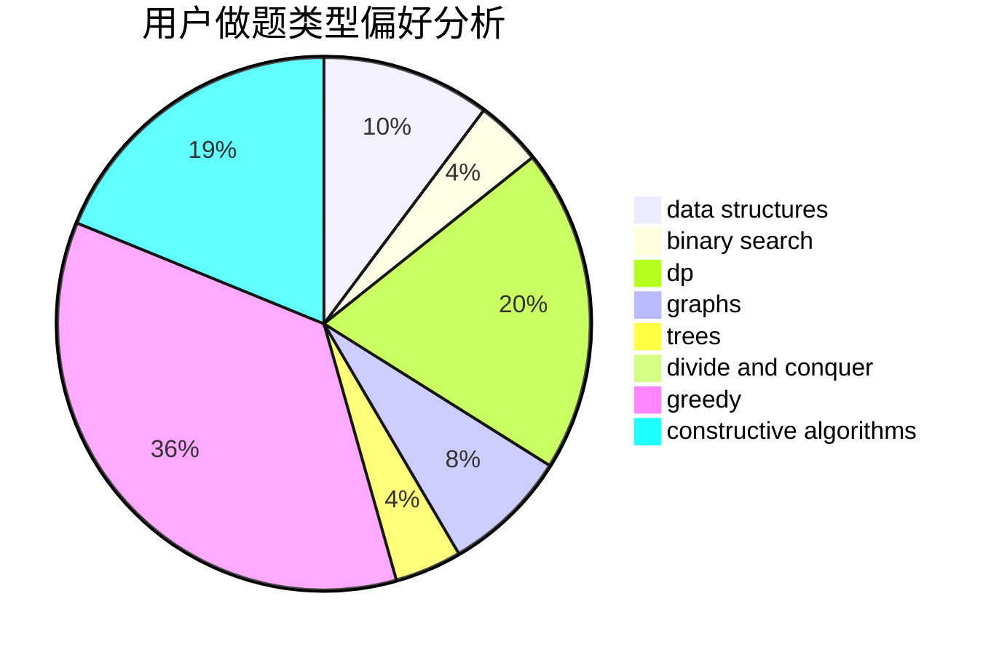
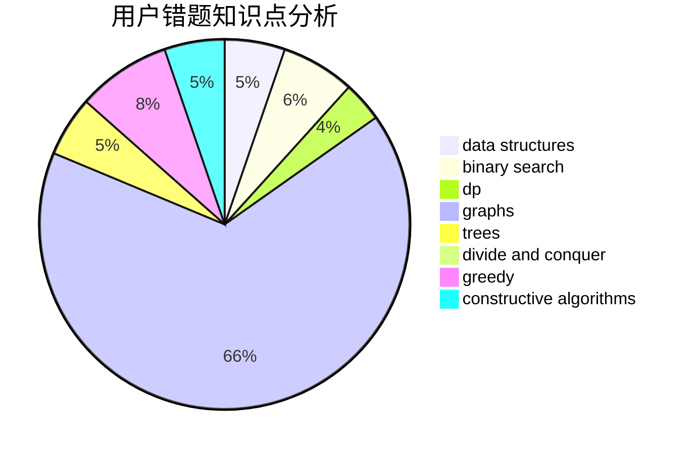

# QZSRY

<!-- tabs:start -->

#### **用户提交结果分析**

#### **用户做题类型偏好分析**

#### **用户错题知识点分析**

<!-- tabs:end -->
# 推荐题目
[1443B](https://codeforces.com/contest/1443/problem/B)		dp,
                        greedy,
                        math,
                        sortings		  
[506C](https://codeforces.com/contest/506/problem/C)		dsu,graphs,sortings,trees		  
[1455E](https://codeforces.com/contest/1455/problem/E)		brute force,
                        constructive algorithms,
                        flows,
                        geometry,
                        greedy,
                        implementation,
                        math,
                        ternary search		  
[1016G](https://codeforces.com/contest/1016/problem/G)		bitmasks,
                        math,
                        number theory		  
[792E](https://codeforces.com/contest/792/problem/E)		greedy,
                        math,
                        number theory		  
[549E](https://codeforces.com/contest/549/problem/E)		geometry,
                        math		  
[1093C](https://codeforces.com/contest/1093/problem/C)		greedy		  
[650B](https://codeforces.com/contest/650/problem/B)		binary search,
                        brute force,
                        dp,
                        two pointers		  
[706E](https://codeforces.com/contest/706/problem/E)		data structures,
                        implementation		  
[924D](https://codeforces.com/contest/924/problem/D)		nan		  
