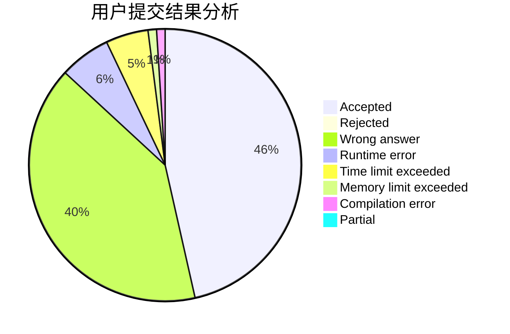
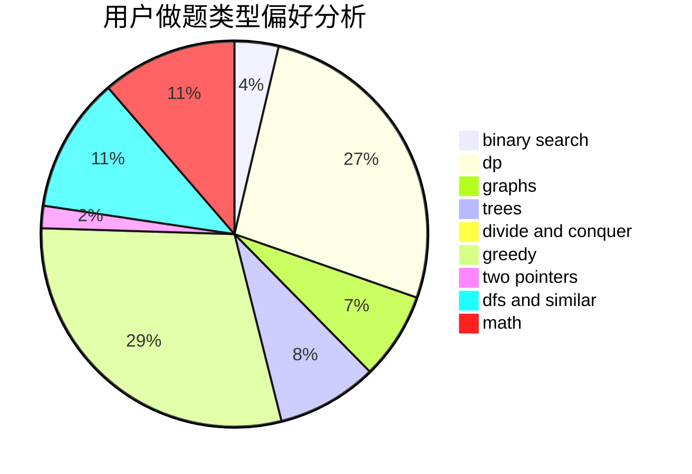

# QZSRY

<!-- tabs:start -->

#### **用户提交结果分析**

#### **用户做题类型偏好分析**

<!-- tabs:end -->
# 推荐题目
[1443B](https://codeforces.com/contest/1443/problem/B)
[506C](https://codeforces.com/contest/506/problem/C)
[1455E](https://codeforces.com/contest/1455/problem/E)
[1016G](https://codeforces.com/contest/1016/problem/G)
[792E](https://codeforces.com/contest/792/problem/E)
[549E](https://codeforces.com/contest/549/problem/E)
[1093C](https://codeforces.com/contest/1093/problem/C)
[650B](https://codeforces.com/contest/650/problem/B)
[706E](https://codeforces.com/contest/706/problem/E)
[924D](https://codeforces.com/contest/924/problem/D)
