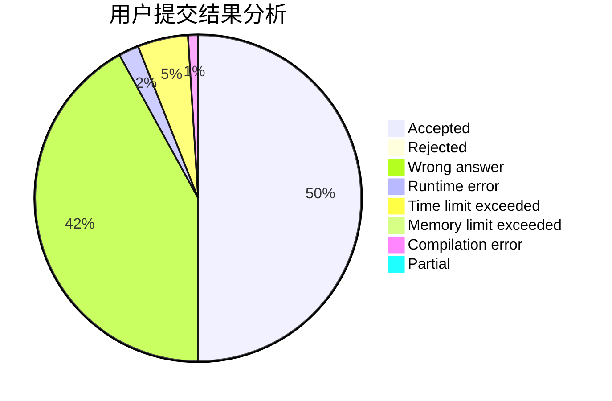
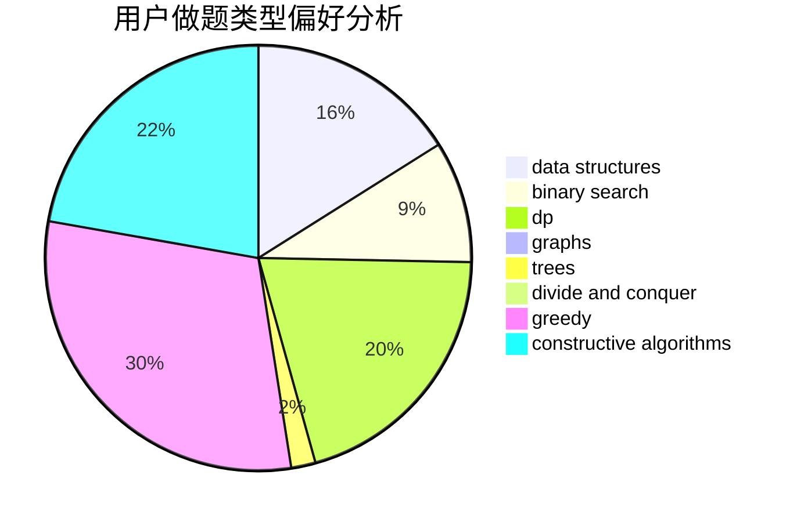
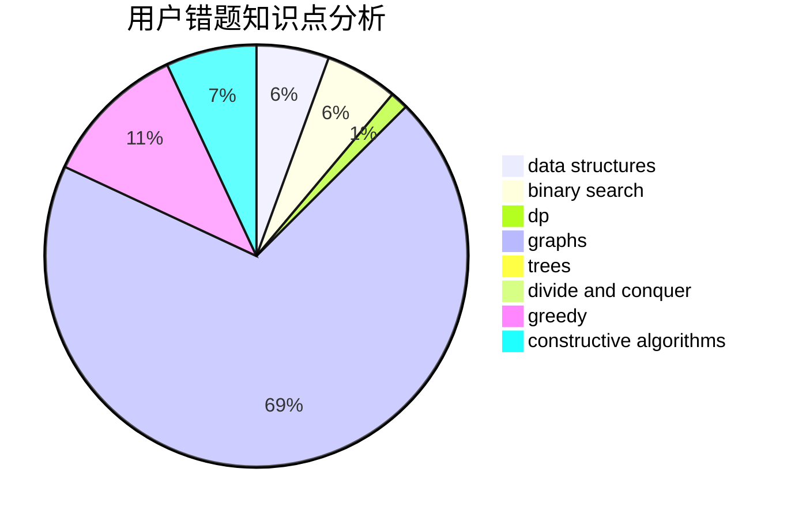

# Q_W_Q

<!-- tabs:start -->

#### **用户提交结果分析**

#### **用户做题类型偏好分析**

#### **用户错题知识点分析**

<!-- tabs:end -->
# 推荐题目
[453D](https://codeforces.com/contest/453/problem/D)		dp,
                        matrices		  
[451A](https://codeforces.com/contest/451/problem/A)		implementation		  
[716B](https://codeforces.com/contest/716/problem/B)		greedy,
                        two pointers		  
[1362E](https://codeforces.com/contest/1362/problem/E)		dsu,graphs,sortings,trees		  
[698C](https://codeforces.com/contest/698/problem/C)		bitmasks,
                        dp,
                        math,
                        probabilities		  
[890C](https://codeforces.com/contest/890/problem/C)		dsu,graphs,sortings,trees		  
[802H](https://codeforces.com/contest/802/problem/H)		constructive algorithms,
                        strings		  
[11631](https://codeforces.com/contest/1163/problem/1)		dsu,graphs,sortings,trees		  
[819A](https://codeforces.com/contest/819/problem/A)		games,
                        greedy		  
[1444D](https://codeforces.com/contest/1444/problem/D)		constructive algorithms,
                        dp,
                        geometry		  
