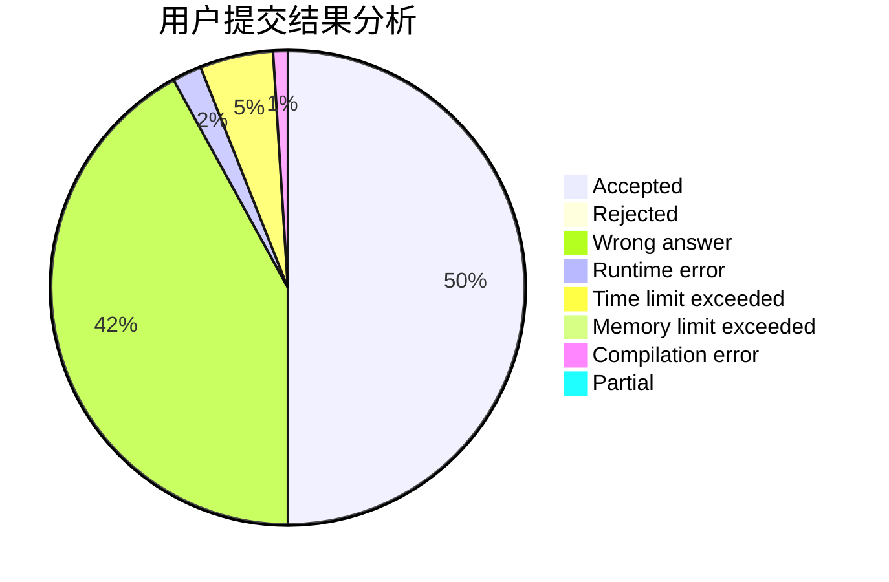
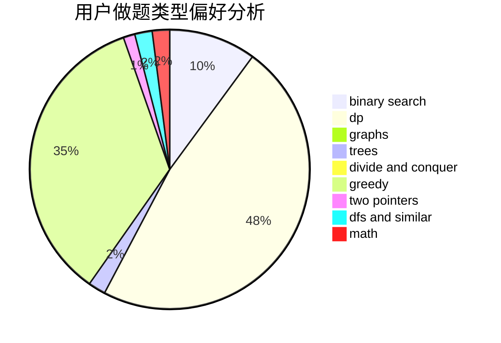

# Q_W_Q

<!-- tabs:start -->

#### **用户提交结果分析**

#### **用户做题类型偏好分析**

<!-- tabs:end -->
# 推荐题目
[453D](https://codeforces.com/contest/453/problem/D)
[451A](https://codeforces.com/contest/451/problem/A)
[716B](https://codeforces.com/contest/716/problem/B)
[1362E](https://codeforces.com/contest/1362/problem/E)
[698C](https://codeforces.com/contest/698/problem/C)
[890C](https://codeforces.com/contest/890/problem/C)
[802H](https://codeforces.com/contest/802/problem/H)
[11631](https://codeforces.com/contest/1163/problem/1)
[819A](https://codeforces.com/contest/819/problem/A)
[1444D](https://codeforces.com/contest/1444/problem/D)
