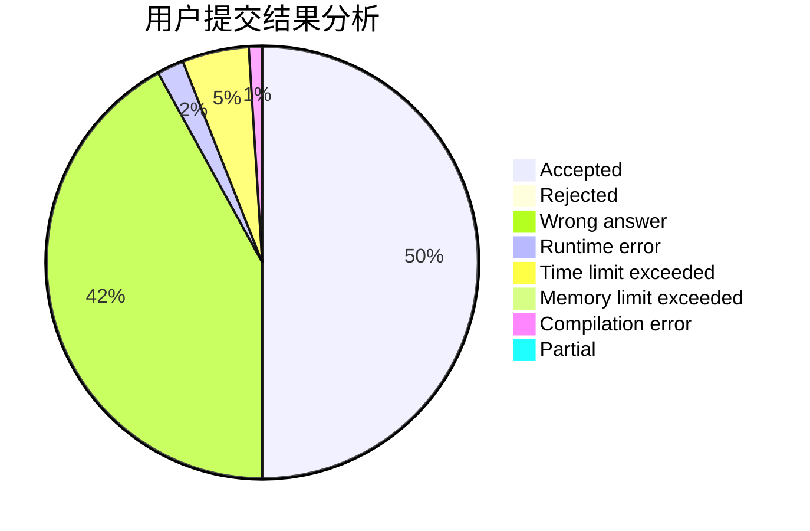
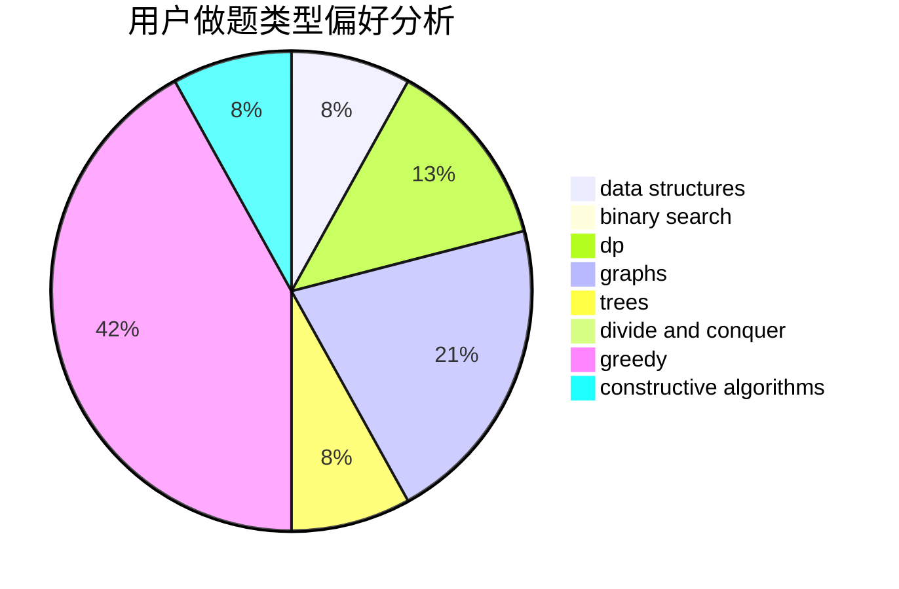
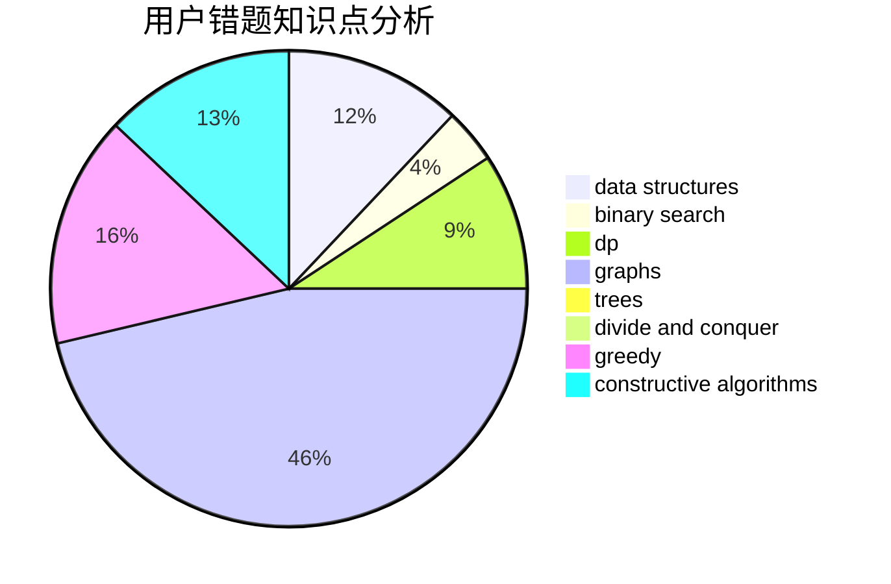

# Q_W_Q

<!-- tabs:start -->

#### **用户提交结果分析**

#### **用户做题类型偏好分析**

#### **用户错题知识点分析**

<!-- tabs:end -->
# 推荐题目
[432D](https://codeforces.com/contest/432/problem/D)		dp,
                        string suffix structures,
                        strings,
                        two pointers		  
[429E](https://codeforces.com/contest/429/problem/E)		graphs		  
[699C](https://codeforces.com/contest/699/problem/C)		dsu,graphs,sortings,trees		  
[1355F](https://codeforces.com/contest/1355/problem/F)		constructive algorithms,
                        interactive,
                        number theory		  
[672B](https://codeforces.com/contest/672/problem/B)		constructive algorithms,
                        implementation,
                        strings		  
[870B](https://codeforces.com/contest/870/problem/B)		greedy		  
[785C](https://codeforces.com/contest/785/problem/C)		binary search,
                        math		  
[115B](https://codeforces.com/contest/115/problem/B)		greedy,
                        sortings		  
[803C](https://codeforces.com/contest/803/problem/C)		constructive algorithms,
                        greedy,
                        math		  
[1434D](https://codeforces.com/contest/1434/problem/D)		dsu,graphs,sortings,trees		  
