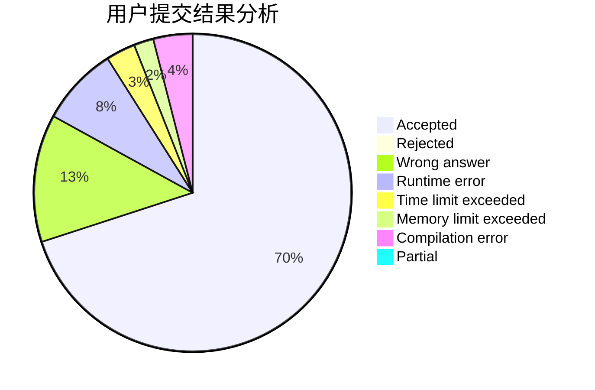
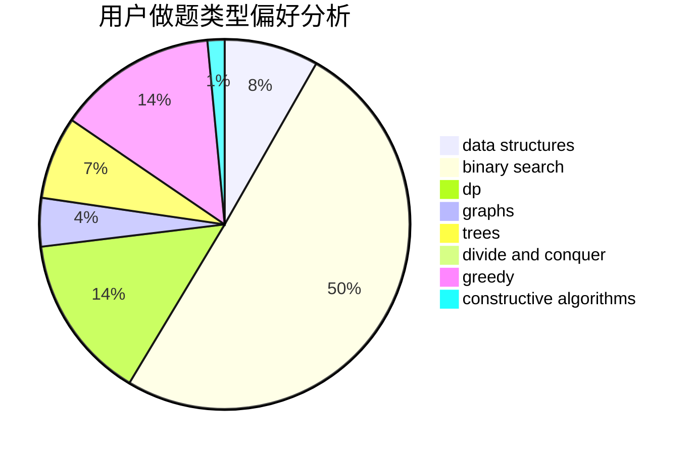
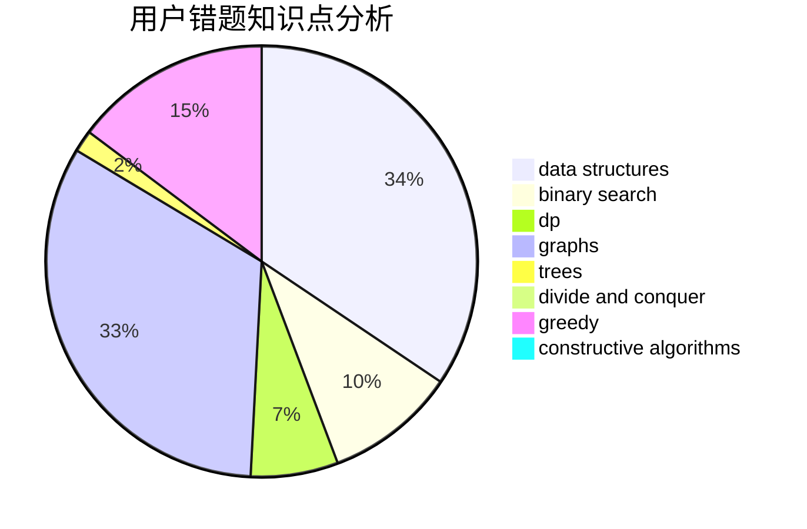

# QiHai_

<!-- tabs:start -->

#### **用户提交结果分析**

#### **用户做题类型偏好分析**

#### **用户错题知识点分析**

<!-- tabs:end -->
# 推荐题目
[555C](https://codeforces.com/contest/555/problem/C)		data structures		  
[467A](https://codeforces.com/contest/467/problem/A)		implementation		  
[44E](https://codeforces.com/contest/44/problem/E)		dp		  
[992D](https://codeforces.com/contest/992/problem/D)		brute force,
                        implementation,
                        math		  
[1083B](https://codeforces.com/contest/1083/problem/B)		greedy,
                        strings		  
[822A](https://codeforces.com/contest/822/problem/A)		implementation,
                        math,
                        number theory		  
[181B](https://codeforces.com/contest/181/problem/B)		binary search,
                        brute force		  
[1176E](https://codeforces.com/contest/1176/problem/E)		dfs and similar,
                        dsu,
                        graphs,
                        shortest paths,
                        trees		  
[1165B](https://codeforces.com/contest/1165/problem/B)		data structures,
                        greedy,
                        sortings		  
[498B](https://codeforces.com/contest/498/problem/B)		dp,
                        probabilities,
                        two pointers		  
