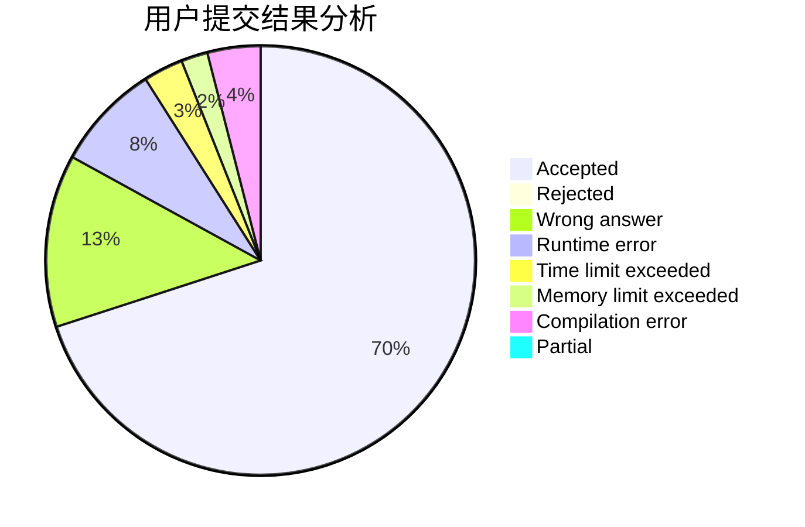
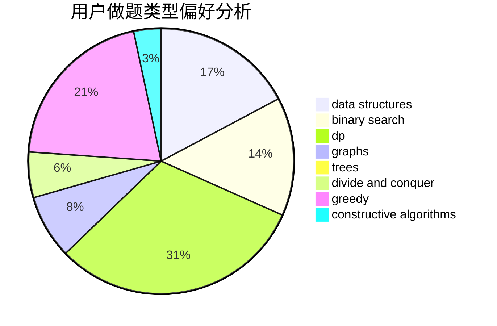
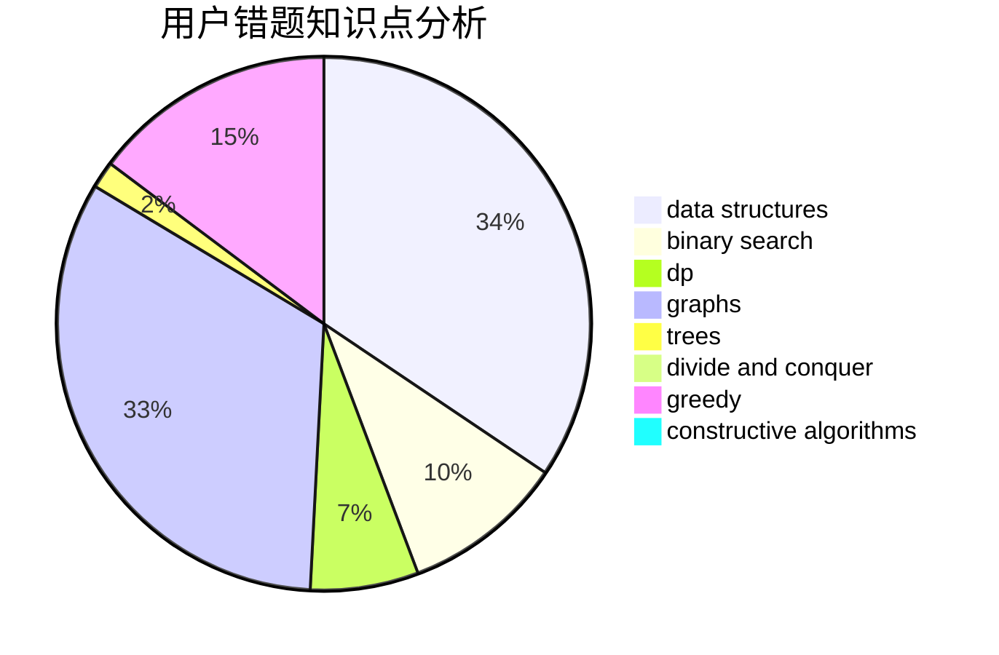

# QiHai_

<!-- tabs:start -->

#### **用户提交结果分析**

#### **用户做题类型偏好分析**

#### **用户错题知识点分析**

<!-- tabs:end -->
# 推荐题目
[533E](https://codeforces.com/contest/533/problem/E)		constructive algorithms,
                        dp,
                        greedy,
                        hashing,
                        strings,
                        two pointers		  
[446E](https://codeforces.com/contest/446/problem/E)		math,
                        matrices		  
[429A](https://codeforces.com/contest/429/problem/A)		dfs and similar,
                        trees		  
[978F](https://codeforces.com/contest/978/problem/F)		binary search,
                        data structures,
                        implementation		  
[1082F](https://codeforces.com/contest/1082/problem/F)		dp,
                        strings,
                        trees		  
[805D](https://codeforces.com/contest/805/problem/D)		dsu,graphs,sortings,trees		  
[15A](https://codeforces.com/contest/15/problem/A)		implementation,
                        sortings		  
[1174C](https://codeforces.com/contest/1174/problem/C)		constructive algorithms,
                        number theory		  
[1163F](https://codeforces.com/contest/1163/problem/F)		data structures,
                        graphs,
                        shortest paths		  
[478B](https://codeforces.com/contest/478/problem/B)		combinatorics,
                        constructive algorithms,
                        greedy,
                        math		  
