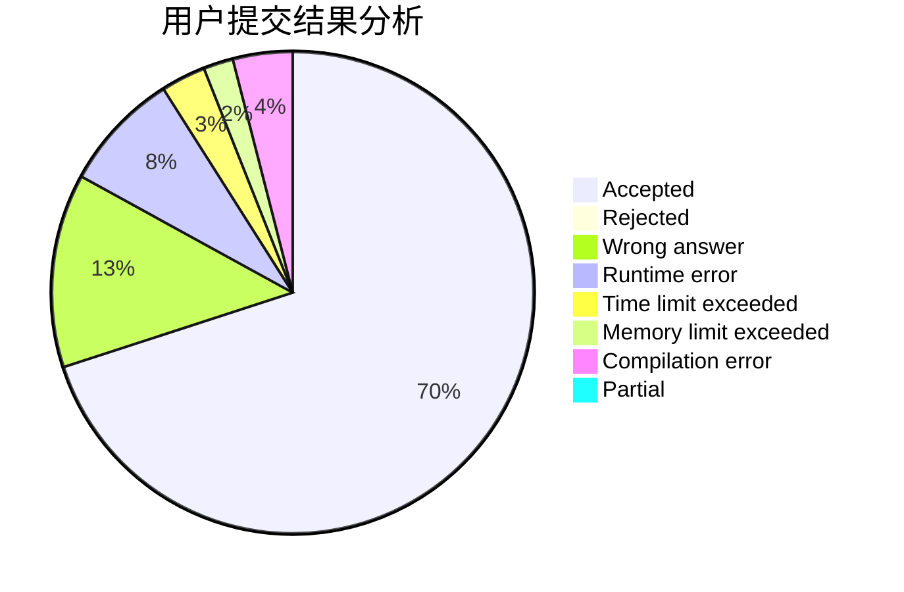
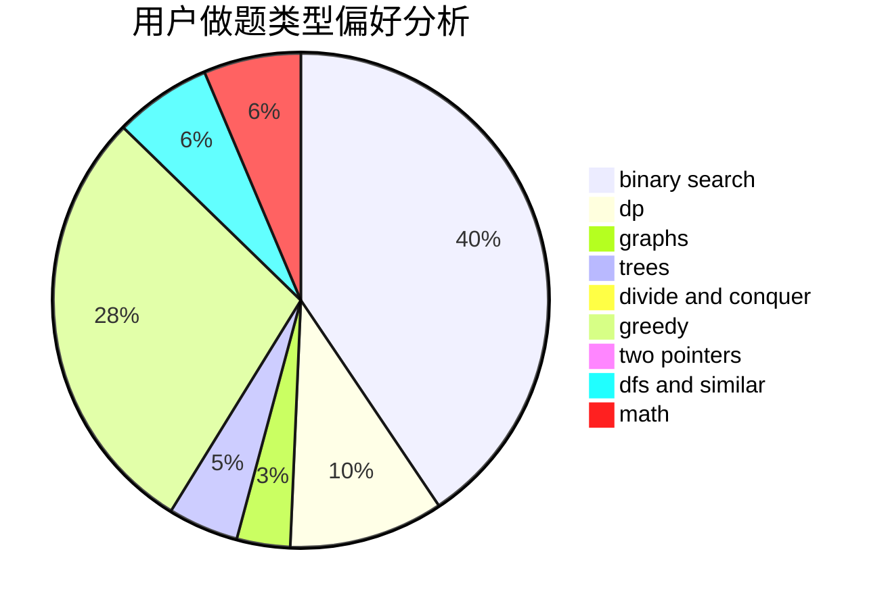

# QiHai_

<!-- tabs:start -->

#### **用户提交结果分析**

#### **用户做题类型偏好分析**

<!-- tabs:end -->
# 推荐题目
[555C](https://codeforces.com/contest/555/problem/C)
[467A](https://codeforces.com/contest/467/problem/A)
[44E](https://codeforces.com/contest/44/problem/E)
[992D](https://codeforces.com/contest/992/problem/D)
[1083B](https://codeforces.com/contest/1083/problem/B)
[822A](https://codeforces.com/contest/822/problem/A)
[181B](https://codeforces.com/contest/181/problem/B)
[1176E](https://codeforces.com/contest/1176/problem/E)
[1165B](https://codeforces.com/contest/1165/problem/B)
[498B](https://codeforces.com/contest/498/problem/B)
