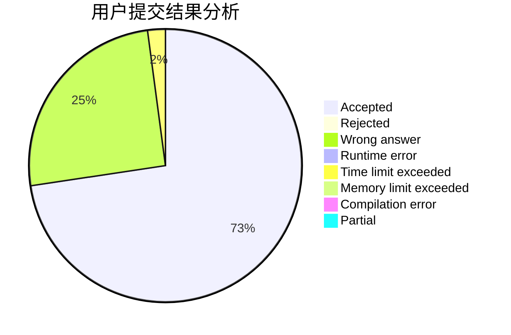
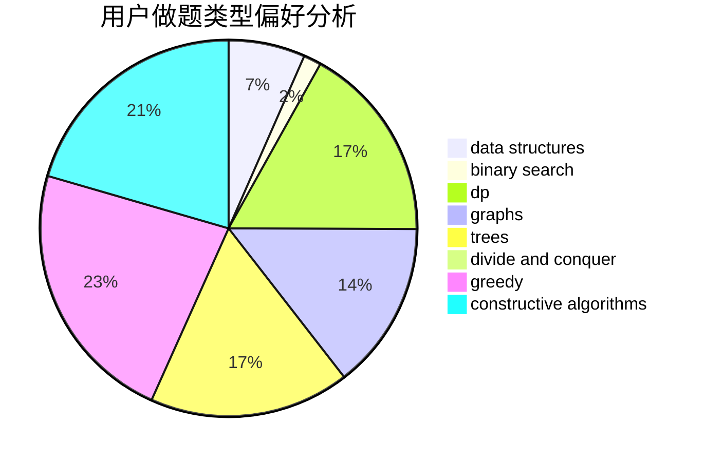
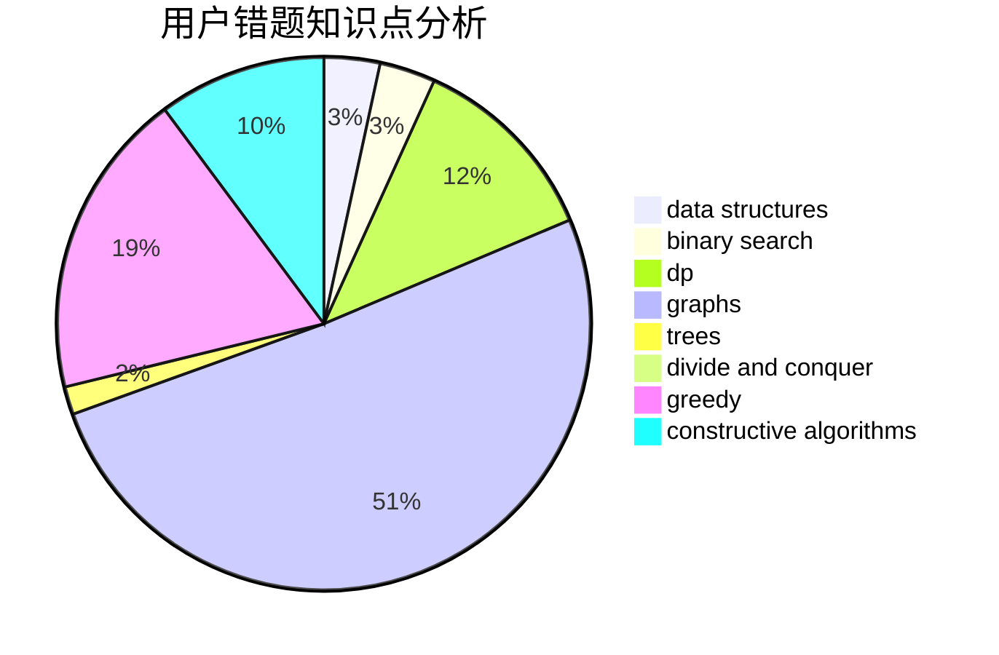

# ACkingdom

<!-- tabs:start -->

#### **用户提交结果分析**

#### **用户做题类型偏好分析**

#### **用户错题知识点分析**

<!-- tabs:end -->
# 推荐题目
[1472C](https://codeforces.com/contest/1472/problem/C)		dp,
                        graphs		  
[1488F](https://codeforces.com/contest/1488/problem/F)		*special problem,
                        *special problem,
                        binary search,
                        data structures		  
[1102A](https://codeforces.com/contest/1102/problem/A)		math		  
[1185D](https://codeforces.com/contest/1185/problem/D)		implementation,
                        math		  
[1488B](https://codeforces.com/contest/1488/problem/B)		*special problem,
                        greedy		  
[1488G](https://codeforces.com/contest/1488/problem/G)		*special problem,
                        data structures,
                        greedy,
                        number theory		  
[1488E](https://codeforces.com/contest/1488/problem/E)		*special problem,
                        data structures,
                        dp		  
[1271F](https://codeforces.com/contest/1271/problem/F)		brute force		  
[1488H](https://codeforces.com/contest/1488/problem/H)		*special problem,
                        combinatorics,
                        data structures		  
[1489C](https://codeforces.com/contest/1489/problem/C)		dsu,graphs,sortings,trees		  
