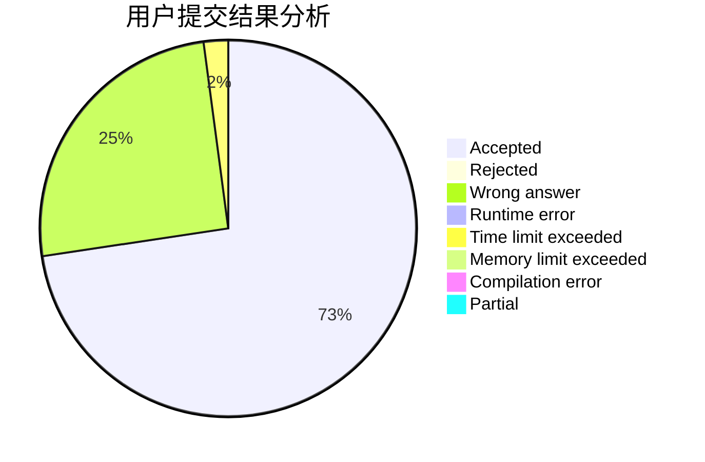
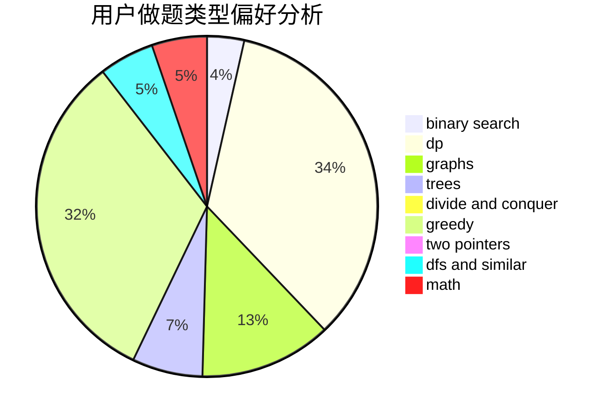

# ACkingdom

<!-- tabs:start -->

#### **用户提交结果分析**

#### **用户做题类型偏好分析**

<!-- tabs:end -->
# 推荐题目
[1472C](https://codeforces.com/contest/1472/problem/C)
[1488F](https://codeforces.com/contest/1488/problem/F)
[1102A](https://codeforces.com/contest/1102/problem/A)
[1185D](https://codeforces.com/contest/1185/problem/D)
[1488B](https://codeforces.com/contest/1488/problem/B)
[1488G](https://codeforces.com/contest/1488/problem/G)
[1488E](https://codeforces.com/contest/1488/problem/E)
[1271F](https://codeforces.com/contest/1271/problem/F)
[1488H](https://codeforces.com/contest/1488/problem/H)
[1489C](https://codeforces.com/contest/1489/problem/C)
