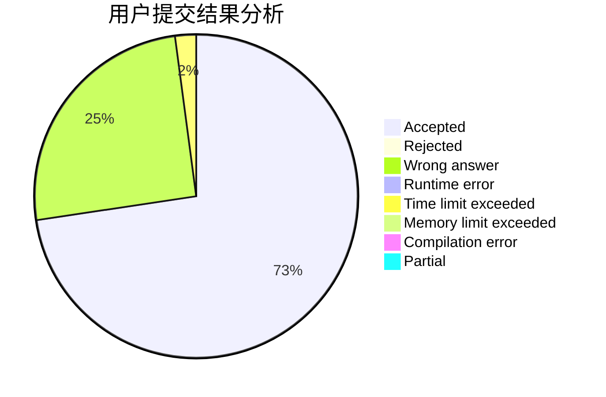
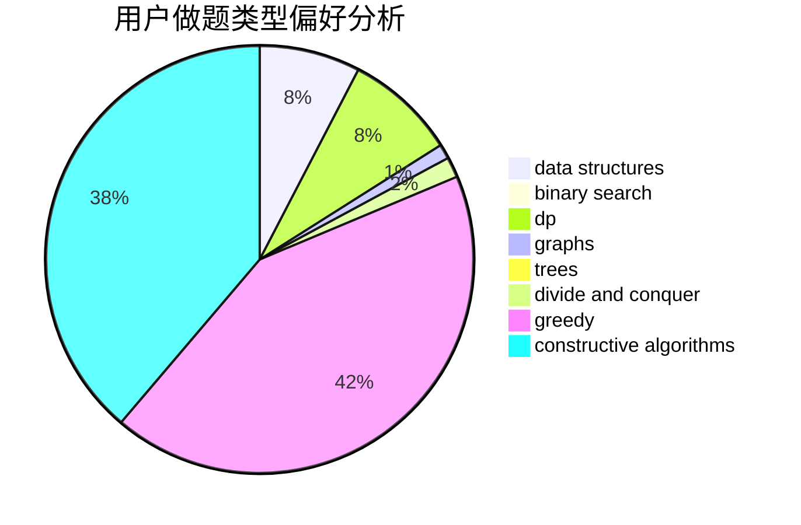
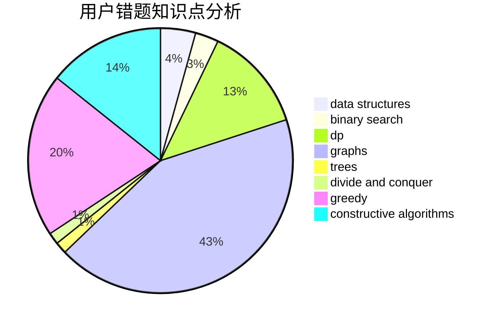

# ACkingdom

<!-- tabs:start -->

#### **用户提交结果分析**

#### **用户做题类型偏好分析**

#### **用户错题知识点分析**

<!-- tabs:end -->
# 推荐题目
[1465B](https://codeforces.com/contest/1465/problem/B)		dsu,graphs,sortings,trees		  
[1480B](https://codeforces.com/contest/1480/problem/B)		greedy,
                        implementation,
                        sortings		  
[1101E](https://codeforces.com/contest/1101/problem/E)		implementation		  
[1183A](https://codeforces.com/contest/1183/problem/A)		implementation		  
[1479D](https://codeforces.com/contest/1479/problem/D)		binary search,
                        bitmasks,
                        brute force,
                        data structures,
                        probabilities,
                        trees		  
[1480C](https://codeforces.com/contest/1480/problem/C)		dsu,graphs,sortings,trees		  
[1480A](https://codeforces.com/contest/1480/problem/A)		games,
                        greedy,
                        strings		  
[1266E](https://codeforces.com/contest/1266/problem/E)		data structures,
                        greedy,
                        implementation		  
[1480D1](https://codeforces.com/contest/1480D/problem/1)		dsu,graphs,sortings,trees		  
[1481A](https://codeforces.com/contest/1481/problem/A)		greedy,
                        strings		  
