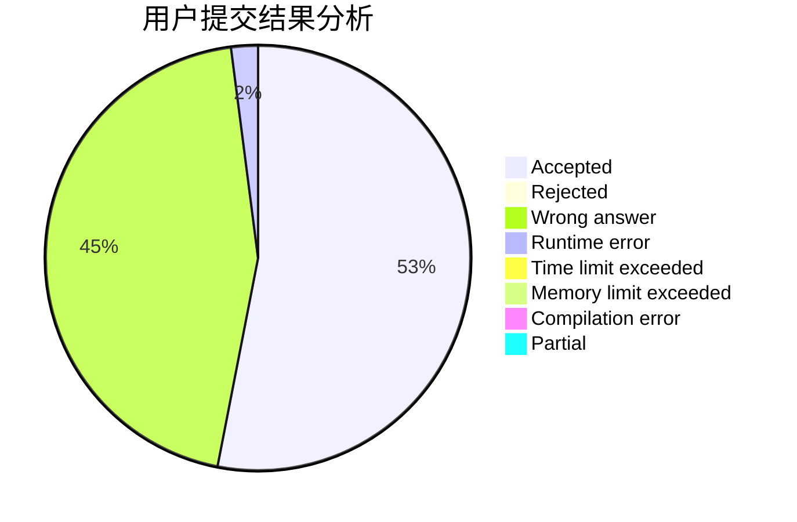
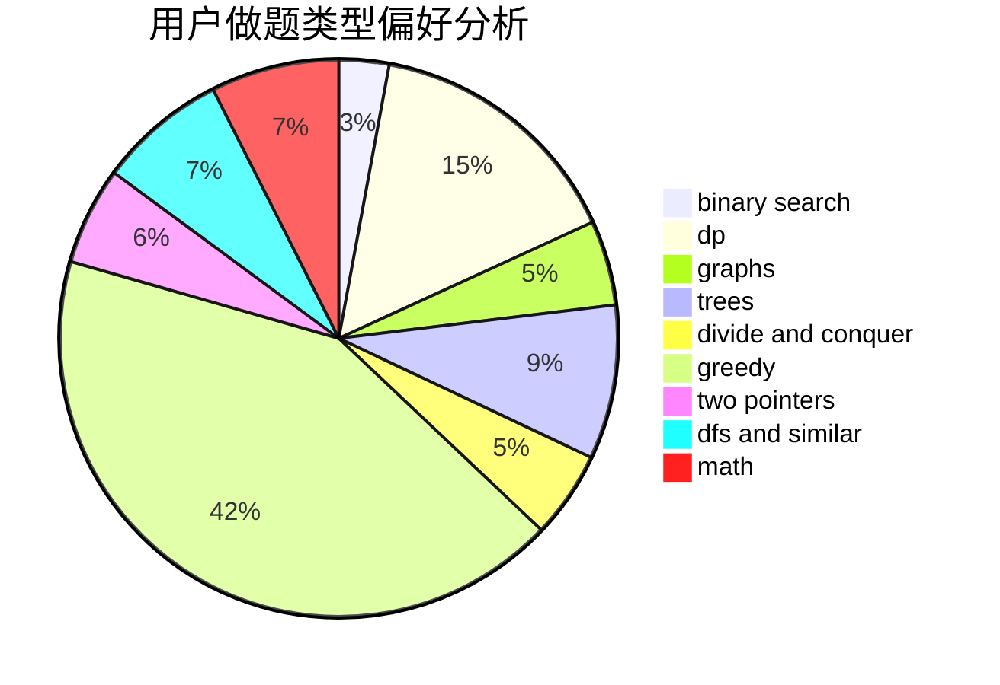

# Qian_2333

<!-- tabs:start -->

#### **用户提交结果分析**

#### **用户做题类型偏好分析**

<!-- tabs:end -->
# 推荐题目
[653F](https://codeforces.com/contest/653/problem/F)
[1386C](https://codeforces.com/contest/1386/problem/C)
[1300A](https://codeforces.com/contest/1300/problem/A)
[1213G](https://codeforces.com/contest/1213/problem/G)
[1444E](https://codeforces.com/contest/1444/problem/E)
[959E](https://codeforces.com/contest/959/problem/E)
[734D](https://codeforces.com/contest/734/problem/D)
[1061F](https://codeforces.com/contest/1061/problem/F)
[1201A](https://codeforces.com/contest/1201/problem/A)
[350B](https://codeforces.com/contest/350/problem/B)
