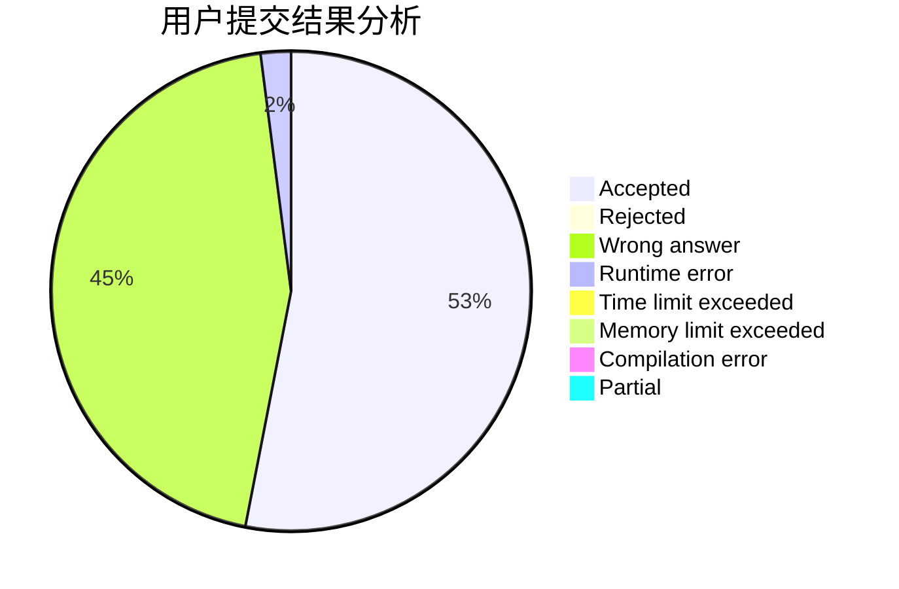
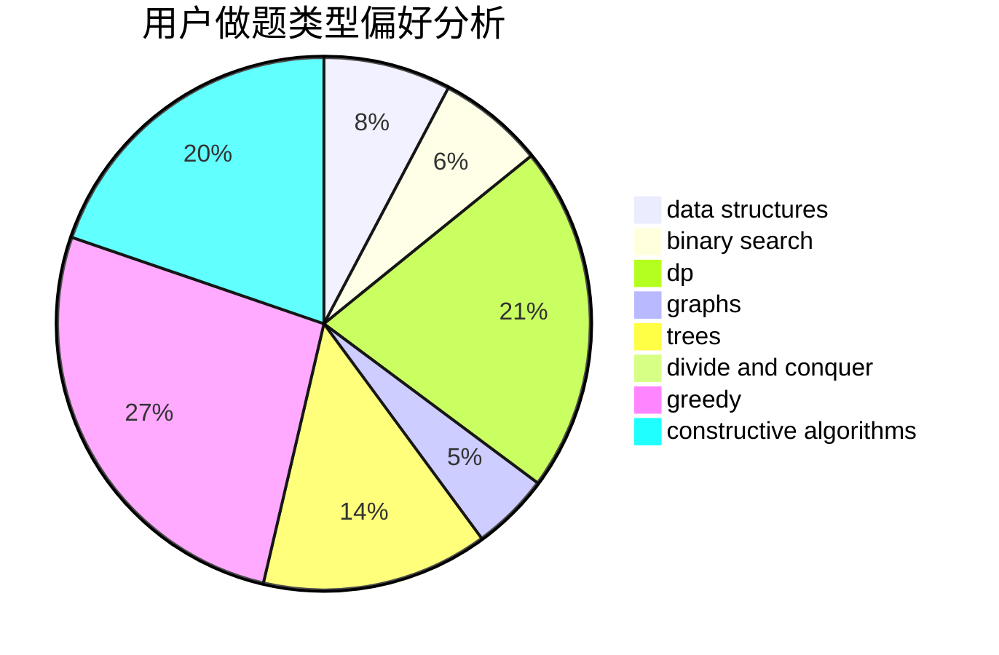
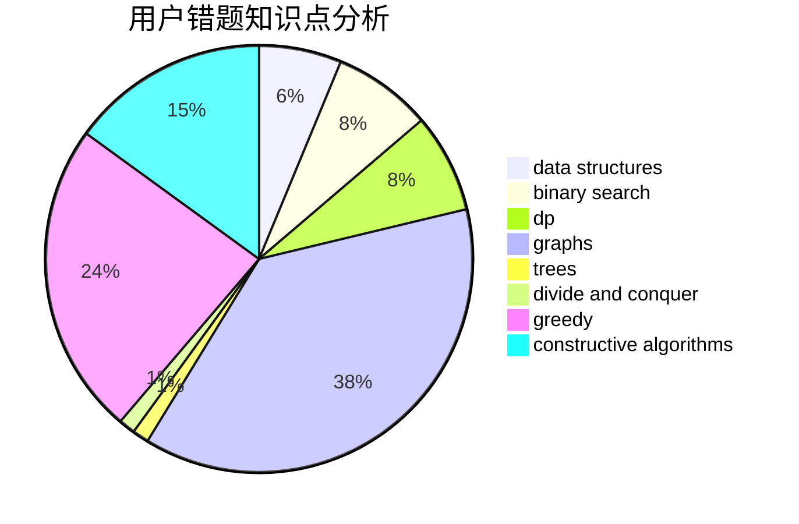

# Qian_2333

<!-- tabs:start -->

#### **用户提交结果分析**

#### **用户做题类型偏好分析**

#### **用户错题知识点分析**

<!-- tabs:end -->
# 推荐题目
[653F](https://codeforces.com/contest/653/problem/F)		data structures,
                        string suffix structures,
                        strings		  
[1386C](https://codeforces.com/contest/1386/problem/C)		*special problem,
                        bitmasks,
                        data structures,
                        divide and conquer,
                        dsu		  
[1300A](https://codeforces.com/contest/1300/problem/A)		implementation,
                        math		  
[1213G](https://codeforces.com/contest/1213/problem/G)		divide and conquer,
                        dsu,
                        graphs,
                        sortings,
                        trees		  
[1444E](https://codeforces.com/contest/1444/problem/E)		brute force,
                        dfs and similar,
                        dp,
                        interactive,
                        trees		  
[959E](https://codeforces.com/contest/959/problem/E)		bitmasks,
                        dp,
                        graphs,
                        implementation,
                        math		  
[734D](https://codeforces.com/contest/734/problem/D)		implementation		  
[1061F](https://codeforces.com/contest/1061/problem/F)		interactive,
                        probabilities		  
[1201A](https://codeforces.com/contest/1201/problem/A)		implementation,
                        strings		  
[350B](https://codeforces.com/contest/350/problem/B)		graphs		  
