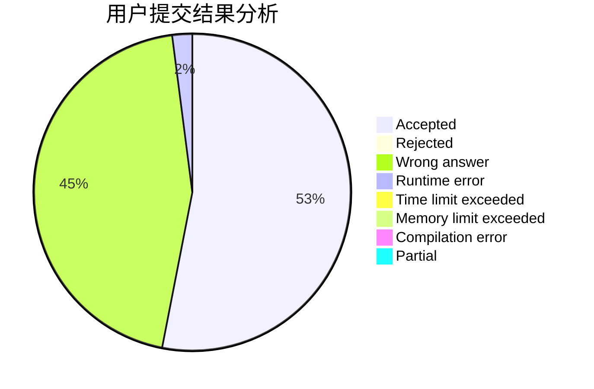
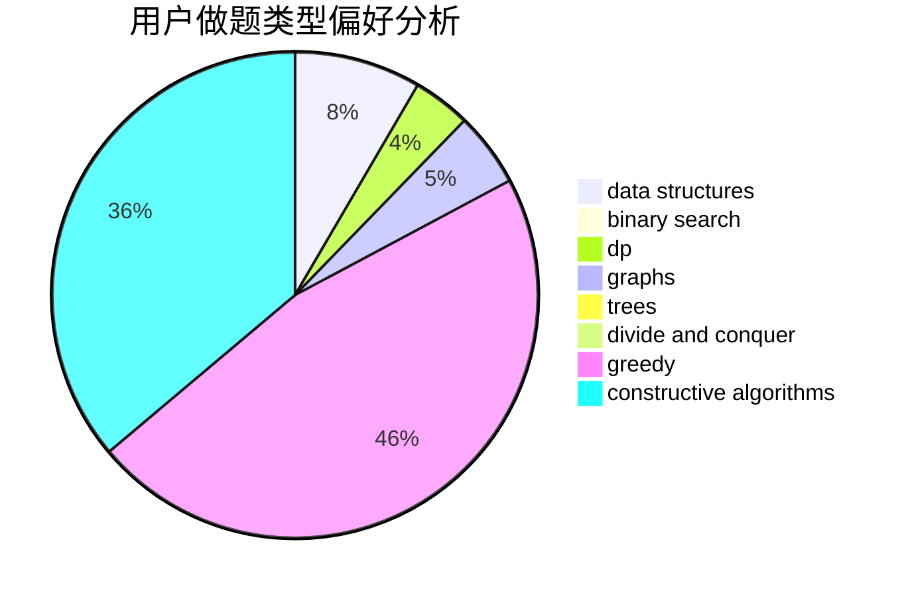
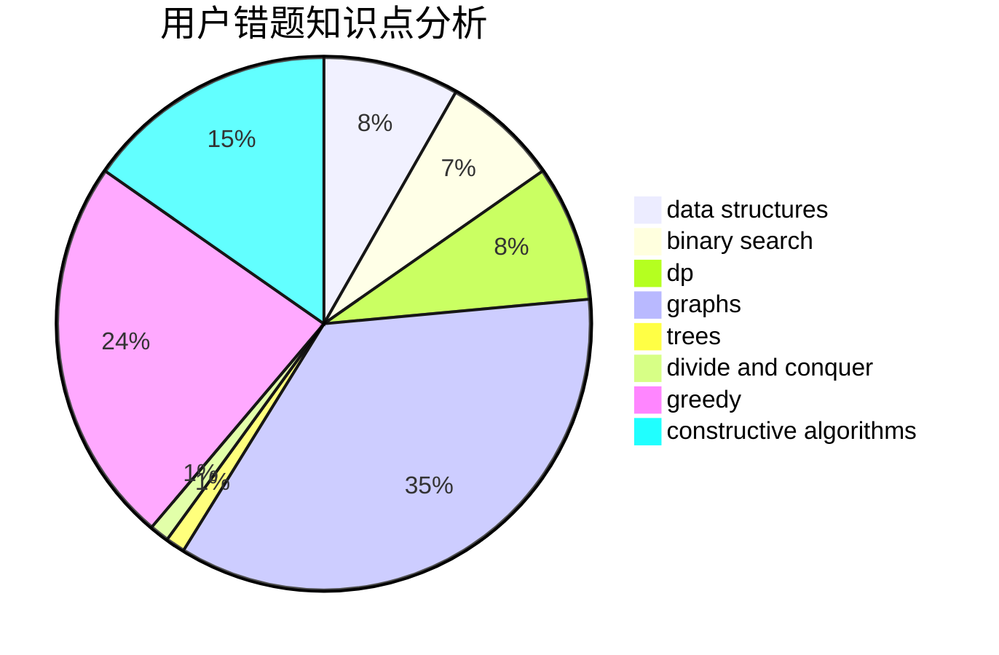

# Qian_2333

<!-- tabs:start -->

#### **用户提交结果分析**

#### **用户做题类型偏好分析**

#### **用户错题知识点分析**

<!-- tabs:end -->
# 推荐题目
[627F](https://codeforces.com/contest/627/problem/F)		dfs and similar,
                        dsu,
                        graphs,
                        trees		  
[1377A2](https://codeforces.com/contest/1377A/problem/2)		dsu,graphs,sortings,trees		  
[1293D](https://codeforces.com/contest/1293/problem/D)		dsu,graphs,sortings,trees		  
[1208C](https://codeforces.com/contest/1208/problem/C)		constructive algorithms		  
[1434E](https://codeforces.com/contest/1434/problem/E)		dsu,
                        games		  
[937C](https://codeforces.com/contest/937/problem/C)		dsu,graphs,sortings,trees		  
[717A](https://codeforces.com/contest/717/problem/A)		math,
                        number theory		  
[1061B](https://codeforces.com/contest/1061/problem/B)		greedy,
                        implementation,
                        sortings		  
[1197D](https://codeforces.com/contest/1197/problem/D)		dp,
                        greedy,
                        math		  
[319E](https://codeforces.com/contest/319/problem/E)		data structures		  
