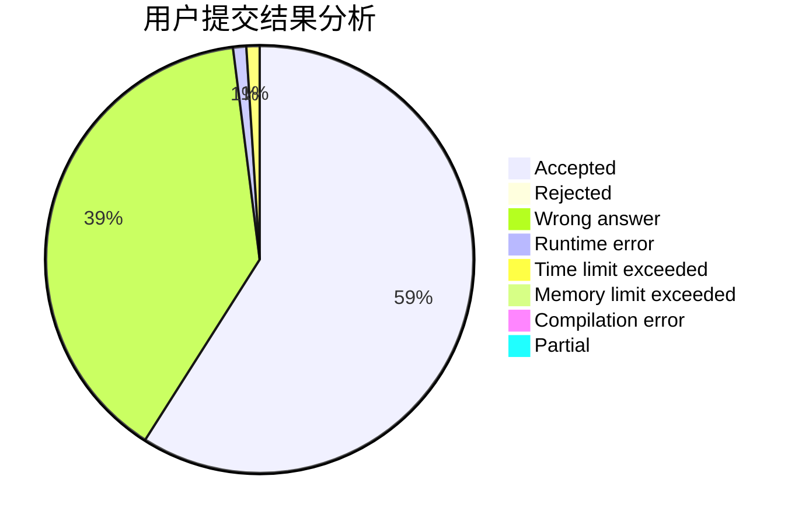
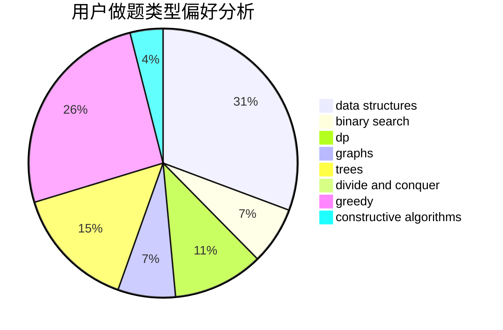
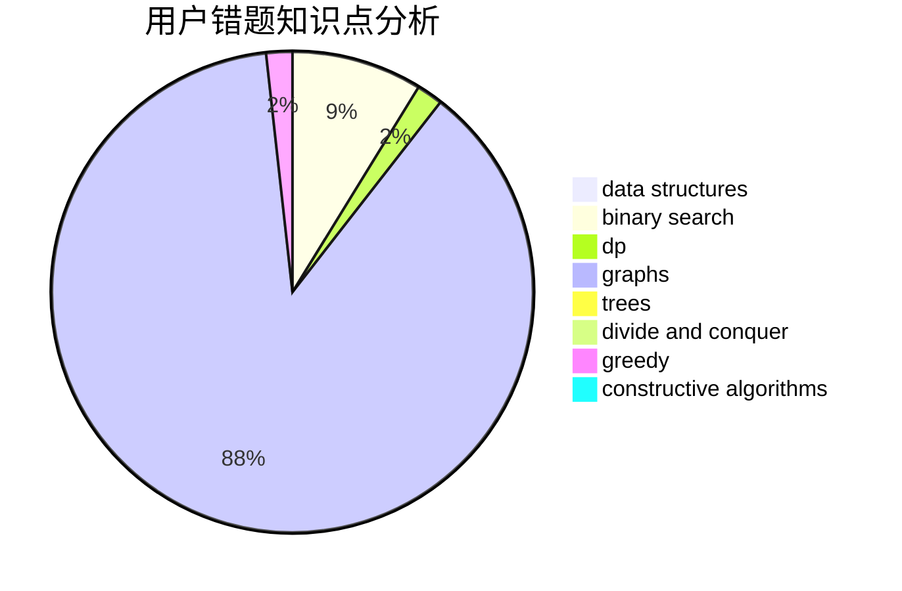

# QieziMin

<!-- tabs:start -->

#### **用户提交结果分析**

#### **用户做题类型偏好分析**

#### **用户错题知识点分析**

<!-- tabs:end -->
# 推荐题目
[1446C](https://codeforces.com/contest/1446/problem/C)		binary search,
                        bitmasks,
                        data structures,
                        divide and conquer,
                        dp,
                        trees		  
[1278F](https://codeforces.com/contest/1278/problem/F)		combinatorics,
                        dp,
                        math,
                        number theory,
                        probabilities		  
[838E](https://codeforces.com/contest/838/problem/E)		dp		  
[28A](https://codeforces.com/contest/28/problem/A)		implementation		  
[985B](https://codeforces.com/contest/985/problem/B)		implementation		  
[1432D](https://codeforces.com/contest/1432/problem/D)		dsu,graphs,sortings,trees		  
[377D](https://codeforces.com/contest/377/problem/D)		data structures		  
[801B](https://codeforces.com/contest/801/problem/B)		constructive algorithms,
                        greedy,
                        strings		  
[1227B](https://codeforces.com/contest/1227/problem/B)		constructive algorithms		  
[1113F](https://codeforces.com/contest/1113/problem/F)		dsu,graphs,sortings,trees		  
