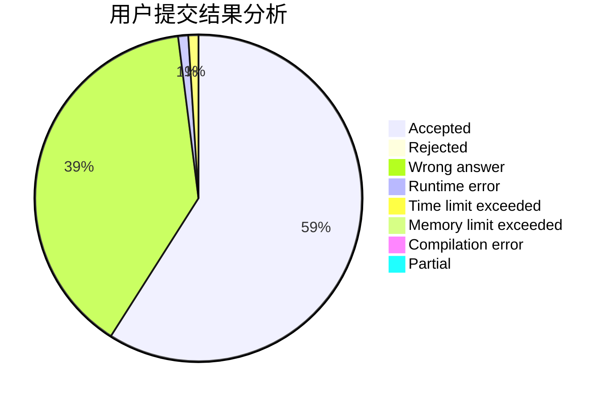
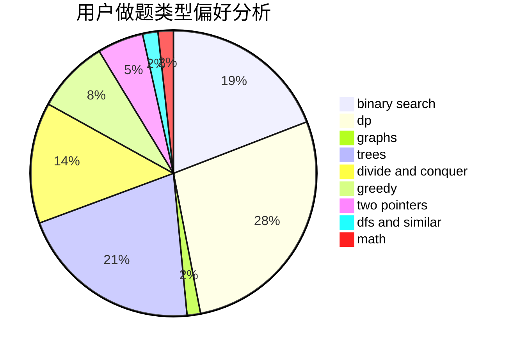

# QieziMin

<!-- tabs:start -->

#### **用户提交结果分析**

#### **用户做题类型偏好分析**

<!-- tabs:end -->
# 推荐题目
[1446C](https://codeforces.com/contest/1446/problem/C)
[1278F](https://codeforces.com/contest/1278/problem/F)
[838E](https://codeforces.com/contest/838/problem/E)
[28A](https://codeforces.com/contest/28/problem/A)
[985B](https://codeforces.com/contest/985/problem/B)
[1432D](https://codeforces.com/contest/1432/problem/D)
[377D](https://codeforces.com/contest/377/problem/D)
[801B](https://codeforces.com/contest/801/problem/B)
[1227B](https://codeforces.com/contest/1227/problem/B)
[1113F](https://codeforces.com/contest/1113/problem/F)
