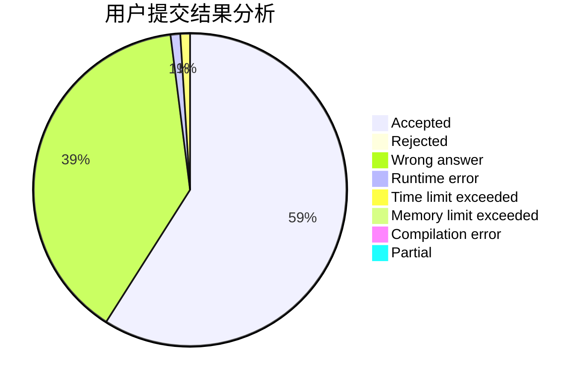
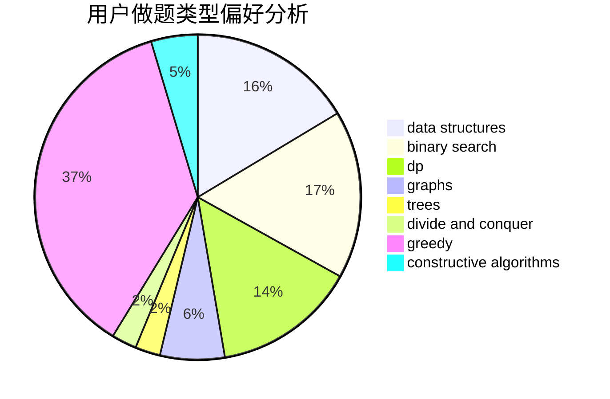
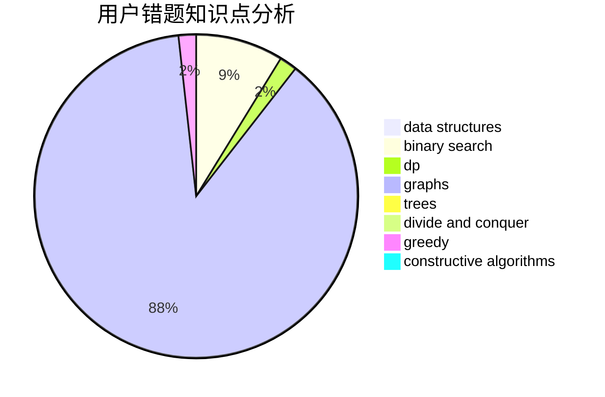

# QieziMin

<!-- tabs:start -->

#### **用户提交结果分析**

#### **用户做题类型偏好分析**

#### **用户错题知识点分析**

<!-- tabs:end -->
# 推荐题目
[1436E](https://codeforces.com/contest/1436/problem/E)		binary search,
                        data structures,
                        two pointers		  
[126B](https://codeforces.com/contest/126/problem/B)		binary search,
                        dp,
                        hashing,
                        string suffix structures,
                        strings		  
[818F](https://codeforces.com/contest/818/problem/F)		binary search,
                        math,
                        ternary search		  
[274B](https://codeforces.com/contest/274/problem/B)		dfs and similar,
                        dp,
                        greedy,
                        trees		  
[962C](https://codeforces.com/contest/962/problem/C)		brute force,
                        implementation,
                        math		  
[1423N](https://codeforces.com/contest/1423/problem/N)		nan		  
[351B](https://codeforces.com/contest/351/problem/B)		combinatorics,
                        dp,
                        probabilities		  
[784B](https://codeforces.com/contest/784/problem/B)		*special problem		  
[121D](https://codeforces.com/contest/121/problem/D)		binary search,
                        implementation,
                        two pointers		  
[1113B](https://codeforces.com/contest/1113/problem/B)		greedy,
                        number theory		  
