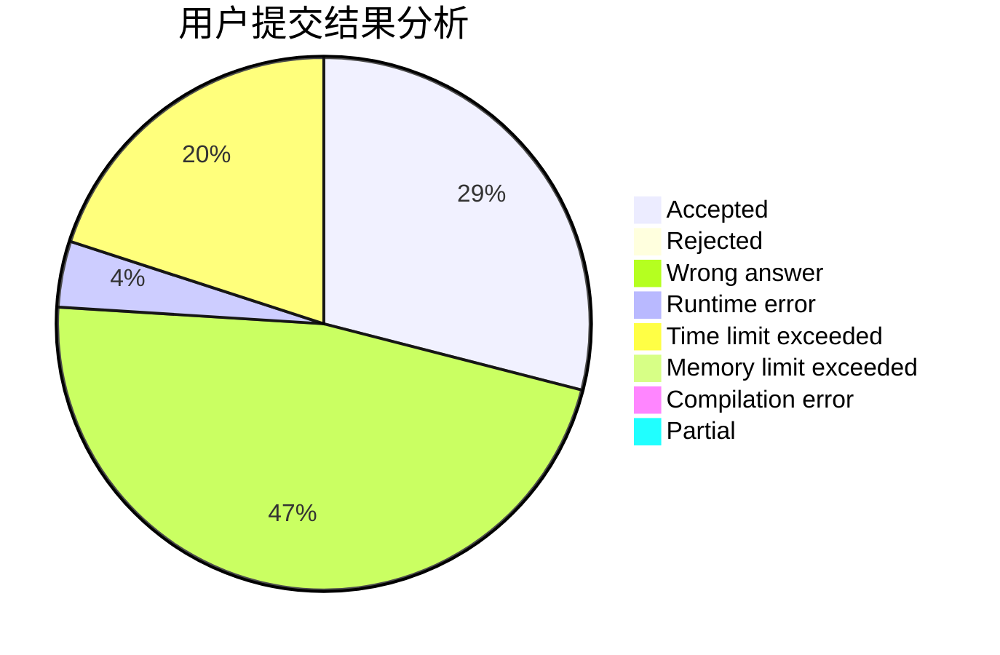
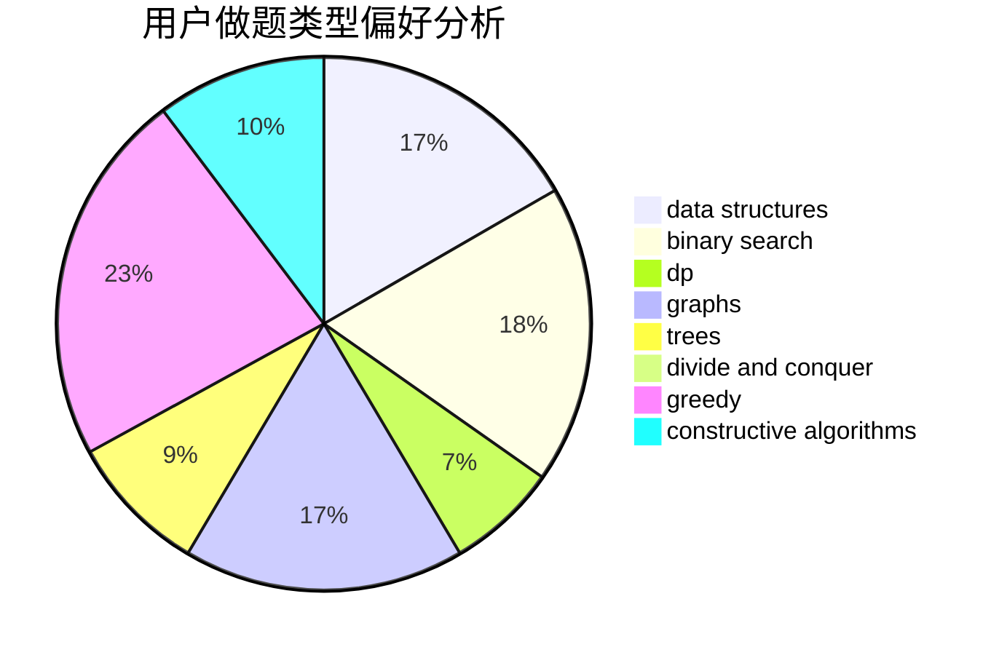

# QinanXuan
<!-- tabs:start -->
#### **用户提交结果分析**

#### **用户做题类型偏好分析**

#### **用户错题知识点分析**

<!-- tabs:end -->
# 推荐题目
[Sleep in Class](http://codeforces.com/problemset/problem/733/E)		constructive algorithms,
                        data structures,
                        math,
                        two pointers		  
[Exams](http://codeforces.com/problemset/problem/732/D)		binary search,
                        greedy,
                        sortings		  
[Distinct Characters Queries](http://codeforces.com/problemset/problem/1234/D)		data structures		  
[Division and Union](http://codeforces.com/problemset/problem/1101/C)		sortings		  
[The Values You Can Make](http://codeforces.com/problemset/problem/687/C)		dp		  
[New Year and Ancient Prophecy](http://codeforces.com/problemset/problem/611/D)		dp,
                        hashing,
                        strings		  
[Subarray Cuts](http://codeforces.com/problemset/problem/513/E2)		dp		  
[Collective Mindsets (medium)](http://codeforces.com/problemset/problem/690/A2)		nan		  
[Minimum Diameter Tree](https://codeforces.com/contest/1086/problem/B)		constructive algorithms,
                        implementation,
                        trees		  
[World Eater Brothers](http://codeforces.com/problemset/problem/238/C)		dfs and similar,
                        dp,
                        greedy,
                        trees		  
<!-- tabs:start -->
#### **data structures**
[Sleep in Class](http://codeforces.com/problemset/problem/733/E)		constructive algorithms,
                        data structures,
                        math,
                        two pointers		  
[Exams](http://codeforces.com/problemset/problem/1234/D)		data structures		  
[Distinct Characters Queries](http://codeforces.com/problemset/problem/938/G)		bitmasks,
                        data structures,
                        dsu,
                        graphs		  
[Division and Union](http://codeforces.com/problemset/problem/912/D)		data structures,
                        graphs,
                        greedy,
                        probabilities,
                        shortest paths		  
[The Values You Can Make](http://codeforces.com/problemset/problem/1313/C1)		brute force,
                        data structures,
                        dp,
                        greedy		  
[New Year and Ancient Prophecy](https://codeforces.com/contest/947/problem/C)		data structures,
                        greedy,
                        strings,
                        trees		  
[Subarray Cuts](http://codeforces.com/problemset/problem/1492/C)		binary search,
                        data structures,
                        dp,
                        greedy,
                        two pointers		  
[Collective Mindsets (medium)](http://codeforces.com/problemset/problem/1490/G)		binary search,
                        data structures,
                        math		  
[Minimum Diameter Tree](http://codeforces.com/problemset/problem/1479/D)		binary search,
                        bitmasks,
                        brute force,
                        data structures,
                        probabilities,
                        trees		  
[World Eater Brothers](http://codeforces.com/problemset/problem/1497/A)		brute force,
                        data structures,
                        greedy,
                        sortings		  
#### **binary search**
[Sleep in Class](http://codeforces.com/problemset/problem/732/D)		binary search,
                        greedy,
                        sortings		  
[Exams](http://codeforces.com/problemset/problem/83/B)		binary search,
                        math,
                        sortings		  
[Distinct Characters Queries](http://codeforces.com/problemset/problem/1492/C)		binary search,
                        data structures,
                        dp,
                        greedy,
                        two pointers		  
[Division and Union](http://codeforces.com/problemset/problem/1463/D)		binary search,
                        constructive algorithms,
                        greedy,
                        two pointers		  
[The Values You Can Make](http://codeforces.com/problemset/problem/1490/G)		binary search,
                        data structures,
                        math		  
[New Year and Ancient Prophecy](http://codeforces.com/problemset/problem/1479/D)		binary search,
                        bitmasks,
                        brute force,
                        data structures,
                        probabilities,
                        trees		  
[Subarray Cuts](http://codeforces.com/problemset/problem/1436/E)		binary search,
                        data structures,
                        two pointers		  
[Collective Mindsets (medium)](http://codeforces.com/problemset/problem/1461/D)		binary search,
                        brute force,
                        data structures,
                        divide and conquer,
                        implementation,
                        sortings		  
[Minimum Diameter Tree](http://codeforces.com/problemset/problem/1493/C)		binary search,
                        brute force,
                        constructive algorithms,
                        greedy,
                        strings		  
[World Eater Brothers](http://codeforces.com/problemset/problem/1487/D)		binary search,
                        brute force,
                        math,
                        number theory		  
#### **dp**
[Sleep in Class](http://codeforces.com/problemset/problem/687/C)		dp		  
[Exams](http://codeforces.com/problemset/problem/611/D)		dp,
                        hashing,
                        strings		  
[Distinct Characters Queries](http://codeforces.com/problemset/problem/513/E2)		dp		  
[Division and Union](http://codeforces.com/problemset/problem/238/C)		dfs and similar,
                        dp,
                        greedy,
                        trees		  
[The Values You Can Make](http://codeforces.com/problemset/problem/691/F)		brute force,
                        dp,
                        number theory		  
[New Year and Ancient Prophecy](https://codeforces.com/contest/1447/problem/D)		dp,
                        strings		  
[Subarray Cuts](http://codeforces.com/problemset/problem/1283/E)		dp,
                        greedy		  
[Collective Mindsets (medium)](http://codeforces.com/problemset/problem/1313/C1)		brute force,
                        data structures,
                        dp,
                        greedy		  
[Minimum Diameter Tree](http://codeforces.com/problemset/problem/1372/E)		dp,
                        greedy,
                        two pointers		  
[World Eater Brothers](http://codeforces.com/problemset/problem/1492/C)		binary search,
                        data structures,
                        dp,
                        greedy,
                        two pointers		  
#### **graph**
[Sleep in Class](http://codeforces.com/problemset/problem/350/B)		graphs		  
[Exams](http://codeforces.com/problemset/problem/938/G)		bitmasks,
                        data structures,
                        dsu,
                        graphs		  
[Distinct Characters Queries](http://codeforces.com/problemset/problem/912/D)		data structures,
                        graphs,
                        greedy,
                        probabilities,
                        shortest paths		  
[Division and Union](http://codeforces.com/problemset/problem/1487/C)		brute force,
                        constructive algorithms,
                        dfs and similar,
                        graphs,
                        greedy,
                        implementation,
                        math		  
[The Values You Can Make](http://codeforces.com/problemset/problem/1437/C)		dp,
                        flows,
                        graph matchings,
                        greedy,
                        math,
                        sortings		  
[New Year and Ancient Prophecy](http://codeforces.com/problemset/problem/1470/D)		constructive algorithms,
                        dfs and similar,
                        graph matchings,
                        graphs,
                        greedy		  
[Subarray Cuts](http://codeforces.com/problemset/problem/1476/C)		dp,
                        graphs,
                        greedy		  
[Collective Mindsets (medium)](http://codeforces.com/problemset/problem/1304/D)		constructive algorithms,
                        graphs,
                        greedy,
                        two pointers		  
[Minimum Diameter Tree](http://codeforces.com/problemset/problem/1475/C)		combinatorics,
                        graphs,
                        math		  
[World Eater Brothers](http://codeforces.com/problemset/problem/553/E)		dp,
                        fft,
                        graphs,
                        math,
                        probabilities		  
#### **trees**
[Sleep in Class](https://codeforces.com/contest/1086/problem/B)		constructive algorithms,
                        implementation,
                        trees		  
[Exams](http://codeforces.com/problemset/problem/238/C)		dfs and similar,
                        dp,
                        greedy,
                        trees		  
[Distinct Characters Queries](https://codeforces.com/contest/947/problem/C)		data structures,
                        greedy,
                        strings,
                        trees		  
[Division and Union](http://codeforces.com/problemset/problem/1479/D)		binary search,
                        bitmasks,
                        brute force,
                        data structures,
                        probabilities,
                        trees		  
[The Values You Can Make](http://codeforces.com/problemset/problem/1511/C)		brute force,
                        data structures,
                        implementation,
                        trees		  
[New Year and Ancient Prophecy](http://codeforces.com/problemset/problem/1499/F)		combinatorics,
                        dfs and similar,
                        dp,
                        trees		  
[Subarray Cuts](http://codeforces.com/problemset/problem/1491/E)		brute force,
                        dfs and similar,
                        divide and conquer,
                        number theory,
                        trees		  
[Collective Mindsets (medium)](http://codeforces.com/problemset/problem/1466/D)		data structures,
                        greedy,
                        sortings,
                        trees		  
[Minimum Diameter Tree](http://codeforces.com/problemset/problem/1495/D)		combinatorics,
                        dfs and similar,
                        graphs,
                        math,
                        shortest paths,
                        trees		  
[World Eater Brothers](http://codeforces.com/problemset/problem/1303/G)		data structures,
                        divide and conquer,
                        geometry,
                        trees		  
#### **divide and conquer**
[Sleep in Class](http://codeforces.com/problemset/problem/1461/D)		binary search,
                        brute force,
                        data structures,
                        divide and conquer,
                        implementation,
                        sortings		  
[Exams](http://codeforces.com/problemset/problem/1466/G)		combinatorics,
                        divide and conquer,
                        hashing,
                        math,
                        string suffix structures,
                        strings		  
[Distinct Characters Queries](http://codeforces.com/problemset/problem/1490/D)		dfs and similar,
                        divide and conquer,
                        implementation		  
[Division and Union](https://codeforces.com/contest/1483/problem/C)		data structures,
                        divide and conquer,
                        dp		  
[The Values You Can Make](http://codeforces.com/problemset/problem/1491/E)		brute force,
                        dfs and similar,
                        divide and conquer,
                        number theory,
                        trees		  
[New Year and Ancient Prophecy](http://codeforces.com/problemset/problem/1303/G)		data structures,
                        divide and conquer,
                        geometry,
                        trees		  
[Subarray Cuts](http://codeforces.com/problemset/problem/1494/D)		constructive algorithms,
                        data structures,
                        dfs and similar,
                        divide and conquer,
                        dsu,
                        greedy,
                        sortings,
                        trees		  
[Collective Mindsets (medium)](http://codeforces.com/problemset/problem/1482/E)		data structures,
                        divide and conquer,
                        dp		  
[Minimum Diameter Tree](http://codeforces.com/problemset/problem/566/C)		dfs and similar,
                        divide and conquer,
                        trees		  
[World Eater Brothers](http://codeforces.com/problemset/problem/1428/F)		binary search,
                        data structures,
                        divide and conquer,
                        dp,
                        two pointers		  
#### **greedy**
[Sleep in Class](http://codeforces.com/problemset/problem/732/D)		binary search,
                        greedy,
                        sortings		  
[Exams](http://codeforces.com/problemset/problem/238/C)		dfs and similar,
                        dp,
                        greedy,
                        trees		  
[Distinct Characters Queries](https://codeforces.com/contest/1434/problem/C)		greedy,
                        math,
                        ternary search		  
[Division and Union](http://codeforces.com/problemset/problem/1283/E)		dp,
                        greedy		  
[The Values You Can Make](http://codeforces.com/problemset/problem/912/D)		data structures,
                        graphs,
                        greedy,
                        probabilities,
                        shortest paths		  
[New Year and Ancient Prophecy](http://codeforces.com/problemset/problem/1313/C1)		brute force,
                        data structures,
                        dp,
                        greedy		  
[Subarray Cuts](https://codeforces.com/contest/947/problem/C)		data structures,
                        greedy,
                        strings,
                        trees		  
[Collective Mindsets (medium)](http://codeforces.com/problemset/problem/1416/B)		constructive algorithms,
                        greedy,
                        math		  
[Minimum Diameter Tree](http://codeforces.com/problemset/problem/1372/E)		dp,
                        greedy,
                        two pointers		  
[World Eater Brothers](http://codeforces.com/problemset/problem/1332/A)		greedy,
                        implementation,
                        math		  
#### **constructive algorithms**
[Sleep in Class](http://codeforces.com/problemset/problem/733/E)		constructive algorithms,
                        data structures,
                        math,
                        two pointers		  
[Exams](https://codeforces.com/contest/1086/problem/B)		constructive algorithms,
                        implementation,
                        trees		  
[Distinct Characters Queries](http://codeforces.com/problemset/problem/667/B)		constructive algorithms,
                        geometry		  
[Division and Union](http://codeforces.com/problemset/problem/1078/E)		constructive algorithms		  
[The Values You Can Make](http://codeforces.com/problemset/problem/1416/B)		constructive algorithms,
                        greedy,
                        math		  
[New Year and Ancient Prophecy](http://codeforces.com/problemset/problem/1493/A)		constructive algorithms,
                        greedy		  
[Subarray Cuts](http://codeforces.com/problemset/problem/1463/D)		binary search,
                        constructive algorithms,
                        greedy,
                        two pointers		  
[Collective Mindsets (medium)](https://codeforces.com/contest/1456/problem/B)		bitmasks,
                        brute force,
                        constructive algorithms		  
[Minimum Diameter Tree](http://codeforces.com/problemset/problem/1492/D)		bitmasks,
                        constructive algorithms,
                        greedy,
                        math		  
[World Eater Brothers](https://codeforces.com/contest/1504/problem/D)		constructive algorithms,
                        games,
                        interactive		  
#### **sortings**
[Sleep in Class](http://codeforces.com/problemset/problem/732/D)		binary search,
                        greedy,
                        sortings		  
[Exams](http://codeforces.com/problemset/problem/1101/C)		sortings		  
[Distinct Characters Queries](http://codeforces.com/problemset/problem/83/B)		binary search,
                        math,
                        sortings		  
[Division and Union](https://codeforces.com/contest/1496/problem/C)		geometry,
                        greedy,
                        math,
                        sortings		  
[The Values You Can Make](http://codeforces.com/problemset/problem/1495/A)		geometry,
                        greedy,
                        math,
                        sortings		  
[New Year and Ancient Prophecy](http://codeforces.com/problemset/problem/1497/A)		brute force,
                        data structures,
                        greedy,
                        sortings		  
[Subarray Cuts](http://codeforces.com/problemset/problem/1427/A)		math,
                        sortings		  
[Collective Mindsets (medium)](http://codeforces.com/problemset/problem/1461/D)		binary search,
                        brute force,
                        data structures,
                        divide and conquer,
                        implementation,
                        sortings		  
[Minimum Diameter Tree](http://codeforces.com/problemset/problem/1437/C)		dp,
                        flows,
                        graph matchings,
                        greedy,
                        math,
                        sortings		  
[World Eater Brothers](http://codeforces.com/problemset/problem/1473/A)		greedy,
                        implementation,
                        math,
                        sortings		  
<!-- tabs:end -->
