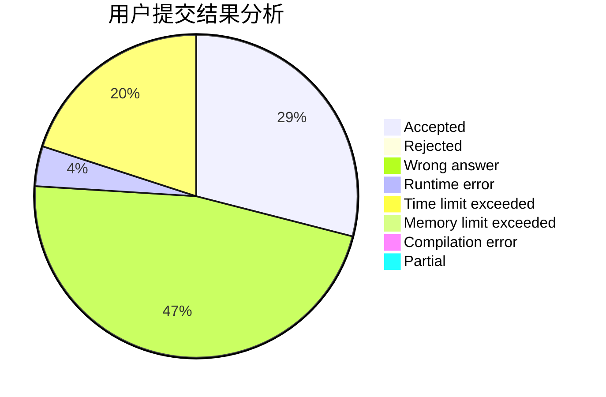
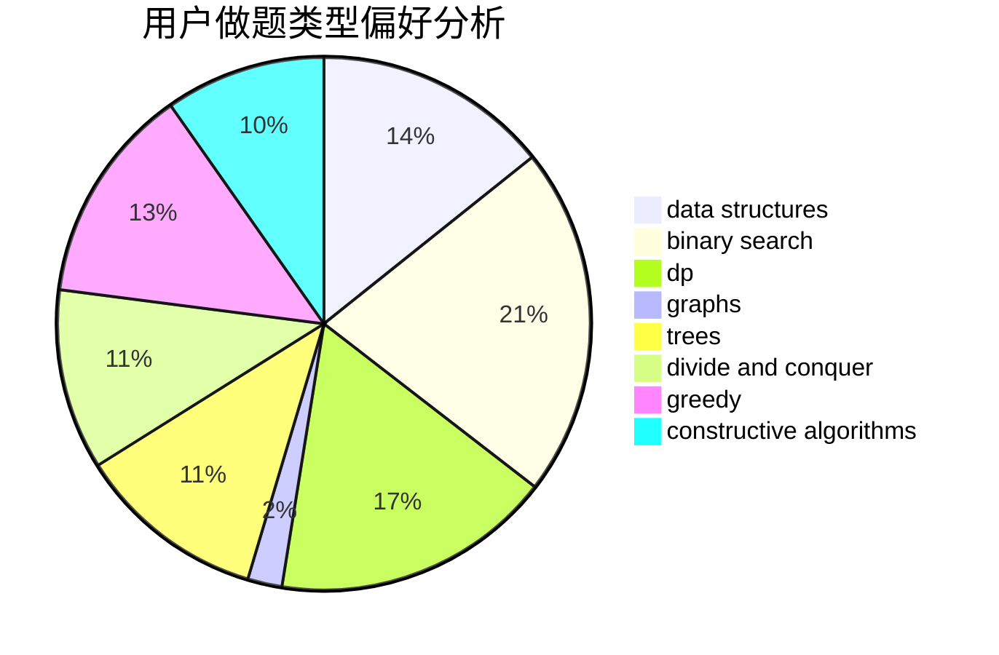

# QinanXuan

<!-- tabs:start -->

#### **用户提交结果分析**

#### **用户做题类型偏好分析**

#### **用户错题知识点分析**

<!-- tabs:end -->
# 推荐题目
[538H](https://codeforces.com/contest/538/problem/H)		2-sat,
                        data structures,
                        dfs and similar,
                        greedy		  
[750C](https://codeforces.com/contest/750/problem/C)		binary search,
                        greedy,
                        math		  
[754A](https://codeforces.com/contest/754/problem/A)		constructive algorithms,
                        greedy,
                        implementation		  
[25E](https://codeforces.com/contest/25/problem/E)		hashing,
                        strings		  
[631D](https://codeforces.com/contest/631/problem/D)		data structures,
                        hashing,
                        implementation,
                        string suffix structures,
                        strings		  
[710C](https://codeforces.com/contest/710/problem/C)		constructive algorithms,
                        math		  
[1101F](https://codeforces.com/contest/1101/problem/F)		binary search,
                        dp		  
[630G](https://codeforces.com/contest/630/problem/G)		combinatorics,
                        math		  
[689B](https://codeforces.com/contest/689/problem/B)		dfs and similar,
                        graphs,
                        greedy,
                        shortest paths		  
[960C](https://codeforces.com/contest/960/problem/C)		bitmasks,
                        constructive algorithms,
                        greedy,
                        implementation		  
