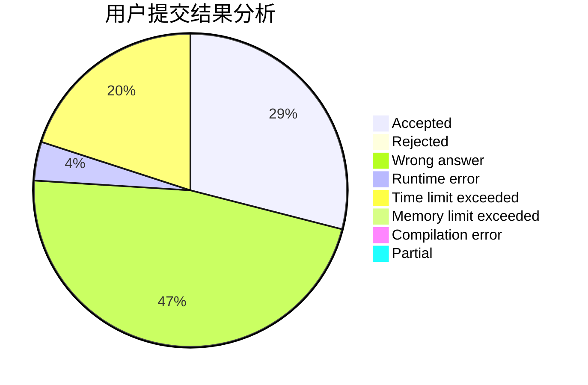
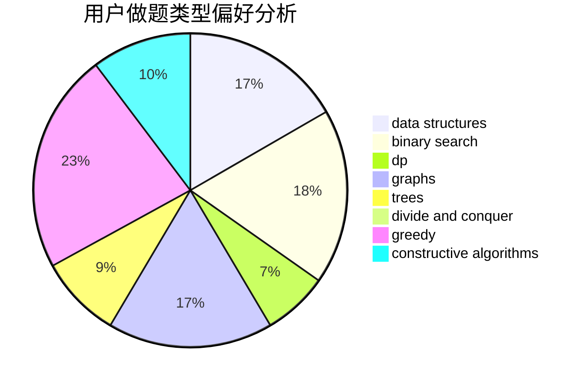

# QinanXuan

<!-- tabs:start -->

#### **用户提交结果分析**

#### **用户做题类型偏好分析**

#### **用户错题知识点分析**

<!-- tabs:end -->
# 推荐题目
[513E2](https://codeforces.com/contest/513E/problem/2)		dp		  
[732D](https://codeforces.com/contest/732/problem/D)		binary search,
                        greedy,
                        sortings		  
[733E](https://codeforces.com/contest/733/problem/E)		constructive algorithms,
                        data structures,
                        math,
                        two pointers		  
[238C](https://codeforces.com/contest/238/problem/C)		dfs and similar,
                        dp,
                        greedy,
                        trees		  
[612B](https://codeforces.com/contest/612/problem/B)		implementation,
                        math		  
[690A2](https://codeforces.com/contest/690A/problem/2)		nan		  
[1101C](https://codeforces.com/contest/1101/problem/C)		sortings		  
[611D](https://codeforces.com/contest/611/problem/D)		dp,
                        hashing,
                        strings		  
[667B](https://codeforces.com/contest/667/problem/B)		constructive algorithms,
                        geometry		  
[938G](https://codeforces.com/contest/938/problem/G)		bitmasks,
                        data structures,
                        dsu,
                        graphs		  
