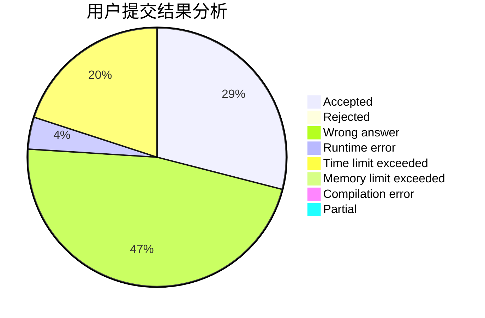
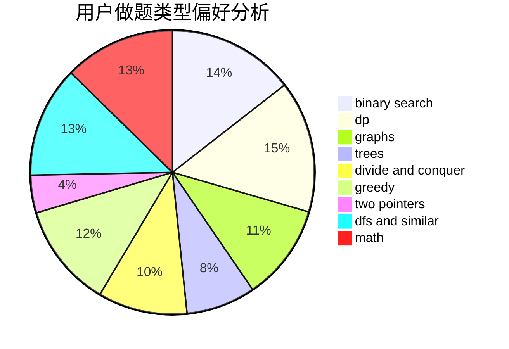

# QinanXuan

<!-- tabs:start -->

#### **用户提交结果分析**

#### **用户做题类型偏好分析**

<!-- tabs:end -->
# 推荐题目
[538H](https://codeforces.com/contest/538/problem/H)
[750C](https://codeforces.com/contest/750/problem/C)
[754A](https://codeforces.com/contest/754/problem/A)
[25E](https://codeforces.com/contest/25/problem/E)
[631D](https://codeforces.com/contest/631/problem/D)
[710C](https://codeforces.com/contest/710/problem/C)
[1101F](https://codeforces.com/contest/1101/problem/F)
[630G](https://codeforces.com/contest/630/problem/G)
[689B](https://codeforces.com/contest/689/problem/B)
[960C](https://codeforces.com/contest/960/problem/C)
