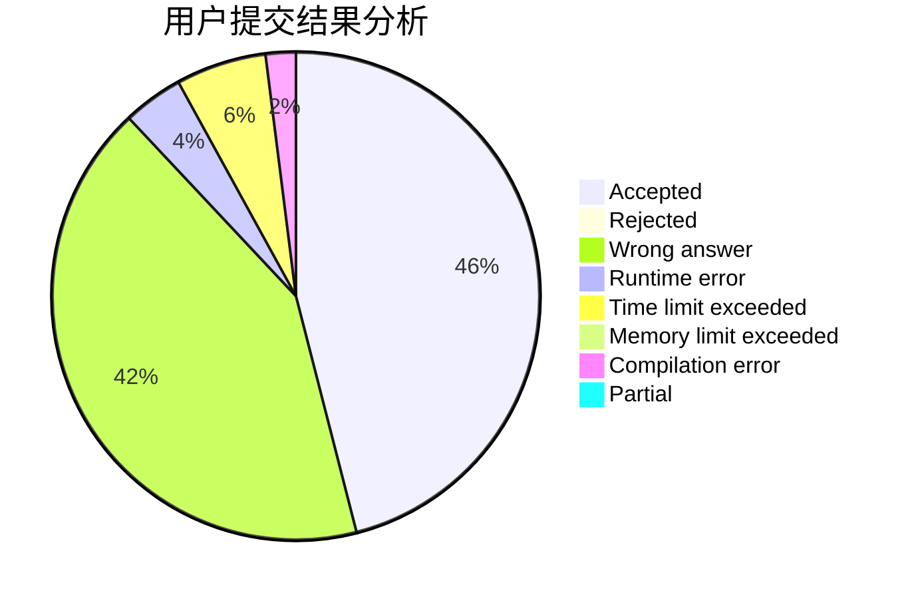
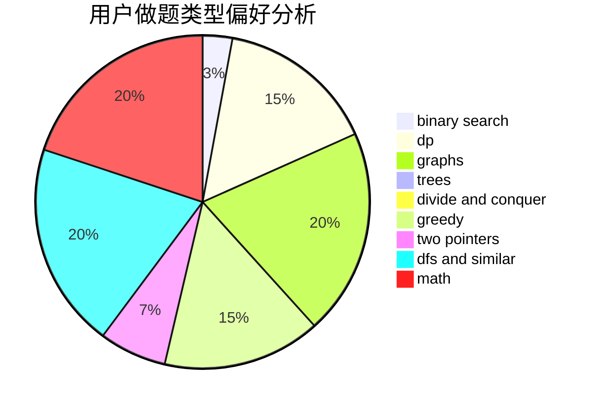

# Qing_LKYi

<!-- tabs:start -->

#### **用户提交结果分析**

#### **用户做题类型偏好分析**

<!-- tabs:end -->
# 推荐题目
[115B](https://codeforces.com/contest/115/problem/B)
[1246D](https://codeforces.com/contest/1246/problem/D)
[574C](https://codeforces.com/contest/574/problem/C)
[1432D](https://codeforces.com/contest/1432/problem/D)
[1147C](https://codeforces.com/contest/1147/problem/C)
[988E](https://codeforces.com/contest/988/problem/E)
[558E](https://codeforces.com/contest/558/problem/E)
[630A](https://codeforces.com/contest/630/problem/A)
[940B](https://codeforces.com/contest/940/problem/B)
[591C](https://codeforces.com/contest/591/problem/C)
