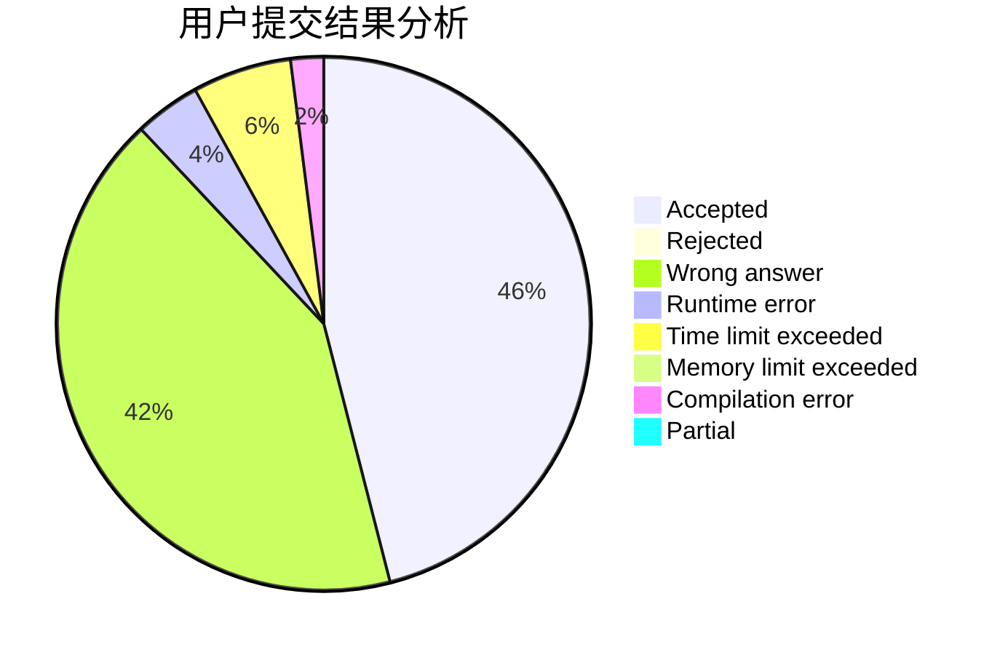
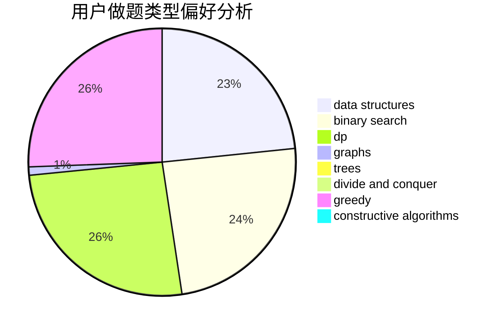
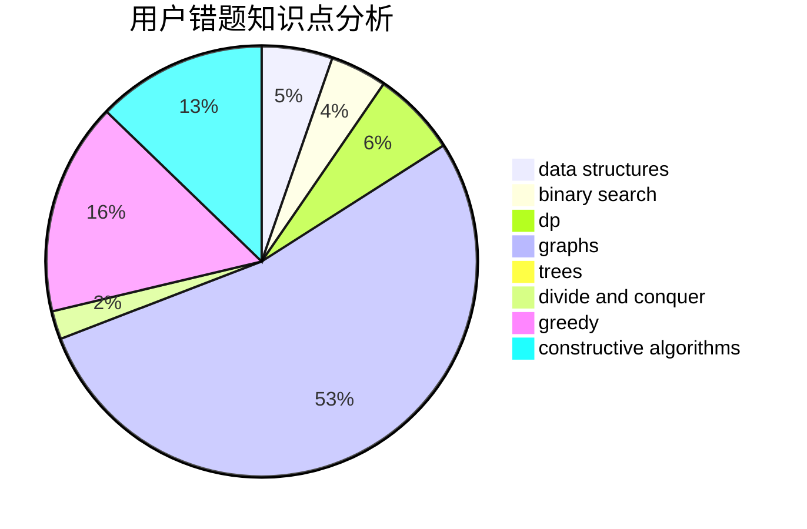

# Qing_LKYi

<!-- tabs:start -->

#### **用户提交结果分析**

#### **用户做题类型偏好分析**

#### **用户错题知识点分析**

<!-- tabs:end -->
# 推荐题目
[1157F](https://codeforces.com/contest/1157/problem/F)		constructive algorithms,
                        dp,
                        greedy,
                        two pointers		  
[1241A](https://codeforces.com/contest/1241/problem/A)		dsu,graphs,sortings,trees		  
[549E](https://codeforces.com/contest/549/problem/E)		geometry,
                        math		  
[1423N](https://codeforces.com/contest/1423/problem/N)		nan		  
[1145B](https://codeforces.com/contest/1145/problem/B)		brute force		  
[967B](https://codeforces.com/contest/967/problem/B)		math,
                        sortings		  
[535E](https://codeforces.com/contest/535/problem/E)		geometry,
                        math		  
[611A](https://codeforces.com/contest/611/problem/A)		implementation		  
[920B](https://codeforces.com/contest/920/problem/B)		implementation		  
[571A](https://codeforces.com/contest/571/problem/A)		combinatorics,
                        implementation,
                        math		  
