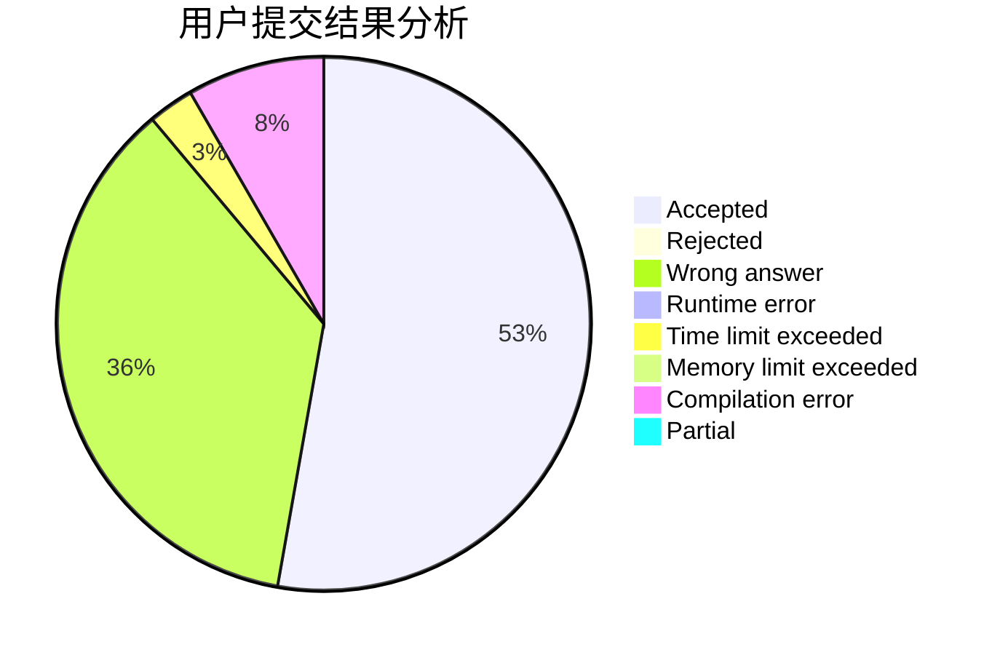
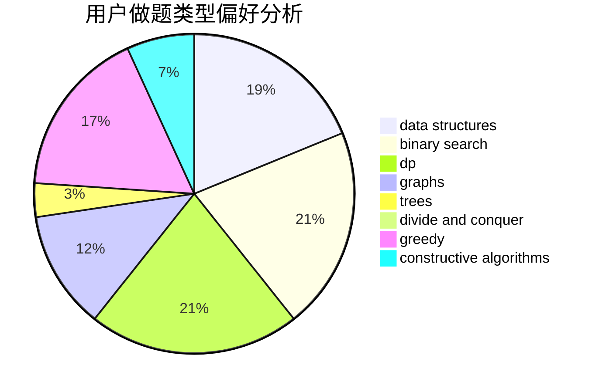
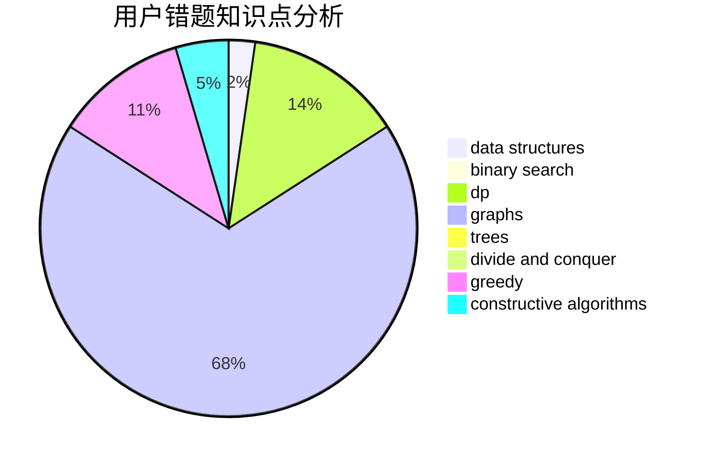

# Qingzhi_chan

<!-- tabs:start -->

#### **用户提交结果分析**

#### **用户做题类型偏好分析**

#### **用户错题知识点分析**

<!-- tabs:end -->
# 推荐题目
[766E](https://codeforces.com/contest/766/problem/E)		bitmasks,
                        constructive algorithms,
                        data structures,
                        dfs and similar,
                        dp,
                        math,
                        trees		  
[147B](https://codeforces.com/contest/147/problem/B)		binary search,
                        graphs,
                        matrices		  
[1167F](https://codeforces.com/contest/1167/problem/F)		combinatorics,
                        data structures,
                        math,
                        sortings		  
[387C](https://codeforces.com/contest/387/problem/C)		greedy,
                        implementation		  
[1240A](https://codeforces.com/contest/1240/problem/A)		dsu,graphs,sortings,trees		  
[1036B](https://codeforces.com/contest/1036/problem/B)		math		  
[899C](https://codeforces.com/contest/899/problem/C)		constructive algorithms,
                        graphs,
                        math		  
[389A](https://codeforces.com/contest/389/problem/A)		greedy,
                        math		  
[263A](https://codeforces.com/contest/263/problem/A)		implementation		  
[895D](https://codeforces.com/contest/895/problem/D)		combinatorics,
                        math,
                        strings		  
