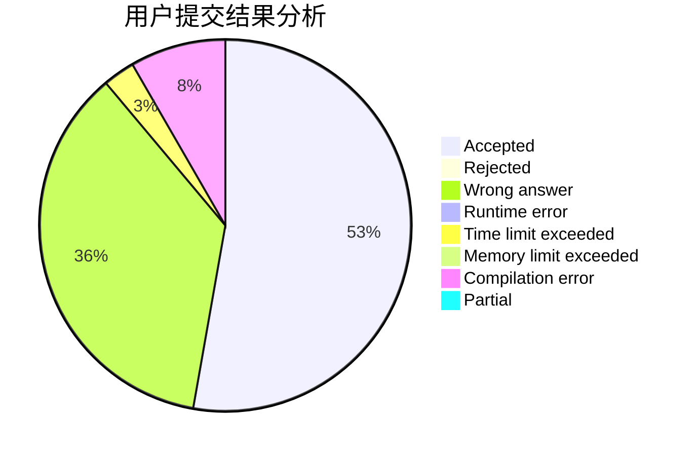
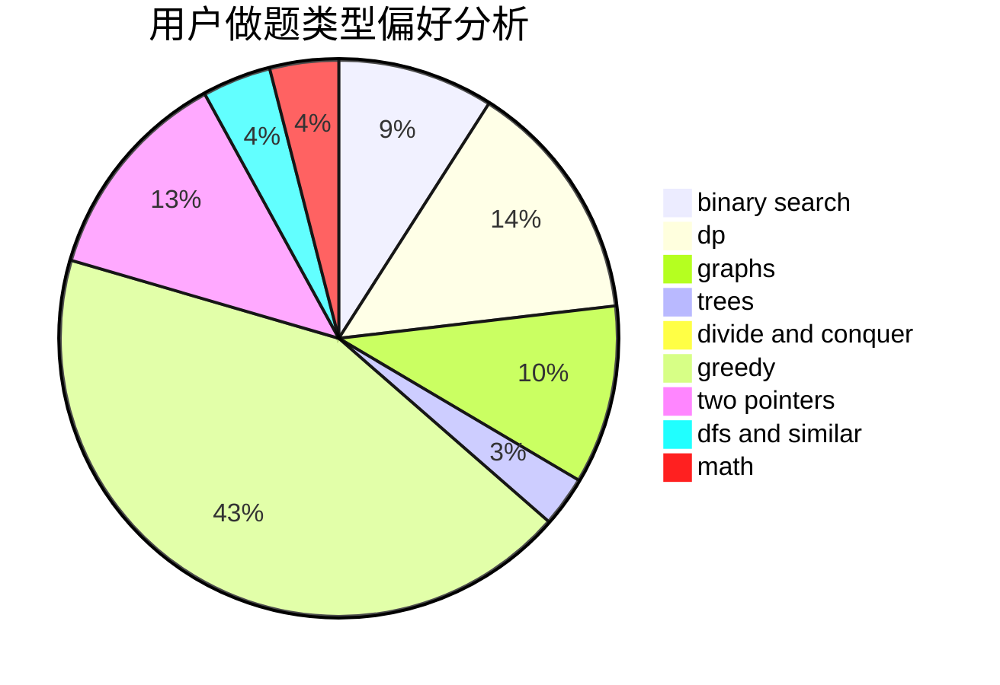

# Qingzhi_chan

<!-- tabs:start -->

#### **用户提交结果分析**

#### **用户做题类型偏好分析**

<!-- tabs:end -->
# 推荐题目
[766E](https://codeforces.com/contest/766/problem/E)
[147B](https://codeforces.com/contest/147/problem/B)
[1167F](https://codeforces.com/contest/1167/problem/F)
[387C](https://codeforces.com/contest/387/problem/C)
[1240A](https://codeforces.com/contest/1240/problem/A)
[1036B](https://codeforces.com/contest/1036/problem/B)
[899C](https://codeforces.com/contest/899/problem/C)
[389A](https://codeforces.com/contest/389/problem/A)
[263A](https://codeforces.com/contest/263/problem/A)
[895D](https://codeforces.com/contest/895/problem/D)
