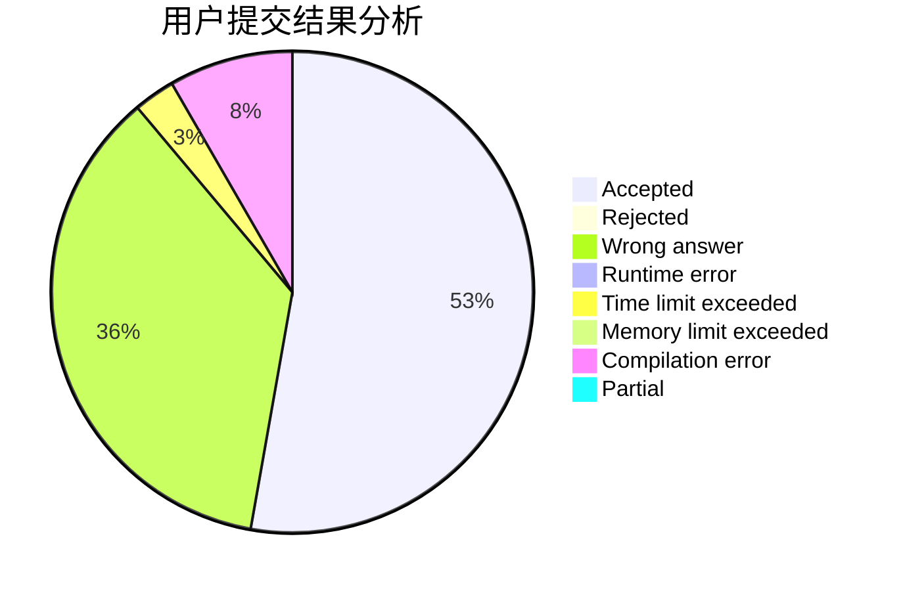
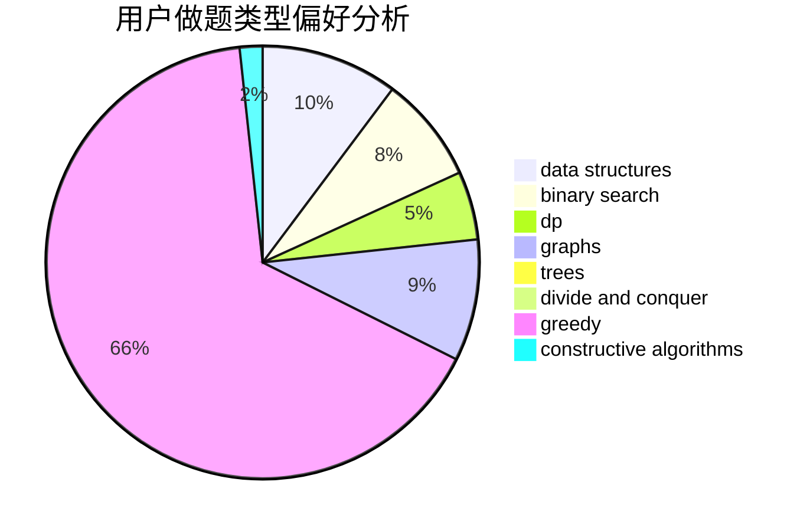
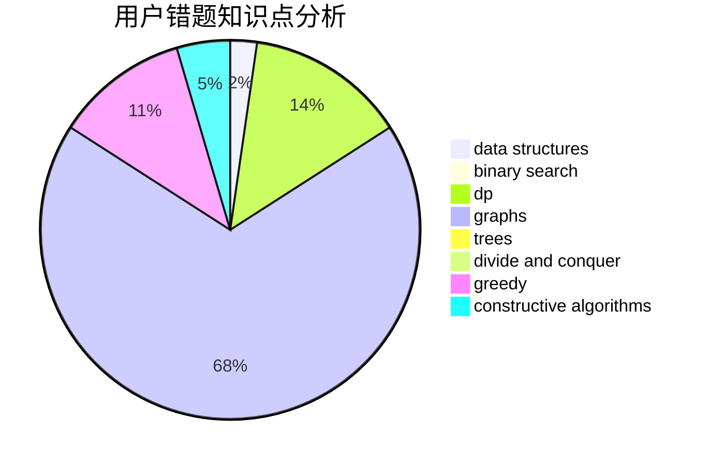

# Qingzhi_chan

<!-- tabs:start -->

#### **用户提交结果分析**

#### **用户做题类型偏好分析**

#### **用户错题知识点分析**

<!-- tabs:end -->
# 推荐题目
[747B](https://codeforces.com/contest/747/problem/B)		implementation,
                        strings		  
[1471D](https://codeforces.com/contest/1471/problem/D)		dsu,graphs,sortings,trees		  
[1165D](https://codeforces.com/contest/1165/problem/D)		math,
                        number theory		  
[359D](https://codeforces.com/contest/359/problem/D)		binary search,
                        brute force,
                        data structures,
                        math,
                        two pointers		  
[1234D](https://codeforces.com/contest/1234/problem/D)		data structures		  
[1034D](https://codeforces.com/contest/1034/problem/D)		binary search,
                        data structures,
                        two pointers		  
[878D](https://codeforces.com/contest/878/problem/D)		bitmasks		  
[360E](https://codeforces.com/contest/360/problem/E)		graphs,
                        greedy,
                        shortest paths		  
[241D](https://codeforces.com/contest/241/problem/D)		nan		  
[875D](https://codeforces.com/contest/875/problem/D)		binary search,
                        bitmasks,
                        combinatorics,
                        data structures,
                        divide and conquer		  
