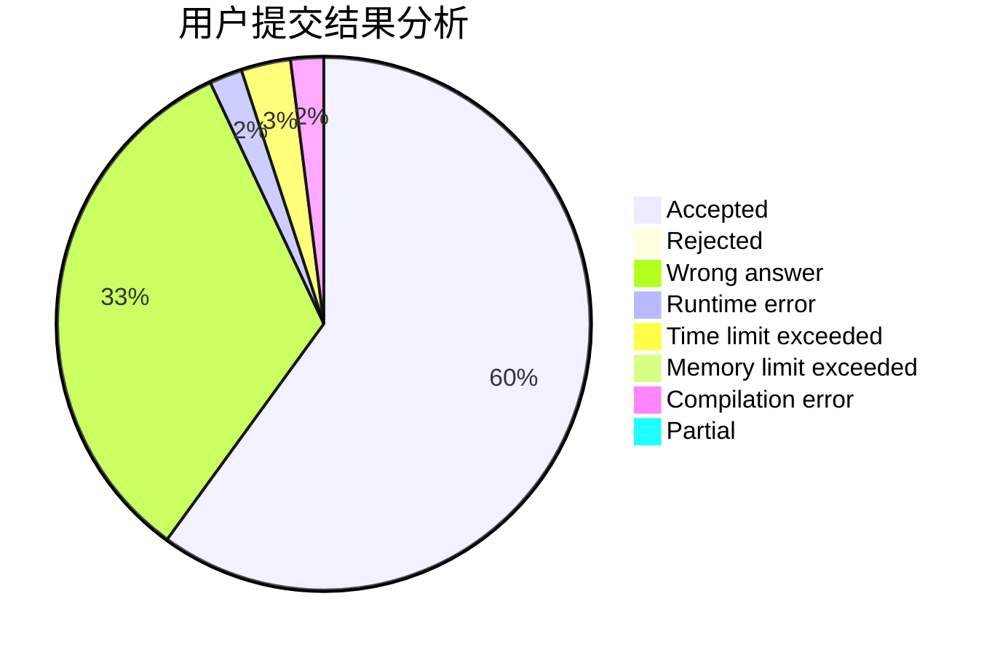
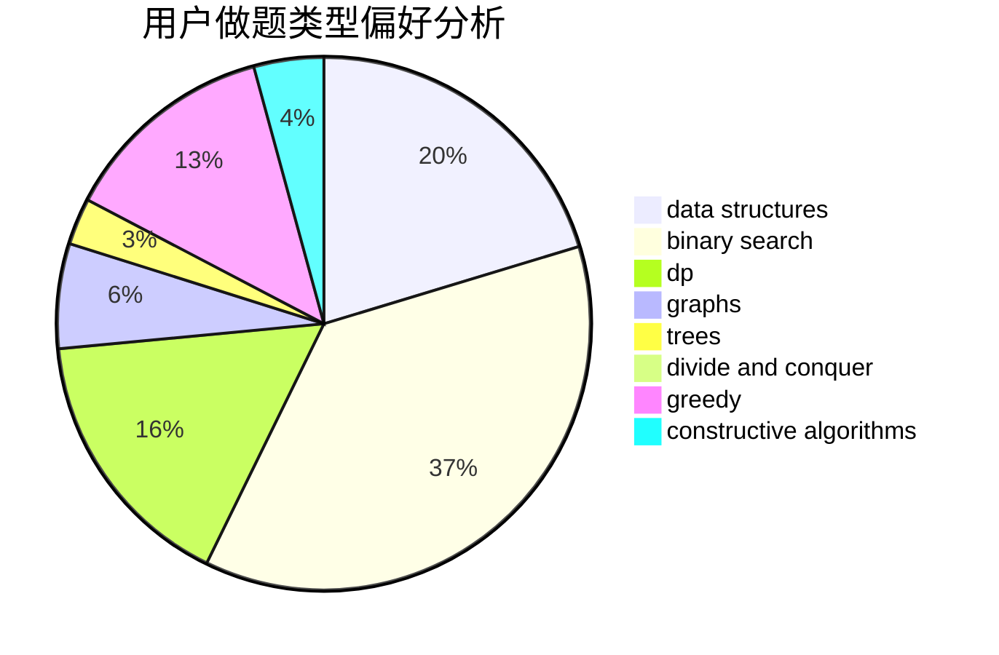
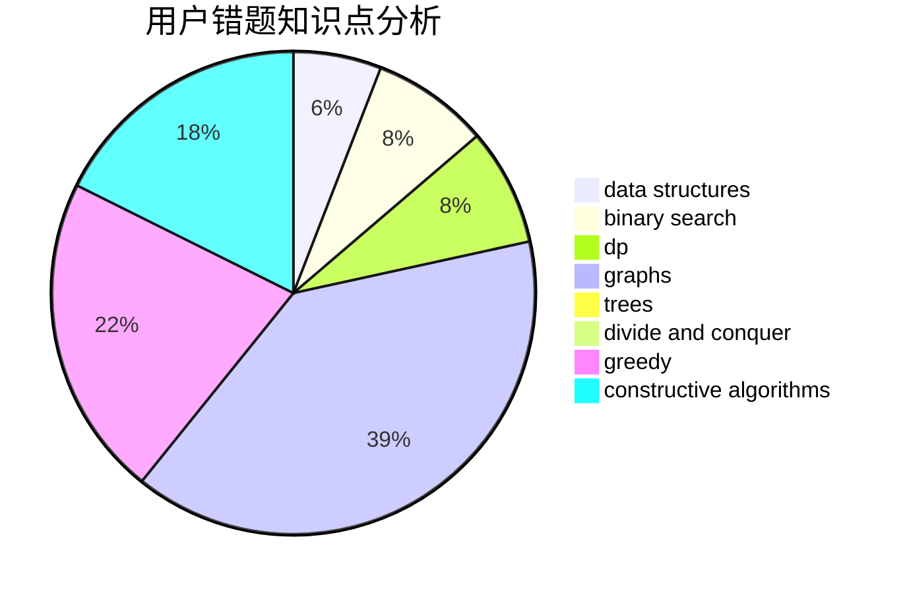

# Qiping_yan.cn

<!-- tabs:start -->

#### **用户提交结果分析**

#### **用户做题类型偏好分析**

#### **用户错题知识点分析**

<!-- tabs:end -->
# 推荐题目
[1154G](https://codeforces.com/contest/1154/problem/G)		brute force,
                        greedy,
                        math,
                        number theory		  
[1004C](https://codeforces.com/contest/1004/problem/C)		constructive algorithms,
                        implementation		  
[916D](https://codeforces.com/contest/916/problem/D)		data structures,
                        interactive,
                        trees		  
[592A](https://codeforces.com/contest/592/problem/A)		implementation		  
[1300C](https://codeforces.com/contest/1300/problem/C)		dsu,graphs,sortings,trees		  
[1142D](https://codeforces.com/contest/1142/problem/D)		dp		  
[14C](https://codeforces.com/contest/14/problem/C)		brute force,
                        constructive algorithms,
                        geometry,
                        implementation,
                        math		  
[662D](https://codeforces.com/contest/662/problem/D)		constructive algorithms,
                        greedy,
                        implementation,
                        math		  
[1225A](https://codeforces.com/contest/1225/problem/A)		math		  
[398C](https://codeforces.com/contest/398/problem/C)		constructive algorithms		  
