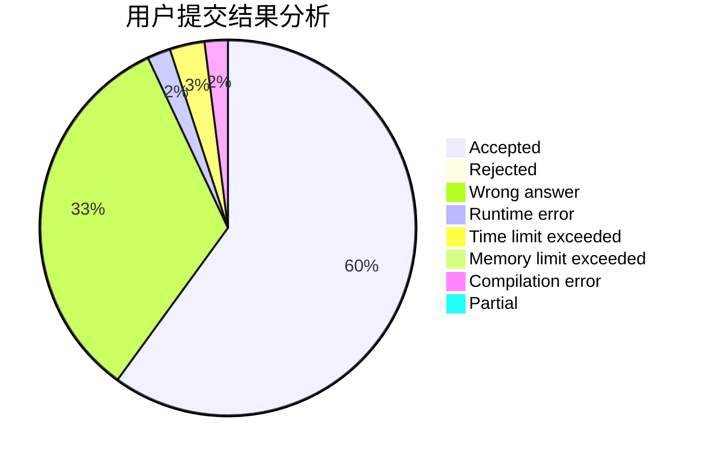
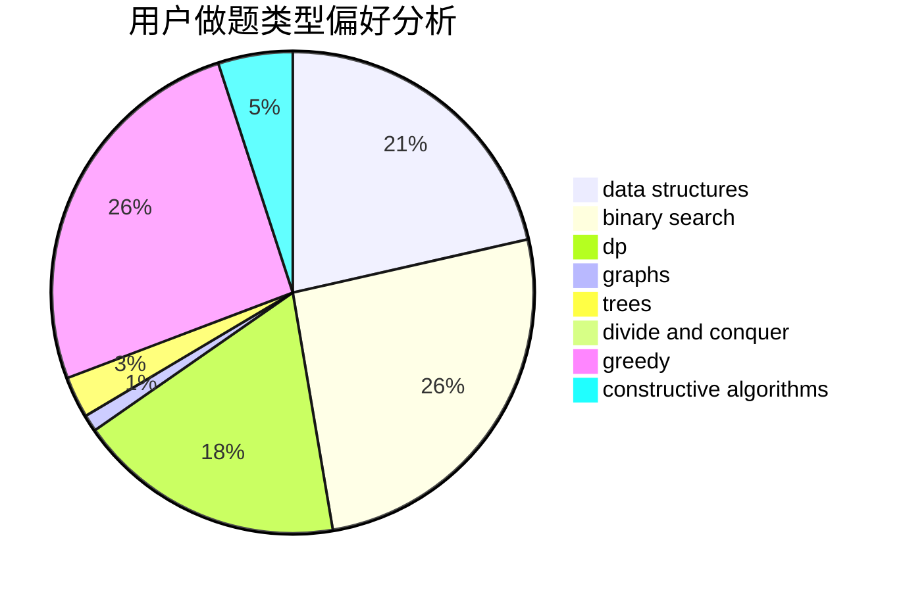
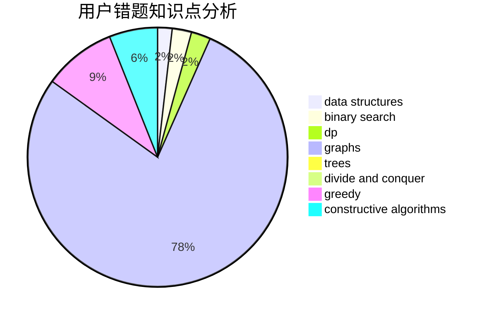

# Qiping_yan.cn

<!-- tabs:start -->

#### **用户提交结果分析**

#### **用户做题类型偏好分析**

#### **用户错题知识点分析**

<!-- tabs:end -->
# 推荐题目
[1152F2](https://codeforces.com/contest/1152F/problem/2)		bitmasks,
                        dp,
                        matrices		  
[1003F](https://codeforces.com/contest/1003/problem/F)		dp,
                        hashing,
                        strings		  
[900A](https://codeforces.com/contest/900/problem/A)		geometry,
                        implementation		  
[571D](https://codeforces.com/contest/571/problem/D)		binary search,
                        data structures,
                        dsu,
                        trees		  
[1294A](https://codeforces.com/contest/1294/problem/A)		math		  
[1140F](https://codeforces.com/contest/1140/problem/F)		data structures,
                        divide and conquer,
                        dsu		  
[1491F](https://codeforces.com/contest/1491/problem/F)		binary search,
                        constructive algorithms,
                        interactive		  
[631E](https://codeforces.com/contest/631/problem/E)		data structures,
                        dp,
                        geometry		  
[1217D](https://codeforces.com/contest/1217/problem/D)		constructive algorithms,
                        dfs and similar,
                        graphs		  
[367D](https://codeforces.com/contest/367/problem/D)		bitmasks,
                        dfs and similar		  
