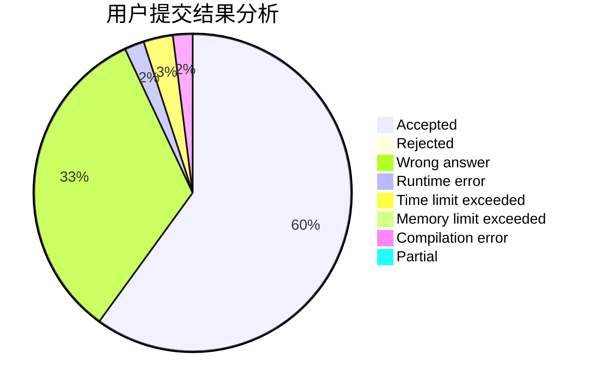
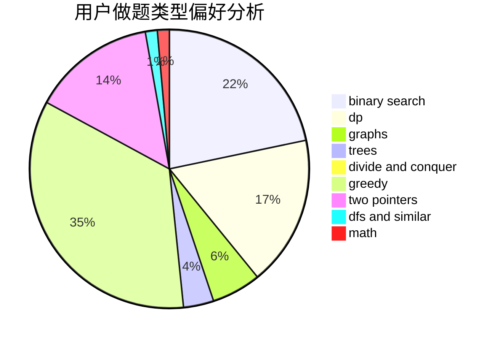

# Qiping_yan.cn

<!-- tabs:start -->

#### **用户提交结果分析**

#### **用户做题类型偏好分析**

<!-- tabs:end -->
# 推荐题目
[1154G](https://codeforces.com/contest/1154/problem/G)
[1004C](https://codeforces.com/contest/1004/problem/C)
[916D](https://codeforces.com/contest/916/problem/D)
[592A](https://codeforces.com/contest/592/problem/A)
[1300C](https://codeforces.com/contest/1300/problem/C)
[1142D](https://codeforces.com/contest/1142/problem/D)
[14C](https://codeforces.com/contest/14/problem/C)
[662D](https://codeforces.com/contest/662/problem/D)
[1225A](https://codeforces.com/contest/1225/problem/A)
[398C](https://codeforces.com/contest/398/problem/C)
