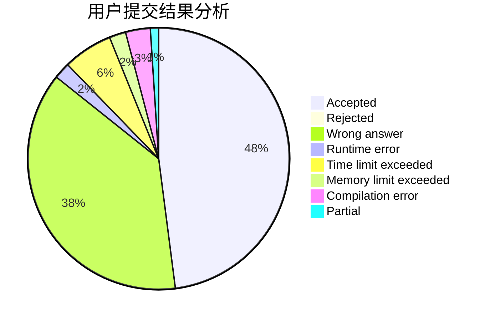
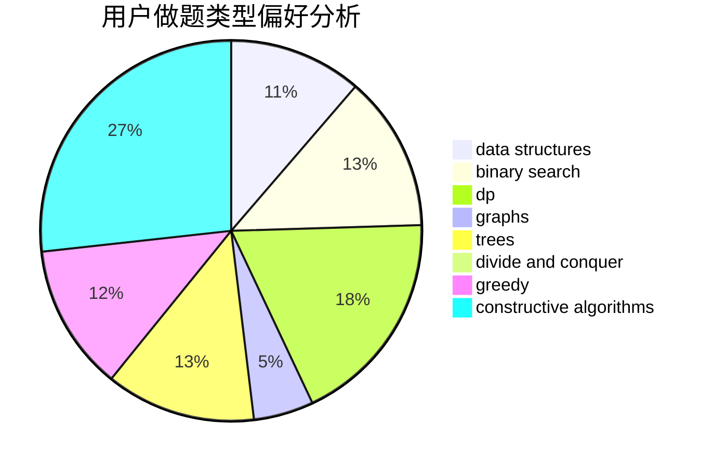
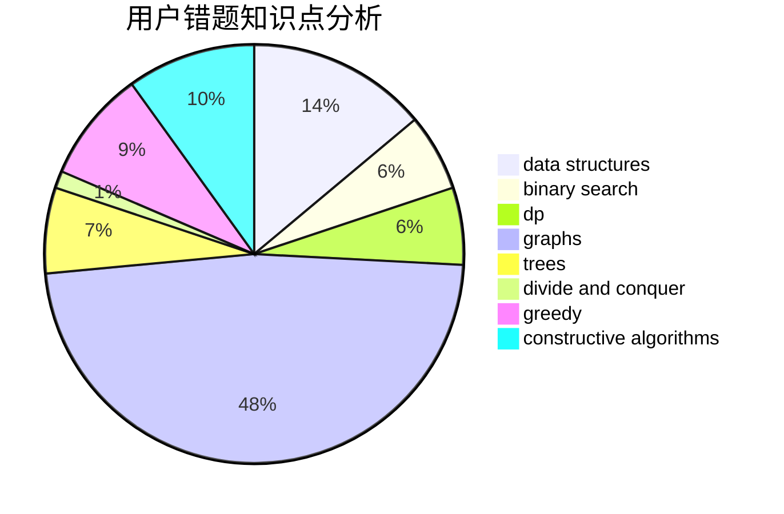

# Qiuly.qwq
<!-- tabs:start -->
#### **用户提交结果分析**

#### **用户做题类型偏好分析**

#### **用户错题知识点分析**

<!-- tabs:end -->
# 推荐题目
[Creating a Character](http://codeforces.com/problemset/problem/1217/A)		binary search,
                        math		  
[Double Profiles](http://codeforces.com/problemset/problem/154/C)		graphs,
                        hashing,
                        sortings		  
[In Search of an Easy Problem](https://codeforces.com/contest/1058/problem/A)		implementation		  
[Beru-taxi](http://codeforces.com/problemset/problem/706/A)		brute force,
                        geometry,
                        implementation		  
[Rook, Bishop and King](http://codeforces.com/problemset/problem/370/A)		graphs,
                        math,
                        shortest paths		  
[Borya's Diagnosis](http://codeforces.com/problemset/problem/879/A)		implementation		  
[The Monster and the Squirrel](http://codeforces.com/problemset/problem/592/B)		math		  
[Numbers Exchange](http://codeforces.com/problemset/problem/746/E)		greedy,
                        implementation,
                        math		  
[Mike and Shortcuts](http://codeforces.com/problemset/problem/689/B)		dfs and similar,
                        graphs,
                        greedy,
                        shortest paths		  
[Barcode](http://codeforces.com/problemset/problem/225/C)		dp,
                        matrices		  
<!-- tabs:start -->
#### **data structures**
[Creating a Character](http://codeforces.com/problemset/problem/1004/E)		binary search,
                        data structures,
                        dp,
                        greedy,
                        shortest paths,
                        trees		  
[Double Profiles](http://codeforces.com/problemset/problem/914/E)		bitmasks,
                        data structures,
                        divide and conquer,
                        trees		  
[In Search of an Easy Problem](https://codeforces.com/contest/1143/problem/E)		data structures,
                        dfs and similar,
                        dp,
                        math,
                        trees		  
[Beru-taxi](http://codeforces.com/problemset/problem/600/B)		binary search,
                        data structures,
                        sortings,
                        two pointers		  
[Rook, Bishop and King](http://codeforces.com/problemset/problem/1088/F)		data structures,
                        trees		  
[Borya's Diagnosis](http://codeforces.com/problemset/problem/242/E)		bitmasks,
                        data structures		  
[The Monster and the Squirrel](http://codeforces.com/problemset/problem/1492/C)		binary search,
                        data structures,
                        dp,
                        greedy,
                        two pointers		  
[Numbers Exchange](http://codeforces.com/problemset/problem/1490/G)		binary search,
                        data structures,
                        math		  
[Mike and Shortcuts](http://codeforces.com/problemset/problem/1479/D)		binary search,
                        bitmasks,
                        brute force,
                        data structures,
                        probabilities,
                        trees		  
[Barcode](http://codeforces.com/problemset/problem/1497/A)		brute force,
                        data structures,
                        greedy,
                        sortings		  
#### **binary search**
[Creating a Character](http://codeforces.com/problemset/problem/1217/A)		binary search,
                        math		  
[Double Profiles](http://codeforces.com/problemset/problem/1004/E)		binary search,
                        data structures,
                        dp,
                        greedy,
                        shortest paths,
                        trees		  
[In Search of an Easy Problem](http://codeforces.com/problemset/problem/416/C)		binary search,
                        dp,
                        greedy,
                        implementation		  
[Beru-taxi](http://codeforces.com/problemset/problem/600/B)		binary search,
                        data structures,
                        sortings,
                        two pointers		  
[Rook, Bishop and King](http://codeforces.com/problemset/problem/1500/B)		binary search,
                        brute force,
                        chinese remainder theorem,
                        math,
                        number theory		  
[Borya's Diagnosis](https://codeforces.com/contest/1247/problem/E)		binary search,
                        dp		  
[The Monster and the Squirrel](http://codeforces.com/problemset/problem/1492/C)		binary search,
                        data structures,
                        dp,
                        greedy,
                        two pointers		  
[Numbers Exchange](http://codeforces.com/problemset/problem/1463/D)		binary search,
                        constructive algorithms,
                        greedy,
                        two pointers		  
[Mike and Shortcuts](http://codeforces.com/problemset/problem/1490/G)		binary search,
                        data structures,
                        math		  
[Barcode](http://codeforces.com/problemset/problem/1479/D)		binary search,
                        bitmasks,
                        brute force,
                        data structures,
                        probabilities,
                        trees		  
#### **dp**
[Creating a Character](http://codeforces.com/problemset/problem/225/C)		dp,
                        matrices		  
[Double Profiles](http://codeforces.com/problemset/problem/1004/E)		binary search,
                        data structures,
                        dp,
                        greedy,
                        shortest paths,
                        trees		  
[In Search of an Easy Problem](http://codeforces.com/problemset/problem/1346/E)		*special problem,
                        dp,
                        graphs		  
[Beru-taxi](http://codeforces.com/problemset/problem/416/C)		binary search,
                        dp,
                        greedy,
                        implementation		  
[Rook, Bishop and King](http://codeforces.com/problemset/problem/651/A)		dp,
                        greedy,
                        implementation,
                        math		  
[Borya's Diagnosis](https://codeforces.com/contest/560/problem/E)		combinatorics,
                        dp,
                        math,
                        number theory		  
[The Monster and the Squirrel](https://codeforces.com/contest/1143/problem/E)		data structures,
                        dfs and similar,
                        dp,
                        math,
                        trees		  
[Numbers Exchange](http://codeforces.com/problemset/problem/86/C)		dp,
                        string suffix structures,
                        trees		  
[Mike and Shortcuts](http://codeforces.com/problemset/problem/704/B)		dp,
                        graphs,
                        greedy		  
[Barcode](http://codeforces.com/problemset/problem/1459/B)		dp,
                        math		  
#### **graph**
[Creating a Character](http://codeforces.com/problemset/problem/154/C)		graphs,
                        hashing,
                        sortings		  
[Double Profiles](http://codeforces.com/problemset/problem/370/A)		graphs,
                        math,
                        shortest paths		  
[In Search of an Easy Problem](http://codeforces.com/problemset/problem/689/B)		dfs and similar,
                        graphs,
                        greedy,
                        shortest paths		  
[Beru-taxi](http://codeforces.com/problemset/problem/1346/E)		*special problem,
                        dp,
                        graphs		  
[Rook, Bishop and King](http://codeforces.com/problemset/problem/1291/F)		graphs,
                        interactive		  
[Borya's Diagnosis](https://codeforces.com/contest/218/problem/C)		brute force,
                        dfs and similar,
                        dsu,
                        graphs		  
[The Monster and the Squirrel](https://codeforces.com/contest/745/problem/C)		dfs and similar,
                        graphs		  
[Numbers Exchange](http://codeforces.com/problemset/problem/704/B)		dp,
                        graphs,
                        greedy		  
[Mike and Shortcuts](http://codeforces.com/problemset/problem/1381/C)		constructive algorithms,
                        graph matchings,
                        greedy,
                        implementation,
                        sortings,
                        two pointers		  
[Barcode](http://codeforces.com/problemset/problem/1487/C)		brute force,
                        constructive algorithms,
                        dfs and similar,
                        graphs,
                        greedy,
                        implementation,
                        math		  
#### **trees**
[Creating a Character](http://codeforces.com/problemset/problem/1004/E)		binary search,
                        data structures,
                        dp,
                        greedy,
                        shortest paths,
                        trees		  
[Double Profiles](http://codeforces.com/problemset/problem/914/E)		bitmasks,
                        data structures,
                        divide and conquer,
                        trees		  
[In Search of an Easy Problem](https://codeforces.com/contest/1143/problem/E)		data structures,
                        dfs and similar,
                        dp,
                        math,
                        trees		  
[Beru-taxi](http://codeforces.com/problemset/problem/86/C)		dp,
                        string suffix structures,
                        trees		  
[Rook, Bishop and King](http://codeforces.com/problemset/problem/1088/F)		data structures,
                        trees		  
[Borya's Diagnosis](http://codeforces.com/problemset/problem/1479/D)		binary search,
                        bitmasks,
                        brute force,
                        data structures,
                        probabilities,
                        trees		  
[The Monster and the Squirrel](http://codeforces.com/problemset/problem/1511/C)		brute force,
                        data structures,
                        implementation,
                        trees		  
[Numbers Exchange](http://codeforces.com/problemset/problem/1499/F)		combinatorics,
                        dfs and similar,
                        dp,
                        trees		  
[Mike and Shortcuts](http://codeforces.com/problemset/problem/1491/E)		brute force,
                        dfs and similar,
                        divide and conquer,
                        number theory,
                        trees		  
[Barcode](http://codeforces.com/problemset/problem/1466/D)		data structures,
                        greedy,
                        sortings,
                        trees		  
#### **divide and conquer**
[Creating a Character](http://codeforces.com/problemset/problem/914/E)		bitmasks,
                        data structures,
                        divide and conquer,
                        trees		  
[Double Profiles](http://codeforces.com/problemset/problem/1461/D)		binary search,
                        brute force,
                        data structures,
                        divide and conquer,
                        implementation,
                        sortings		  
[In Search of an Easy Problem](http://codeforces.com/problemset/problem/1466/G)		combinatorics,
                        divide and conquer,
                        hashing,
                        math,
                        string suffix structures,
                        strings		  
[Beru-taxi](http://codeforces.com/problemset/problem/1490/D)		dfs and similar,
                        divide and conquer,
                        implementation		  
[Rook, Bishop and King](https://codeforces.com/contest/1483/problem/C)		data structures,
                        divide and conquer,
                        dp		  
[Borya's Diagnosis](http://codeforces.com/problemset/problem/1491/E)		brute force,
                        dfs and similar,
                        divide and conquer,
                        number theory,
                        trees		  
[The Monster and the Squirrel](http://codeforces.com/problemset/problem/1303/G)		data structures,
                        divide and conquer,
                        geometry,
                        trees		  
[Numbers Exchange](http://codeforces.com/problemset/problem/1494/D)		constructive algorithms,
                        data structures,
                        dfs and similar,
                        divide and conquer,
                        dsu,
                        greedy,
                        sortings,
                        trees		  
[Mike and Shortcuts](http://codeforces.com/problemset/problem/1482/E)		data structures,
                        divide and conquer,
                        dp		  
[Barcode](http://codeforces.com/problemset/problem/566/C)		dfs and similar,
                        divide and conquer,
                        trees		  
#### **greedy**
[Creating a Character](http://codeforces.com/problemset/problem/746/E)		greedy,
                        implementation,
                        math		  
[Double Profiles](http://codeforces.com/problemset/problem/689/B)		dfs and similar,
                        graphs,
                        greedy,
                        shortest paths		  
[In Search of an Easy Problem](http://codeforces.com/problemset/problem/1004/E)		binary search,
                        data structures,
                        dp,
                        greedy,
                        shortest paths,
                        trees		  
[Beru-taxi](http://codeforces.com/problemset/problem/416/C)		binary search,
                        dp,
                        greedy,
                        implementation		  
[Rook, Bishop and King](http://codeforces.com/problemset/problem/651/A)		dp,
                        greedy,
                        implementation,
                        math		  
[Borya's Diagnosis](http://codeforces.com/problemset/problem/1157/D)		constructive algorithms,
                        greedy,
                        math		  
[The Monster and the Squirrel](http://codeforces.com/problemset/problem/704/B)		dp,
                        graphs,
                        greedy		  
[Numbers Exchange](https://codeforces.com/contest/146/problem/C)		greedy,
                        implementation		  
[Mike and Shortcuts](http://codeforces.com/problemset/problem/1108/B)		brute force,
                        greedy,
                        math,
                        number theory		  
[Barcode](http://codeforces.com/problemset/problem/1381/C)		constructive algorithms,
                        graph matchings,
                        greedy,
                        implementation,
                        sortings,
                        two pointers		  
#### **constructive algorithms**
[Creating a Character](http://codeforces.com/problemset/problem/732/A)		brute force,
                        constructive algorithms,
                        implementation,
                        math		  
[Double Profiles](http://codeforces.com/problemset/problem/803/B)		constructive algorithms		  
[In Search of an Easy Problem](http://codeforces.com/problemset/problem/1080/D)		constructive algorithms,
                        implementation,
                        math		  
[Beru-taxi](http://codeforces.com/problemset/problem/1157/D)		constructive algorithms,
                        greedy,
                        math		  
[Rook, Bishop and King](http://codeforces.com/problemset/problem/1381/C)		constructive algorithms,
                        graph matchings,
                        greedy,
                        implementation,
                        sortings,
                        two pointers		  
[Borya's Diagnosis](http://codeforces.com/problemset/problem/1451/E2)		bitmasks,
                        constructive algorithms,
                        interactive,
                        math		  
[The Monster and the Squirrel](http://codeforces.com/problemset/problem/1493/A)		constructive algorithms,
                        greedy		  
[Numbers Exchange](http://codeforces.com/problemset/problem/1463/D)		binary search,
                        constructive algorithms,
                        greedy,
                        two pointers		  
[Mike and Shortcuts](https://codeforces.com/contest/1456/problem/B)		bitmasks,
                        brute force,
                        constructive algorithms		  
[Barcode](http://codeforces.com/problemset/problem/1492/D)		bitmasks,
                        constructive algorithms,
                        greedy,
                        math		  
#### **sortings**
[Creating a Character](http://codeforces.com/problemset/problem/154/C)		graphs,
                        hashing,
                        sortings		  
[Double Profiles](http://codeforces.com/problemset/problem/600/B)		binary search,
                        data structures,
                        sortings,
                        two pointers		  
[In Search of an Easy Problem](http://codeforces.com/problemset/problem/1381/C)		constructive algorithms,
                        graph matchings,
                        greedy,
                        implementation,
                        sortings,
                        two pointers		  
[Beru-taxi](https://codeforces.com/contest/1496/problem/C)		geometry,
                        greedy,
                        math,
                        sortings		  
[Rook, Bishop and King](http://codeforces.com/problemset/problem/1495/A)		geometry,
                        greedy,
                        math,
                        sortings		  
[Borya's Diagnosis](http://codeforces.com/problemset/problem/1497/A)		brute force,
                        data structures,
                        greedy,
                        sortings		  
[The Monster and the Squirrel](http://codeforces.com/problemset/problem/1427/A)		math,
                        sortings		  
[Numbers Exchange](http://codeforces.com/problemset/problem/1461/D)		binary search,
                        brute force,
                        data structures,
                        divide and conquer,
                        implementation,
                        sortings		  
[Mike and Shortcuts](http://codeforces.com/problemset/problem/1437/C)		dp,
                        flows,
                        graph matchings,
                        greedy,
                        math,
                        sortings		  
[Barcode](http://codeforces.com/problemset/problem/1473/A)		greedy,
                        implementation,
                        math,
                        sortings		  
<!-- tabs:end -->
