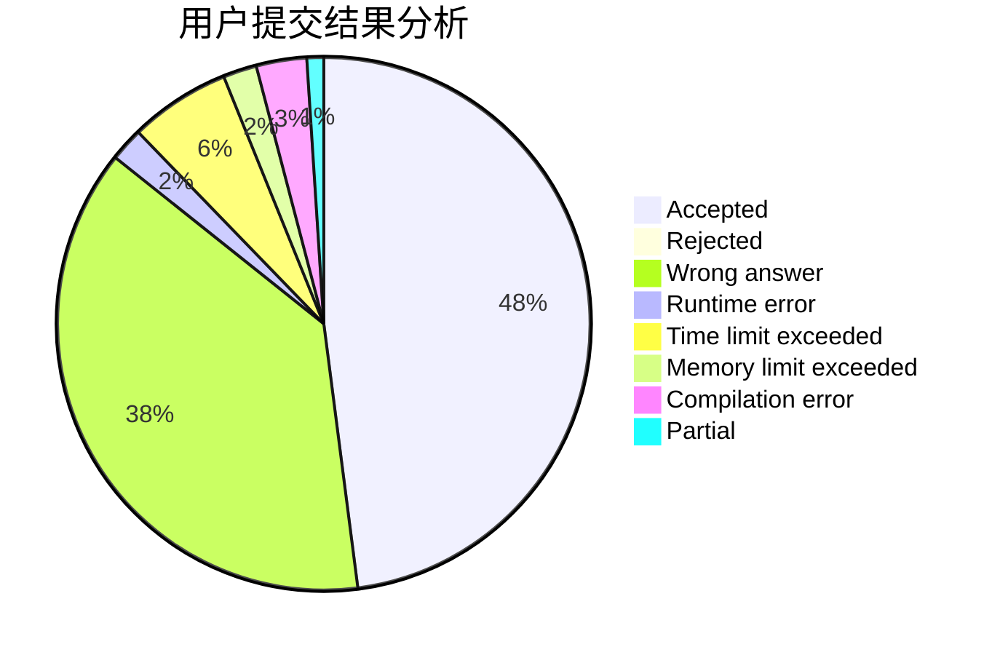
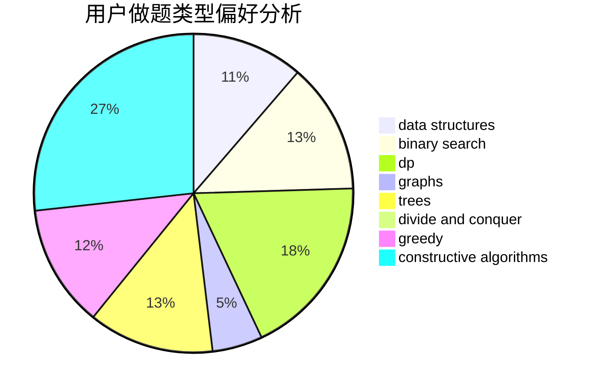
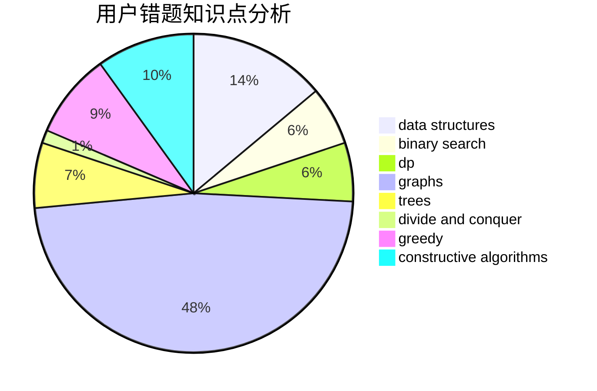

# Qiuly.qwq

<!-- tabs:start -->

#### **用户提交结果分析**

#### **用户做题类型偏好分析**

#### **用户错题知识点分析**

<!-- tabs:end -->
# 推荐题目
[1217A](https://codeforces.com/contest/1217/problem/A)		binary search,
                        math		  
[154C](https://codeforces.com/contest/154/problem/C)		graphs,
                        hashing,
                        sortings		  
[1058A](https://codeforces.com/contest/1058/problem/A)		dsu,graphs,sortings,trees		  
[1247E](https://codeforces.com/contest/1247/problem/E)		dsu,graphs,sortings,trees		  
[1157D](https://codeforces.com/contest/1157/problem/D)		constructive algorithms,
                        greedy,
                        math		  
[225C](https://codeforces.com/contest/225/problem/C)		dp,
                        matrices		  
[370A](https://codeforces.com/contest/370/problem/A)		graphs,
                        math,
                        shortest paths		  
[879A](https://codeforces.com/contest/879/problem/A)		implementation		  
[1346E](https://codeforces.com/contest/1346/problem/E)		*special problem,
                        dp,
                        graphs		  
[914E](https://codeforces.com/contest/914/problem/E)		bitmasks,
                        data structures,
                        divide and conquer,
                        trees		  
