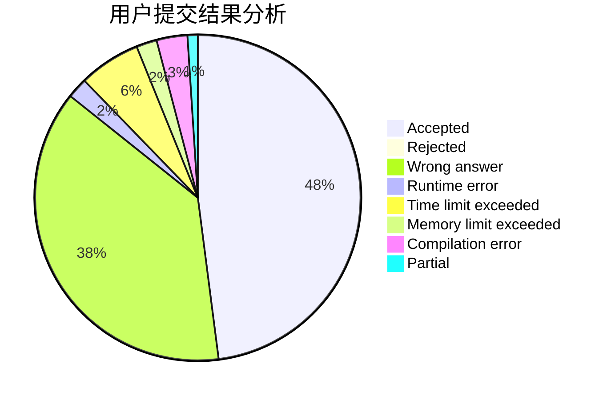
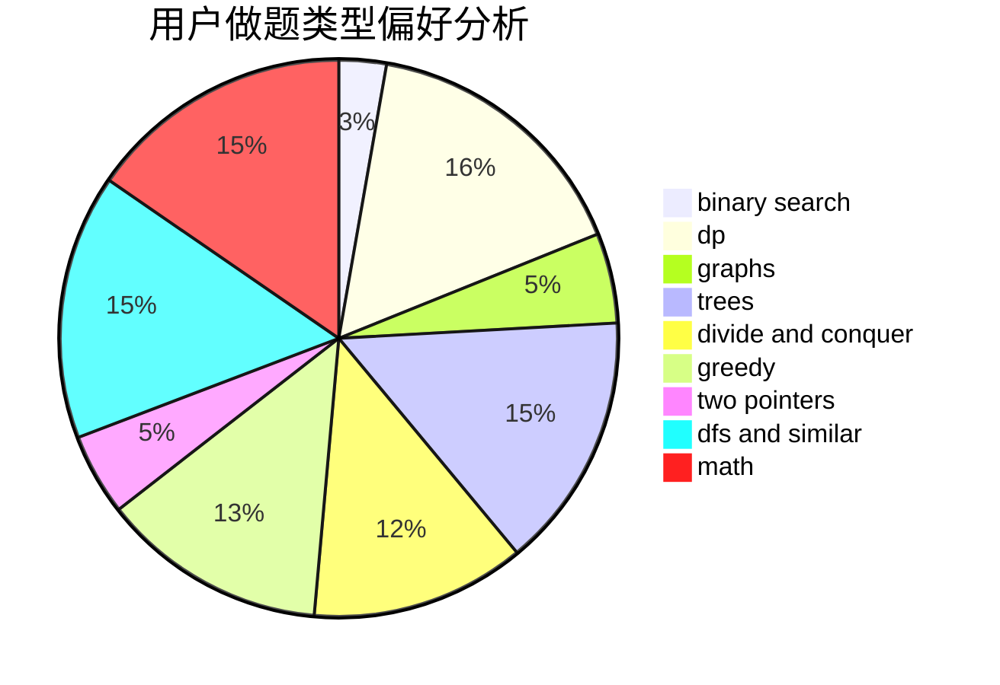

# Qiuly.qwq

<!-- tabs:start -->

#### **用户提交结果分析**

#### **用户做题类型偏好分析**

<!-- tabs:end -->
# 推荐题目
[1223E](https://codeforces.com/contest/1223/problem/E)
[176B](https://codeforces.com/contest/176/problem/B)
[1058D](https://codeforces.com/contest/1058/problem/D)
[1251D](https://codeforces.com/contest/1251/problem/D)
[1159F](https://codeforces.com/contest/1159/problem/F)
[243C](https://codeforces.com/contest/243/problem/C)
[3C](https://codeforces.com/contest/3/problem/C)
[899E](https://codeforces.com/contest/899/problem/E)
[1353F](https://codeforces.com/contest/1353/problem/F)
[934A](https://codeforces.com/contest/934/problem/A)
