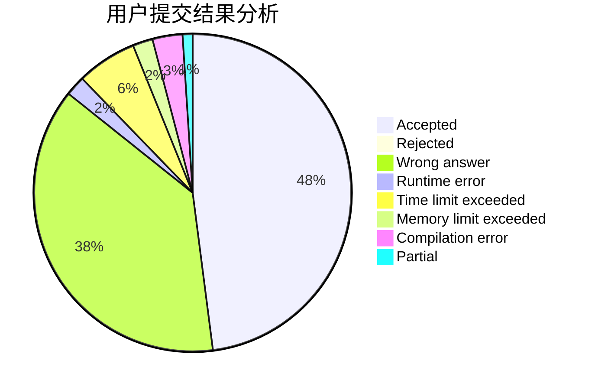
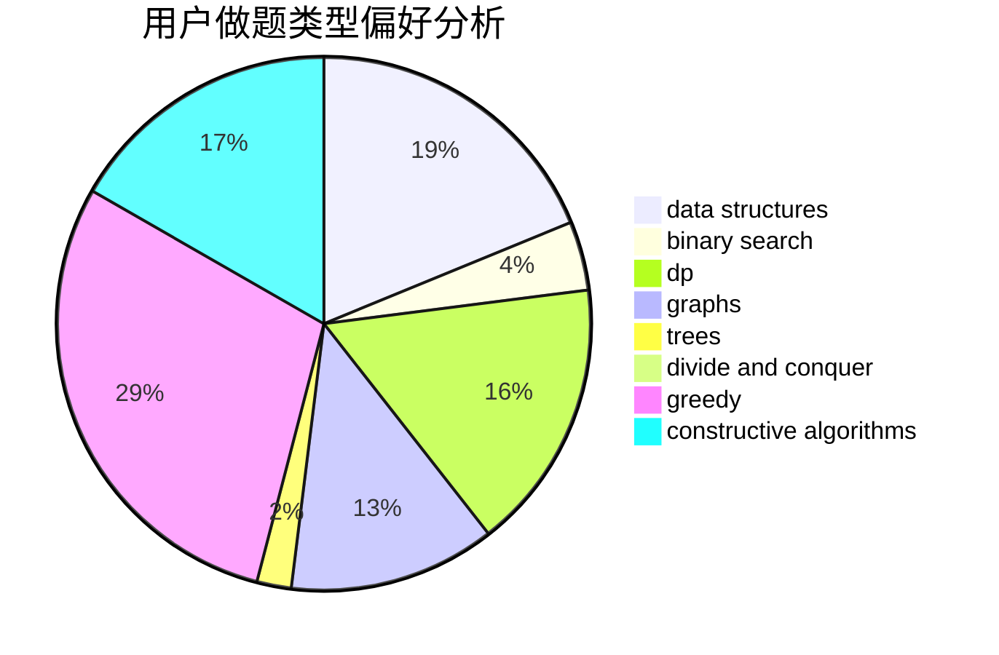
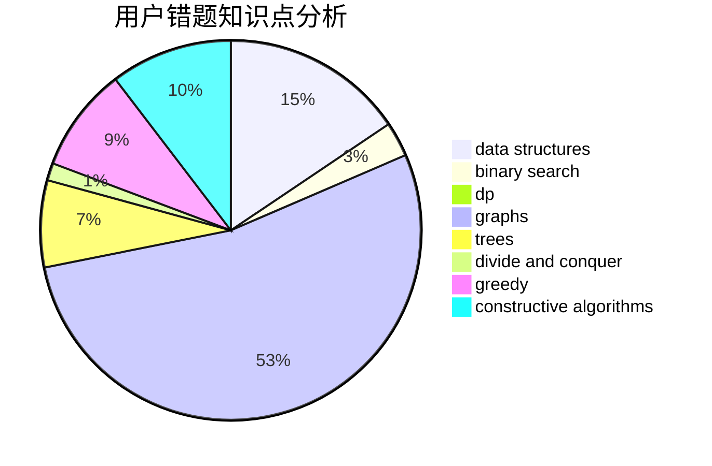

# Qiuly.qwq

<!-- tabs:start -->

#### **用户提交结果分析**

#### **用户做题类型偏好分析**

#### **用户错题知识点分析**

<!-- tabs:end -->
# 推荐题目
[1223E](https://codeforces.com/contest/1223/problem/E)		dp,
                        sortings,
                        trees		  
[176B](https://codeforces.com/contest/176/problem/B)		dp		  
[1058D](https://codeforces.com/contest/1058/problem/D)		dsu,graphs,sortings,trees		  
[1251D](https://codeforces.com/contest/1251/problem/D)		binary search,
                        greedy,
                        sortings		  
[1159F](https://codeforces.com/contest/1159/problem/F)		dsu,graphs,sortings,trees		  
[243C](https://codeforces.com/contest/243/problem/C)		dfs and similar,
                        implementation		  
[3C](https://codeforces.com/contest/3/problem/C)		brute force,
                        games,
                        implementation		  
[899E](https://codeforces.com/contest/899/problem/E)		data structures,
                        dsu,
                        flows,
                        implementation,
                        two pointers		  
[1353F](https://codeforces.com/contest/1353/problem/F)		brute force,
                        dp		  
[934A](https://codeforces.com/contest/934/problem/A)		brute force,
                        games		  
