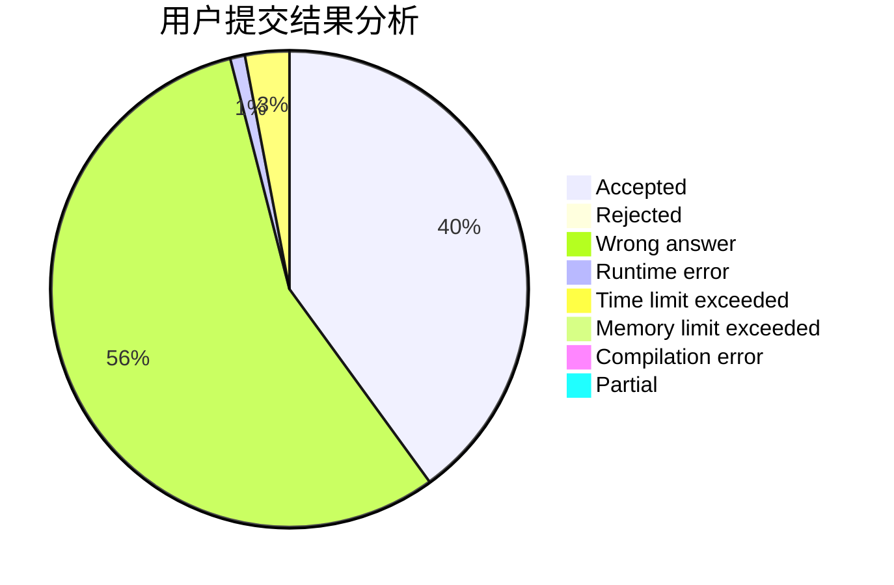
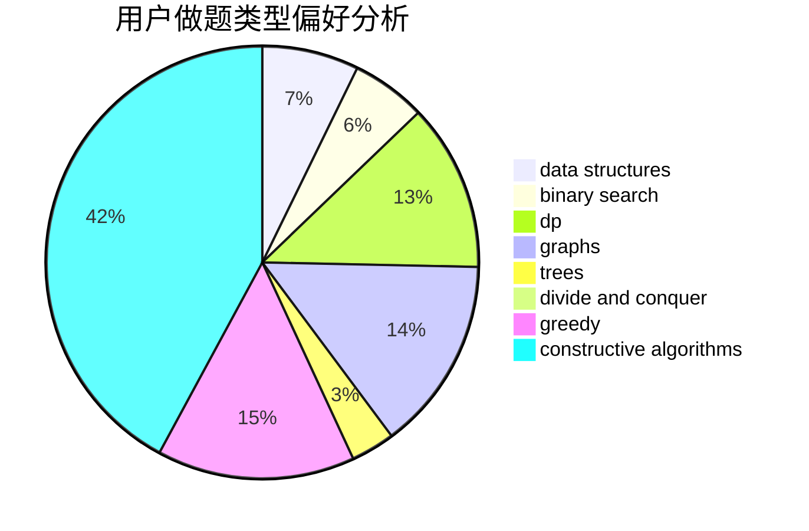
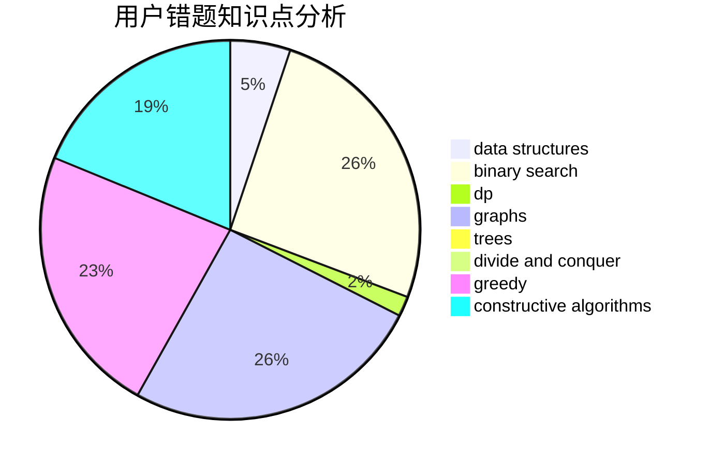

# QoooQ

<!-- tabs:start -->

#### **用户提交结果分析**

#### **用户做题类型偏好分析**

#### **用户错题知识点分析**

<!-- tabs:end -->
# 推荐题目
[253A](https://codeforces.com/contest/253/problem/A)		greedy		  
[55D](https://codeforces.com/contest/55/problem/D)		dp,
                        number theory		  
[1000G](https://codeforces.com/contest/1000/problem/G)		data structures,
                        dp,
                        trees		  
[1261E](https://codeforces.com/contest/1261/problem/E)		dsu,graphs,sortings,trees		  
[797C](https://codeforces.com/contest/797/problem/C)		data structures,
                        greedy,
                        strings		  
[472A](https://codeforces.com/contest/472/problem/A)		math,
                        number theory		  
[1506B](https://codeforces.com/contest/1506/problem/B)		greedy,
                        implementation		  
[915D](https://codeforces.com/contest/915/problem/D)		dfs and similar,
                        graphs		  
[400E](https://codeforces.com/contest/400/problem/E)		binary search,
                        bitmasks,
                        data structures		  
[977D](https://codeforces.com/contest/977/problem/D)		dfs and similar,
                        math,
                        sortings		  
