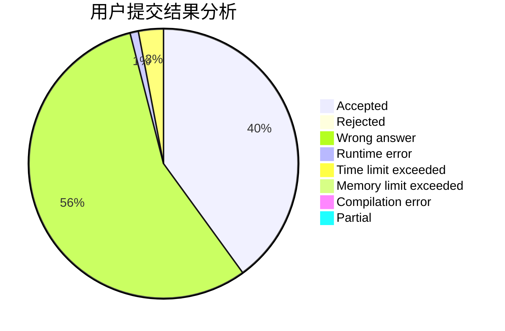
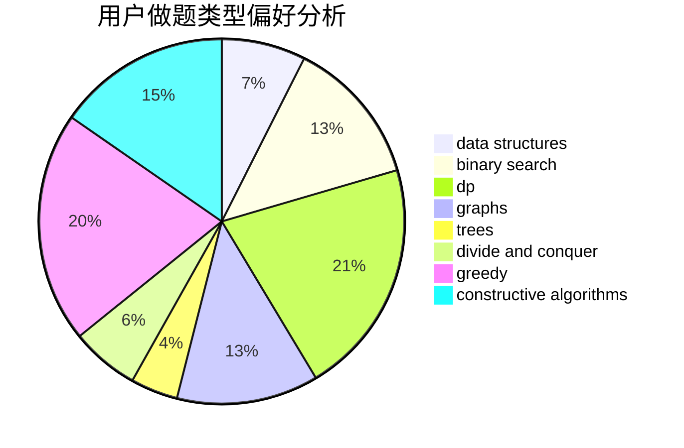
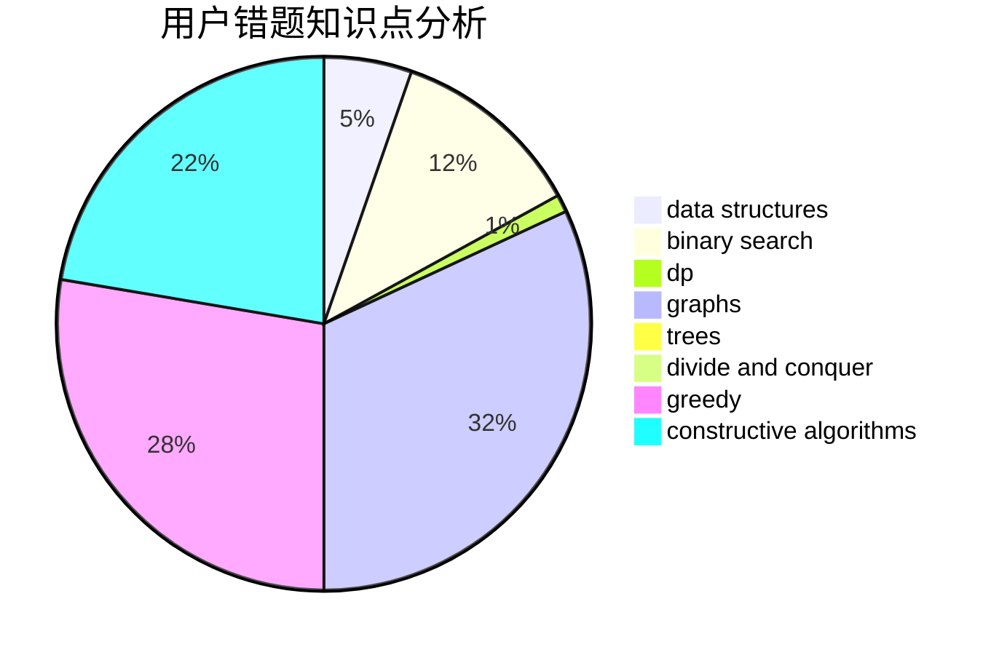

# QoooQ

<!-- tabs:start -->

#### **用户提交结果分析**

#### **用户做题类型偏好分析**

#### **用户错题知识点分析**

<!-- tabs:end -->
# 推荐题目
[26D](https://codeforces.com/contest/26/problem/D)		combinatorics,
                        math,
                        probabilities		  
[584B](https://codeforces.com/contest/584/problem/B)		combinatorics		  
[1000G](https://codeforces.com/contest/1000/problem/G)		data structures,
                        dp,
                        trees		  
[1267F](https://codeforces.com/contest/1267/problem/F)		graphs		  
[811B](https://codeforces.com/contest/811/problem/B)		implementation,
                        sortings		  
[490B](https://codeforces.com/contest/490/problem/B)		dsu,
                        implementation		  
[157C](https://codeforces.com/contest/157/problem/C)		dsu,graphs,sortings,trees		  
[935C](https://codeforces.com/contest/935/problem/C)		geometry		  
[42A](https://codeforces.com/contest/42/problem/A)		greedy,
                        implementation		  
[991B](https://codeforces.com/contest/991/problem/B)		greedy,
                        sortings		  
