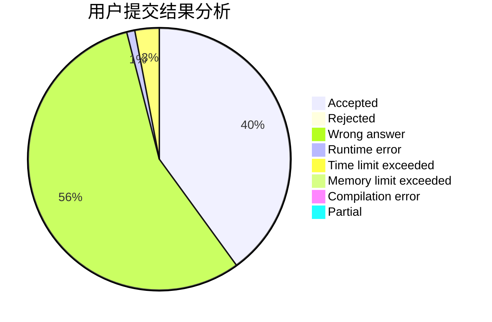
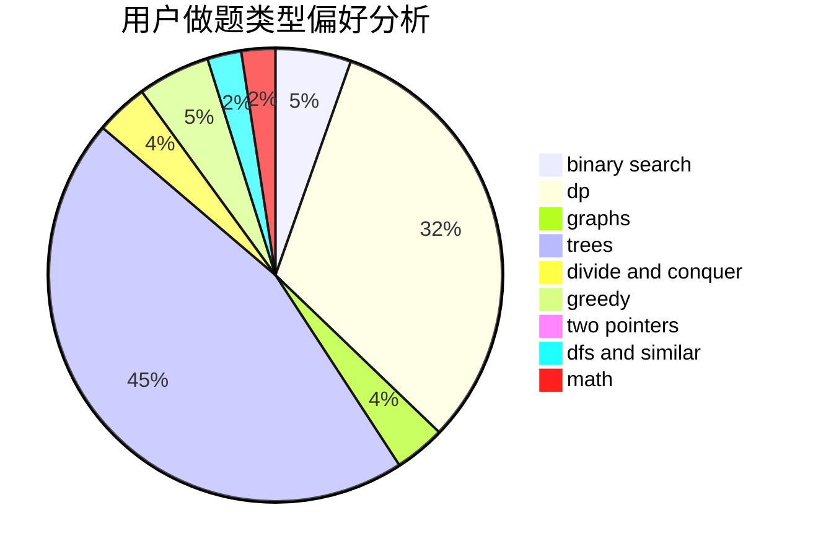

# QoooQ

<!-- tabs:start -->

#### **用户提交结果分析**

#### **用户做题类型偏好分析**

<!-- tabs:end -->
# 推荐题目
[26D](https://codeforces.com/contest/26/problem/D)
[584B](https://codeforces.com/contest/584/problem/B)
[1000G](https://codeforces.com/contest/1000/problem/G)
[1267F](https://codeforces.com/contest/1267/problem/F)
[811B](https://codeforces.com/contest/811/problem/B)
[490B](https://codeforces.com/contest/490/problem/B)
[157C](https://codeforces.com/contest/157/problem/C)
[935C](https://codeforces.com/contest/935/problem/C)
[42A](https://codeforces.com/contest/42/problem/A)
[991B](https://codeforces.com/contest/991/problem/B)
