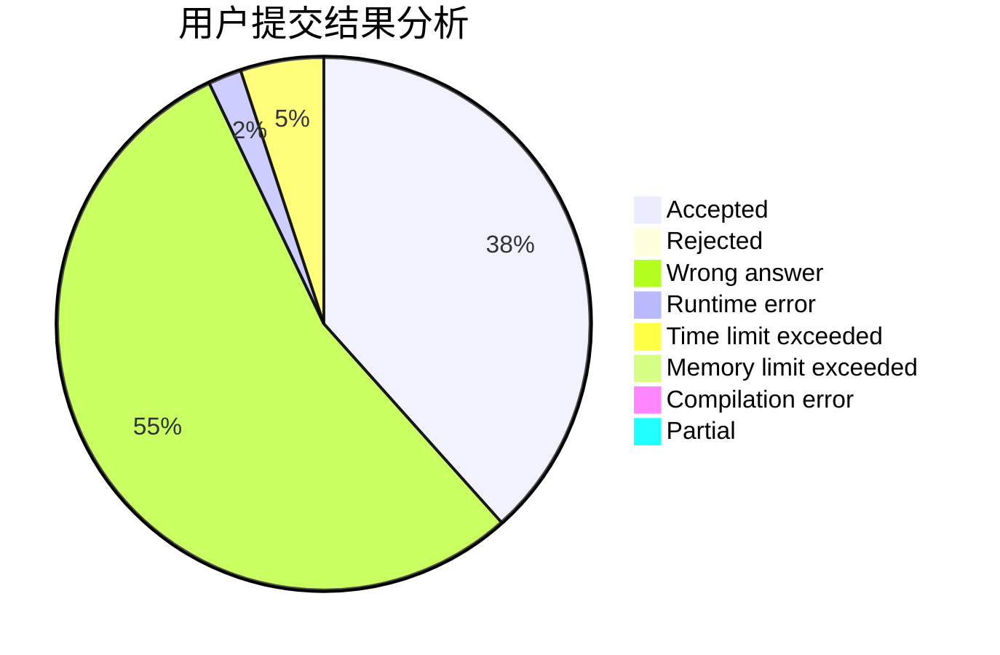
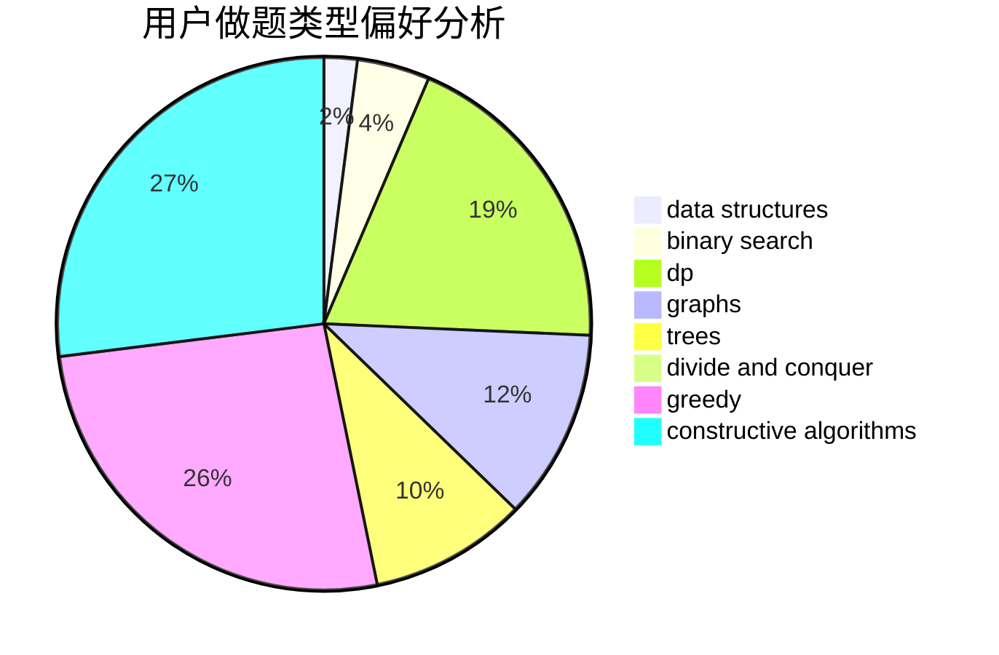
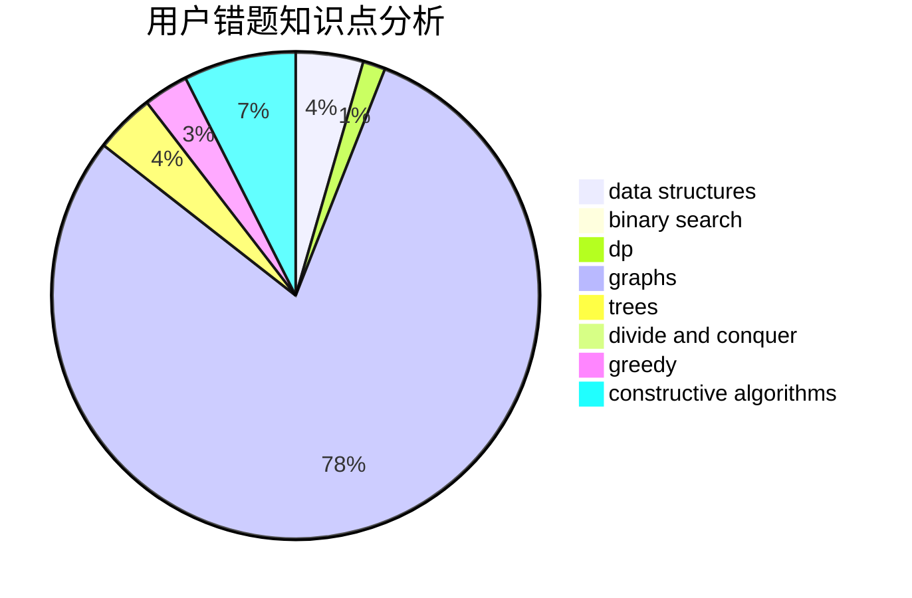

# Quasrain
<!-- tabs:start -->
#### **用户提交结果分析**

#### **用户做题类型偏好分析**

#### **用户错题知识点分析**

<!-- tabs:end -->
# 推荐题目
[Three Bags](http://codeforces.com/problemset/problem/1467/C)		constructive algorithms,
                        greedy		  
[Sum of Paths](http://codeforces.com/problemset/problem/1467/D)		combinatorics,
                        dp,
                        math		  
[Permutation recovery](http://codeforces.com/problemset/problem/1158/C)		constructive algorithms,
                        data structures,
                        dfs and similar,
                        graphs,
                        greedy,
                        math,
                        sortings		  
[Boxers](http://codeforces.com/problemset/problem/1203/E)		greedy,
                        sortings		  
[Mystical Mosaic](https://codeforces.com/contest/957/problem/B)		greedy,
                        implementation		  
[Robin Hood](https://codeforces.com/contest/672/problem/D)		binary search,
                        greedy		  
[Divisors](http://codeforces.com/problemset/problem/1033/D)		interactive,
                        math,
                        number theory		  
[Little Pony and Lord Tirek](http://codeforces.com/problemset/problem/453/E)		data structures		  
[Towers](http://codeforces.com/problemset/problem/229/D)		dp,
                        greedy,
                        two pointers		  
[Zigzag](http://codeforces.com/problemset/problem/228/D)		data structures		  
<!-- tabs:start -->
#### **data structures**
[Permutation recovery](http://codeforces.com/problemset/problem/1158/C)		constructive algorithms,
                        data structures,
                        dfs and similar,
                        graphs,
                        greedy,
                        math,
                        sortings		  
[Little Pony and Lord Tirek](http://codeforces.com/problemset/problem/453/E)		data structures		  
[Zigzag](http://codeforces.com/problemset/problem/228/D)		data structures		  
[Yet Another Partiton Problem](http://codeforces.com/problemset/problem/1175/G)		data structures,
                        divide and conquer,
                        dp,
                        geometry,
                        two pointers		  
[Bipartite Segments](http://codeforces.com/problemset/problem/901/C)		binary search,
                        data structures,
                        dfs and similar,
                        dsu,
                        graphs,
                        two pointers		  
[GCD of an Array](http://codeforces.com/problemset/problem/1493/D)		brute force,
                        data structures,
                        hashing,
                        implementation,
                        math,
                        number theory,
                        sortings,
                        two pointers		  
[Painting the Array II](http://codeforces.com/problemset/problem/1479/B2)		constructive algorithms,
                        data structures,
                        dp,
                        greedy,
                        implementation		  
[Cow Tennis Tournament](http://codeforces.com/problemset/problem/283/E)		combinatorics,
                        data structures,
                        math		  
[Broken BST](http://codeforces.com/problemset/problem/797/D)		data structures,
                        dfs and similar		  
[Goodbye Souvenir](http://codeforces.com/problemset/problem/848/C)		data structures,
                        divide and conquer		  
#### **binary search**
[Robin Hood](https://codeforces.com/contest/672/problem/D)		binary search,
                        greedy		  
[Meme Problem](http://codeforces.com/problemset/problem/1076/C)		binary search,
                        math		  
[Bipartite Segments](http://codeforces.com/problemset/problem/901/C)		binary search,
                        data structures,
                        dfs and similar,
                        dsu,
                        graphs,
                        two pointers		  
[Maximum width](http://codeforces.com/problemset/problem/1492/C)		binary search,
                        data structures,
                        dp,
                        greedy,
                        two pointers		  
[Pairs](http://codeforces.com/problemset/problem/1463/D)		binary search,
                        constructive algorithms,
                        greedy,
                        two pointers		  
[Old Floppy Drive](http://codeforces.com/problemset/problem/1490/G)		binary search,
                        data structures,
                        math		  
[Odd Mineral Resource](http://codeforces.com/problemset/problem/1479/D)		binary search,
                        bitmasks,
                        brute force,
                        data structures,
                        probabilities,
                        trees		  
[Complicated Computations](http://codeforces.com/problemset/problem/1436/E)		binary search,
                        data structures,
                        two pointers		  
[Divide and Summarize](http://codeforces.com/problemset/problem/1461/D)		binary search,
                        brute force,
                        data structures,
                        divide and conquer,
                        implementation,
                        sortings		  
[K-beautiful Strings](http://codeforces.com/problemset/problem/1493/C)		binary search,
                        brute force,
                        constructive algorithms,
                        greedy,
                        strings		  
#### **dp**
[Sum of Paths](http://codeforces.com/problemset/problem/1467/D)		combinatorics,
                        dp,
                        math		  
[Towers](http://codeforces.com/problemset/problem/229/D)		dp,
                        greedy,
                        two pointers		  
[Card Bag](http://codeforces.com/problemset/problem/1156/F)		dp,
                        math,
                        probabilities		  
[Dima and Hares](http://codeforces.com/problemset/problem/358/D)		dp,
                        greedy		  
[The Great Julya Calendar](http://codeforces.com/problemset/problem/331/C1)		dp		  
[Representative Sampling](http://codeforces.com/problemset/problem/178/F2)		dp,
                        sortings,
                        strings		  
[Yet Another Partiton Problem](http://codeforces.com/problemset/problem/1175/G)		data structures,
                        divide and conquer,
                        dp,
                        geometry,
                        two pointers		  
[Casinos and travel](http://codeforces.com/problemset/problem/852/E)		dp		  
[MADMAX](http://codeforces.com/problemset/problem/917/B)		dfs and similar,
                        dp,
                        games,
                        graphs		  
[Berzerk](http://codeforces.com/problemset/problem/786/A)		dfs and similar,
                        dp,
                        games		  
#### **graph**
[Permutation recovery](http://codeforces.com/problemset/problem/1158/C)		constructive algorithms,
                        data structures,
                        dfs and similar,
                        graphs,
                        greedy,
                        math,
                        sortings		  
[Hide and Seek](http://codeforces.com/problemset/problem/1147/A)		graphs		  
[MADMAX](http://codeforces.com/problemset/problem/917/B)		dfs and similar,
                        dp,
                        games,
                        graphs		  
[The Shortest Statement](http://codeforces.com/problemset/problem/1051/F)		graphs,
                        shortest paths,
                        trees		  
[Bipartite Segments](http://codeforces.com/problemset/problem/901/C)		binary search,
                        data structures,
                        dfs and similar,
                        dsu,
                        graphs,
                        two pointers		  
[Igor In the Museum](http://codeforces.com/problemset/problem/598/D)		dfs and similar,
                        graphs,
                        shortest paths		  
[Fox And Names](http://codeforces.com/problemset/problem/510/C)		dfs and similar,
                        graphs,
                        sortings		  
[Minimum Ties](http://codeforces.com/problemset/problem/1487/C)		brute force,
                        constructive algorithms,
                        dfs and similar,
                        graphs,
                        greedy,
                        implementation,
                        math		  
[Chef Monocarp](http://codeforces.com/problemset/problem/1437/C)		dp,
                        flows,
                        graph matchings,
                        greedy,
                        math,
                        sortings		  
[Strange Housing](http://codeforces.com/problemset/problem/1470/D)		constructive algorithms,
                        dfs and similar,
                        graph matchings,
                        graphs,
                        greedy		  
#### **trees**
[Tree and XOR](http://codeforces.com/problemset/problem/1055/F)		strings,
                        trees		  
[The Shortest Statement](http://codeforces.com/problemset/problem/1051/F)		graphs,
                        shortest paths,
                        trees		  
[Odd Mineral Resource](http://codeforces.com/problemset/problem/1479/D)		binary search,
                        bitmasks,
                        brute force,
                        data structures,
                        probabilities,
                        trees		  
[Yet Another Card Deck](http://codeforces.com/problemset/problem/1511/C)		brute force,
                        data structures,
                        implementation,
                        trees		  
[Diameter Cuts](http://codeforces.com/problemset/problem/1499/F)		combinatorics,
                        dfs and similar,
                        dp,
                        trees		  
[Fib-tree](http://codeforces.com/problemset/problem/1491/E)		brute force,
                        dfs and similar,
                        divide and conquer,
                        number theory,
                        trees		  
[13th Labour of Heracles](http://codeforces.com/problemset/problem/1466/D)		data structures,
                        greedy,
                        sortings,
                        trees		  
[BFS Trees](http://codeforces.com/problemset/problem/1495/D)		combinatorics,
                        dfs and similar,
                        graphs,
                        math,
                        shortest paths,
                        trees		  
[Sum of Prefix Sums](http://codeforces.com/problemset/problem/1303/G)		data structures,
                        divide and conquer,
                        geometry,
                        trees		  
[Number of Simple Paths](http://codeforces.com/problemset/problem/1454/E)		combinatorics,
                        dfs and similar,
                        graphs,
                        trees		  
#### **divide and conquer**
[Yet Another Partiton Problem](http://codeforces.com/problemset/problem/1175/G)		data structures,
                        divide and conquer,
                        dp,
                        geometry,
                        two pointers		  
[Goodbye Souvenir](http://codeforces.com/problemset/problem/848/C)		data structures,
                        divide and conquer		  
[Divide and Summarize](http://codeforces.com/problemset/problem/1461/D)		binary search,
                        brute force,
                        data structures,
                        divide and conquer,
                        implementation,
                        sortings		  
[Song of the Sirens](http://codeforces.com/problemset/problem/1466/G)		combinatorics,
                        divide and conquer,
                        hashing,
                        math,
                        string suffix structures,
                        strings		  
[Permutation Transformation](http://codeforces.com/problemset/problem/1490/D)		dfs and similar,
                        divide and conquer,
                        implementation		  
[Skyline Photo](https://codeforces.com/contest/1483/problem/C)		data structures,
                        divide and conquer,
                        dp		  
[Fib-tree](http://codeforces.com/problemset/problem/1491/E)		brute force,
                        dfs and similar,
                        divide and conquer,
                        number theory,
                        trees		  
[Sum of Prefix Sums](http://codeforces.com/problemset/problem/1303/G)		data structures,
                        divide and conquer,
                        geometry,
                        trees		  
[Dogeforces](http://codeforces.com/problemset/problem/1494/D)		constructive algorithms,
                        data structures,
                        dfs and similar,
                        divide and conquer,
                        dsu,
                        greedy,
                        sortings,
                        trees		  
[Logistical Questions](http://codeforces.com/problemset/problem/566/C)		dfs and similar,
                        divide and conquer,
                        trees		  
#### **greedy**
[Three Bags](http://codeforces.com/problemset/problem/1467/C)		constructive algorithms,
                        greedy		  
[Permutation recovery](http://codeforces.com/problemset/problem/1158/C)		constructive algorithms,
                        data structures,
                        dfs and similar,
                        graphs,
                        greedy,
                        math,
                        sortings		  
[Boxers](http://codeforces.com/problemset/problem/1203/E)		greedy,
                        sortings		  
[Mystical Mosaic](https://codeforces.com/contest/957/problem/B)		greedy,
                        implementation		  
[Robin Hood](https://codeforces.com/contest/672/problem/D)		binary search,
                        greedy		  
[Towers](http://codeforces.com/problemset/problem/229/D)		dp,
                        greedy,
                        two pointers		  
[Dima and Hares](http://codeforces.com/problemset/problem/358/D)		dp,
                        greedy		  
[Tokitsukaze and Duel](https://codeforces.com/contest/1191/problem/E)		brute force,
                        games,
                        greedy		  
[Urbanization](http://codeforces.com/problemset/problem/735/B)		greedy,
                        number theory,
                        sortings		  
[Painting the Array II](http://codeforces.com/problemset/problem/1479/B2)		constructive algorithms,
                        data structures,
                        dp,
                        greedy,
                        implementation		  
#### **constructive algorithms**
[Three Bags](http://codeforces.com/problemset/problem/1467/C)		constructive algorithms,
                        greedy		  
[Permutation recovery](http://codeforces.com/problemset/problem/1158/C)		constructive algorithms,
                        data structures,
                        dfs and similar,
                        graphs,
                        greedy,
                        math,
                        sortings		  
[Candies Distribution](http://codeforces.com/problemset/problem/1054/C)		constructive algorithms,
                        implementation		  
[Painting the Array II](http://codeforces.com/problemset/problem/1479/B2)		constructive algorithms,
                        data structures,
                        dp,
                        greedy,
                        implementation		  
[Queue](http://codeforces.com/problemset/problem/353/D)		constructive algorithms,
                        dp		  
[Anti-knapsack](http://codeforces.com/problemset/problem/1493/A)		constructive algorithms,
                        greedy		  
[Pairs](http://codeforces.com/problemset/problem/1463/D)		binary search,
                        constructive algorithms,
                        greedy,
                        two pointers		  
[XOR-gun](https://codeforces.com/contest/1456/problem/B)		bitmasks,
                        brute force,
                        constructive algorithms		  
[Genius's Gambit](http://codeforces.com/problemset/problem/1492/D)		bitmasks,
                        constructive algorithms,
                        greedy,
                        math		  
[3-Coloring](https://codeforces.com/contest/1504/problem/D)		constructive algorithms,
                        games,
                        interactive		  
#### **sortings**
[Permutation recovery](http://codeforces.com/problemset/problem/1158/C)		constructive algorithms,
                        data structures,
                        dfs and similar,
                        graphs,
                        greedy,
                        math,
                        sortings		  
[Boxers](http://codeforces.com/problemset/problem/1203/E)		greedy,
                        sortings		  
[Representative Sampling](http://codeforces.com/problemset/problem/178/F2)		dp,
                        sortings,
                        strings		  
[Urbanization](http://codeforces.com/problemset/problem/735/B)		greedy,
                        number theory,
                        sortings		  
[GCD of an Array](http://codeforces.com/problemset/problem/1493/D)		brute force,
                        data structures,
                        hashing,
                        implementation,
                        math,
                        number theory,
                        sortings,
                        two pointers		  
[Drazil and Factorial](https://codeforces.com/contest/516/problem/A)		greedy,
                        math,
                        sortings		  
[Fox And Names](http://codeforces.com/problemset/problem/510/C)		dfs and similar,
                        graphs,
                        sortings		  
[Discounts](http://codeforces.com/problemset/problem/1132/B)		greedy,
                        sortings		  
[Diamond Miner](https://codeforces.com/contest/1496/problem/C)		geometry,
                        greedy,
                        math,
                        sortings		  
[Meximization](http://codeforces.com/problemset/problem/1497/A)		brute force,
                        data structures,
                        greedy,
                        sortings		  
<!-- tabs:end -->
