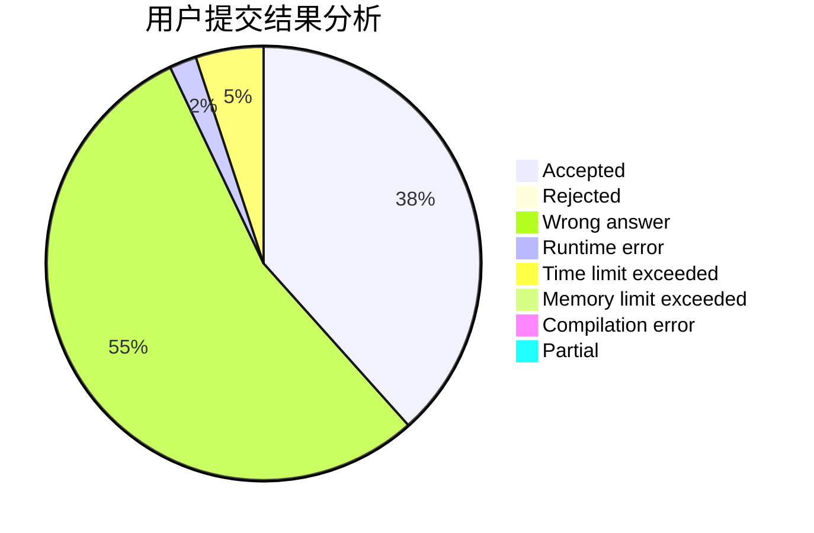
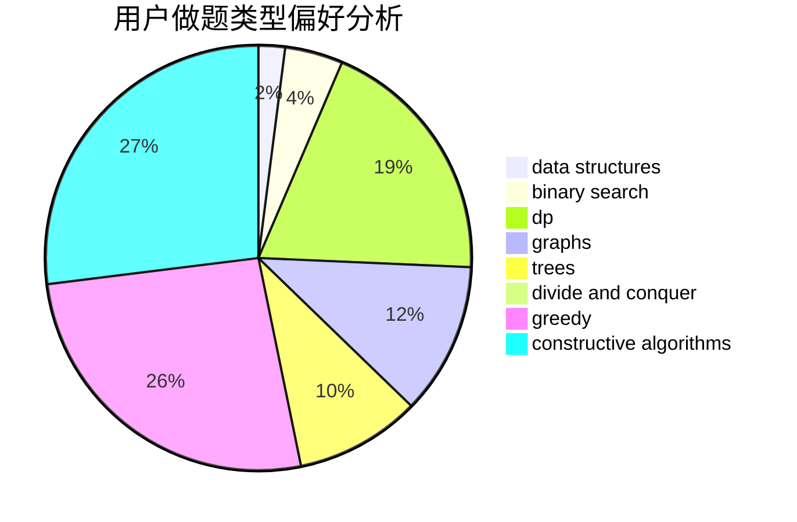
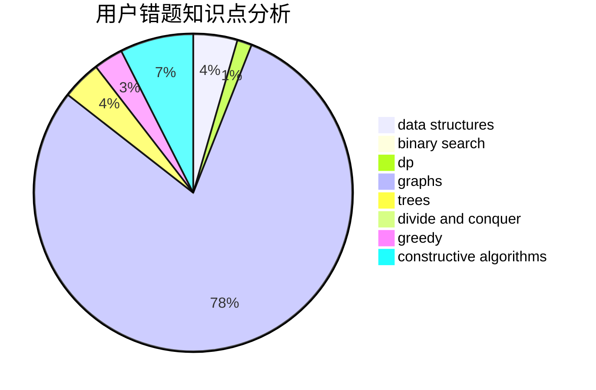

# Quasrain

<!-- tabs:start -->

#### **用户提交结果分析**

#### **用户做题类型偏好分析**

#### **用户错题知识点分析**

<!-- tabs:end -->
# 推荐题目
[1399B](https://codeforces.com/contest/1399/problem/B)		greedy		  
[123D](https://codeforces.com/contest/123/problem/D)		string suffix structures		  
[1467D](https://codeforces.com/contest/1467/problem/D)		combinatorics,
                        dp,
                        math		  
[957B](https://codeforces.com/contest/957/problem/B)		dsu,graphs,sortings,trees		  
[1033D](https://codeforces.com/contest/1033/problem/D)		interactive,
                        math,
                        number theory		  
[1164I](https://codeforces.com/contest/1164/problem/I)		dsu,graphs,sortings,trees		  
[7B](https://codeforces.com/contest/7/problem/B)		implementation		  
[229D](https://codeforces.com/contest/229/problem/D)		dp,
                        greedy,
                        two pointers		  
[358D](https://codeforces.com/contest/358/problem/D)		dp,
                        greedy		  
[228D](https://codeforces.com/contest/228/problem/D)		data structures		  
