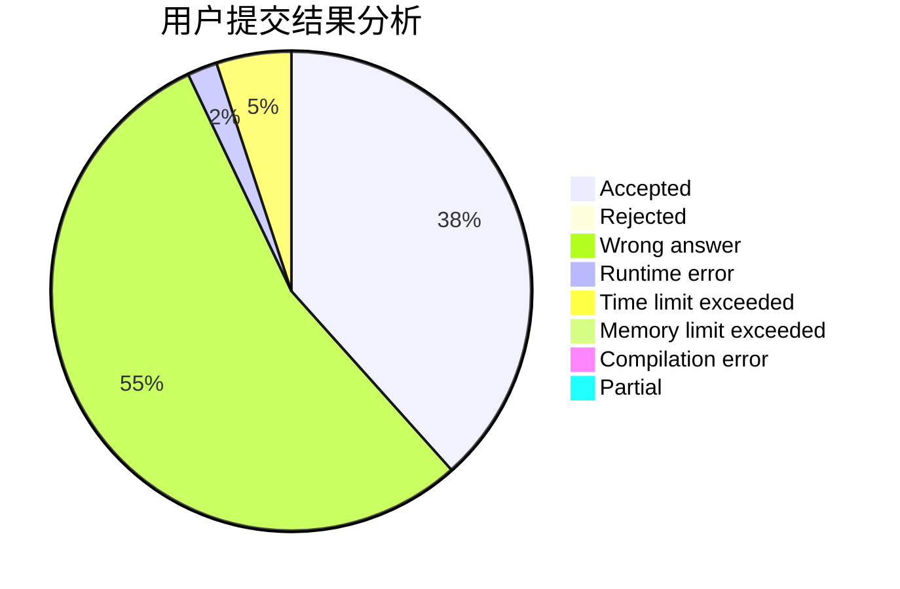
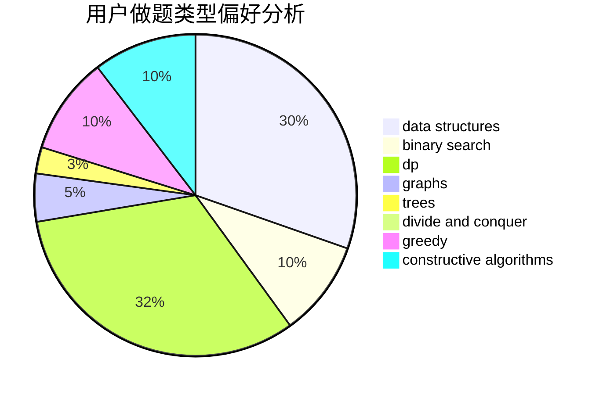
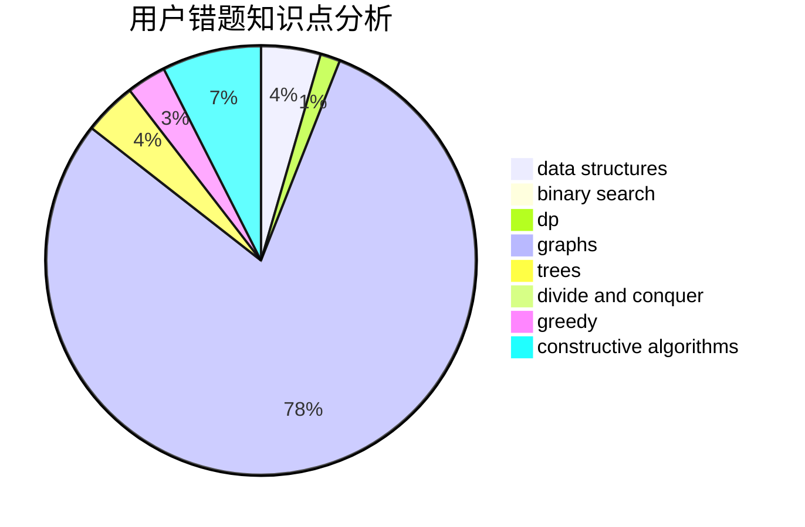

# Quasrain

<!-- tabs:start -->

#### **用户提交结果分析**

#### **用户做题类型偏好分析**

#### **用户错题知识点分析**

<!-- tabs:end -->
# 推荐题目
[1408C](https://codeforces.com/contest/1408/problem/C)		binary search,
                        dp,
                        implementation,
                        math,
                        two pointers		  
[1245B](https://codeforces.com/contest/1245/problem/B)		constructive algorithms,
                        dp,
                        greedy		  
[1474F](https://codeforces.com/contest/1474/problem/F)		dp,
                        math,
                        matrices		  
[978E](https://codeforces.com/contest/978/problem/E)		combinatorics,
                        math		  
[1033G](https://codeforces.com/contest/1033/problem/G)		games		  
[1166A](https://codeforces.com/contest/1166/problem/A)		combinatorics,
                        greedy		  
[814C](https://codeforces.com/contest/814/problem/C)		brute force,
                        dp,
                        strings,
                        two pointers		  
[249E](https://codeforces.com/contest/249/problem/E)		math		  
[383E](https://codeforces.com/contest/383/problem/E)		combinatorics,
                        divide and conquer,
                        dp		  
[246D](https://codeforces.com/contest/246/problem/D)		brute force,
                        dfs and similar,
                        graphs		  
